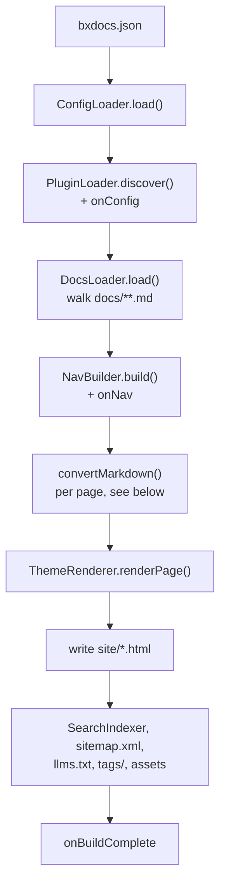
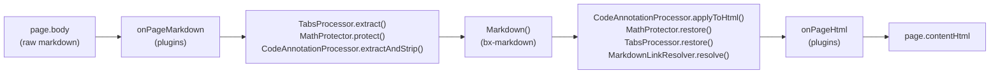

# bx-docs — Module Spec v0.1

A BoxLang module that generates static documentation sites from Markdown, in the spirit of mkdocs + mkdocs-material.

## 1. Identity

- Module name: `bx-docs`
- Slug: `bx-docs`
- BoxLang mapping: `bxdocs`
- Executable name: `bxDocs`

### box.json

```json
{
  "name": "BX Docs",
  "version": "@build.version@+@build.number@",
  "slug": "bx-docs",
  "type": "boxlang-modules",
  "shortDescription": "Static documentation site generator for BoxLang, built on bx-markdown",
  "boxlang": {
    "minimumVersion": "1.0.0",
    "moduleName": "bxdocs",
    "executable": "bxDocs"
  },
  "dependencies": {
    "bx-markdown": "*"
  }
}
```

## 2. Invocation

```
boxlang module:bxDocs <verb> [options]
```

`ModuleConfig.bx` implements `main(args)` following the same verb-dispatch pattern as bx-agents: parsed CLI options (`--flag`, `--flag=value`, `--no-flag`, short forms), `resolveProjectRoot()` precedence (`--projectRoot` > first positional > cwd), one dispatcher class per verb under `models/cli/`.

### Verbs (v1)

| Verb | Purpose |
|---|---|
| `new` | Scaffold a docs project |
| `build` | Render `docs/**.md` → static site in `site/` |
| `serve` | Build + serve locally with live reload |
| `search-index` | Rebuild the search index standalone (also runs automatically during `build`) |
| `clean` | Remove `site/` and any cache |
| `gh-deploy` | Build + force-push `site/` to a `gh-pages`-style branch |

## 3. Project structure

```
docs/                  # markdown source; folder nesting = nav structure
bxdocs.json            # site config
theme/                 # optional project-level theme override
site/                  # build output (generated)
```

## 4. Config file — bxdocs.json

Site name, description, nav (auto-inferred from folder/file structure by default; an explicit `nav` array — inline or in a project's own `docs/nav.json` — overrides that inference entirely), theme name + theme options, base URL, search on/off, `mermaid`/`math` on/off, a `plugins` array of BoxLang module names to activate, markdown-extension passthrough settings (table options, anchor links, YouTube transformer, code style — all sourced from bx-markdown's existing option set), and per-page frontmatter (`tags`/`icon`/`summary`/`ogImage`, on top of `title`/`order`/`hidden`/`description`).

## 5. Core pipeline





1. **Loader** — walks `docs/`, reads `.md` files + frontmatter (`title`, `order`, `hidden`)
2. **Parser** — delegates entirely to **bx-markdown** (`Markdown()` BIF / `bx:markdown` component) for markdown-to-HTML conversion, including admonitions (`!!! type "Title"`), footnotes and definition lists via bx-markdown's own native Flexmark extensions (`markdown.enableAdmonition`/`enableFootnotes`/`enableDefinitionLists`). No custom parsing on the bx-docs side for those three. Content tabs (`=== "Title"`), math (`$...$`/`$$...$$`, KaTeX client-side), and fenced-code `hl_lines`/`linenums`/`title` annotations have no Flexmark extension to lean on, so bx-docs implements each as its own pre/post-processing pass around `Markdown()` instead (`TabsProcessor`/`MathProtector`/`CodeAnnotationProcessor`) — protect the source from Flexmark's own inline parsing before conversion, restore/apply against the rendered HTML after. A page-to-page link written the normal mkdocs way — a file-relative path to another page's `.md` source, e.g. `[Search](../guides/search.md)` — is also rendered by bx-markdown completely verbatim, since it has no concept of where that file will eventually be built; `MarkdownLinkResolver` runs as a post-processing-only pass (no pre-processing needed) that rewrites every such `href` to its built pretty-URL, resolved against the *linking* page's own directory.
3. **Nav builder** — folder/file structure → nav tree, frontmatter overrides applied
4. **Theme renderer** — invokes the active theme's `.bxm` templates with page data + nav tree in scope
5. **Search indexer** — builds a static JSON index (title, url, headings, truncated body text)
6. **Asset pipeline** — copies theme assets + `docs/assets/` into `site/`

## 6. Theme system

- Themes are native **BoxLang `.bxm` templates** — no separate template engine
- `ThemeProvider` contract: each theme folder provides `layout.bxm`, `page.bxm`, `search.bxm` (or search partial), `assets/` (css/js)
- Built-in themes ship in module `resources/themes/`; custom/project themes resolved relative to project root and referenced by name/path in `bxdocs.json`

### Built-in themes (v1)

- **`bootstrap` (default)** — Bootstrap (latest), restyled with BoxLang brand:
  - Gradient: `#00FF78` → `#00DBFF`
  - Accent: `#FFF500`
  - Font: Poppins
  - BoxLang logo mark
- **`material`** — Material-style, same brand palette applied
- **`tailwind`** — Tailwind-based, same brand palette applied

`new` defaults to `bootstrap` unless `--theme` is passed.

## 7. Search (v1, locked)

- Fully static, client-side — matches mkdocs' default (lunr.js), no server dependency
- Index built at `build` time → `site/search-index.json`
- Each theme wires its own search UI against the shared index format
- Meilisearch integration (bx-meilisearch) explicitly deferred to a future optional add-on, not v1 core

## 8. Open items

None currently blocking. Deferred to later phases:
- Optional `bx-docs-search-meilisearch` add-on
- Versioned docs (multiple doc sets / version switcher) — **done**, see section 5's `docs/versions/` convention
- Admonitions, footnotes, definition lists and Mermaid diagrams — **done**, see section 5 step 2 and `bxdocs.json`'s `mermaid` key
- Plugin hook system beyond themes (e.g. custom nav sources) - **done** for nav (see `nav`/`docs/nav.json`, section 4); bx-markdown also has a `markdownRegisterExtension()`/`markdownUnregisterExtension()` API for registering arbitrary Flexmark extensions, independent of bx-docs
- Per-page tags/icon/summary and per-page/auto-generated social cards — **done**, see section 4 and `bxdocs.json`'s `generateOgImages` key
- One-command GitHub Pages publish (`gh-deploy`) — **done**, see section 2's verb table
- Content tabs, math (KaTeX), and fenced-code `hl_lines`/`linenums`/`title` annotations — **done**, see section 5 step 2 and `bxdocs.json`'s `math` key
- General-purpose plugin system, based on BoxLang's own module system — **done**: a plugin is any BoxLang module exposing a `models/BxDocsPlugin.bx` class, opted in by module name via `bxdocs.json`'s `plugins` array (`PluginLoader.bx`). Five optional hooks — `onConfig`/`onPageMarkdown`/`onPageHtml`/`onNav`/`onBuildComplete` — cover the config, per-page markdown/HTML, nav tree, and post-build stages. See `docs/guides/plugins.md` and the worked example at `examples/hello-plugin/`
- i18n, a blog/tags-plugin-equivalent beyond the simple tags index, and self-hosting third-party CSS/JS (Bootstrap, highlight.js, lunr, Alpine, Mermaid, KaTeX still load from CDN at view time) remain deferred

## 9. Phased task breakdown

**Phase 1 — Module skeleton**
- box.json, ModuleConfig.bx `main()` + verb stubs
- bxdocs.json loader/validator
- `new` verb (scaffold project + bootstrap theme default)

**Phase 2 — Core build pipeline**
- Loader + frontmatter parsing
- bx-markdown integration
- Nav builder
- Default theme (`bootstrap`) render path
- `build` verb end to end

**Phase 3 — Theme system**
- Formalize `ThemeProvider` contract
- Add `material`, `tailwind` themes
- Custom/project-level theme override support

**Phase 4 — Search**
- Static index builder
- Client search UI wired per theme
- `search-index` verb

**Phase 5 — serve / clean / polish**
- `serve` verb with live reload
- `clean` verb
- Docs + examples for bx-docs itself (dogfooding)
