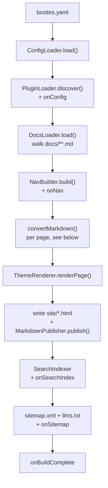
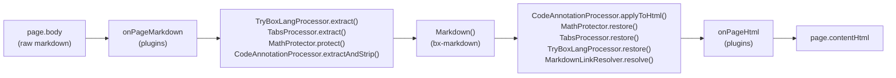

# bx-sites — Module Spec v0.1

A BoxLang module that generates static documentation sites from Markdown, in the spirit of mkdocs + mkdocs-material.

## 1. Identity

- Module name: `bx-sites`
- Slug: `bx-sites`
- BoxLang mapping: `bxsites`
- Executable name: `bxSites`

### box.json

```json
{
  "name": "BX Sites",
  "version": "@build.version@+@build.number@",
  "slug": "bx-sites",
  "type": "boxlang-modules",
  "shortDescription": "Static documentation site generator for BoxLang, built on bx-markdown",
  "boxlang": {
    "minimumVersion": "1.6.0",
    "moduleName": "bxsites",
    "executable": "bxSites"
  },
  "dependencies": {
    "bx-markdown": "*",
    "bx-esapi": "*",
    "bx-yaml": "*",
    "bx-image": "*"
  }
}
```

## 2. Invocation

```
boxlang bxSites <verb> [options]
```

`ModuleConfig.bx` implements `main(args)` following the same verb-dispatch pattern as bx-agents: parsed CLI options (`--flag`, `--flag=value`, `--no-flag`, short forms), `resolveProjectRoot()` precedence (`--projectRoot` > first positional > cwd), one dispatcher class per verb under `models/cli/`.

Beyond the verb table below, an installed+activated module (the same `plugins` array from section 4) can register its own additional verbs via a `models/BxSitesCliProvider.bx` contract - `bxSites cloud publish` is `cloud:publish` (colon-joined, same convention as `post:new`) dispatched via two-space-separated-token sugar, not a second dispatch mechanism. Core always wins a verb-name collision, and discovery failures (no project, malformed config, a provider with no verbs of its own) always fall back to core-only dispatch rather than breaking it. See `docs/guides/cli-providers.md` and `models/cli/CliProviderLoader.bx`.

### Verbs (v1)

| Verb | Purpose |
|---|---|
| `new` | Scaffold a docs project |
| `build` | Render `docs/**.md` → static site in `site/` |
| `serve` | Build + serve locally with live reload |
| `search-index` | Rebuild the search index standalone (also runs automatically during `build`) |
| `clean` | Remove `site/` and any cache |
| `gh-deploy` | Build + force-push `site/` to a `gh-pages`-style branch |
| `deploy` | Build + ship `site/` to a real target: s3, azure, gcs, firebase, ftp, sftp, rsync, netlify, vercel, cloudflare-pages, local, or github-pages - via a `deployments/*.json` entry, flag-only shorthand (`local`/`github-pages`), or no args at all to deploy every `deployments/*.json` entry (`--verbose` for progress output) |
| `package` | Build + zip `site/` into a single distributable archive (`--output=<path>`, defaults to `site.zip`) |
| `migrate` | Convert a GitBook export (`SUMMARY.md` + `.md` files, default) or an mkdocs project (`mkdocs.yml`, `--from=mkdocs`) into a bx-sites project |
| `check` | CI-grade content check on a built `site/`: broken internal links/images, missing alt text, orphaned pages |
| `stats` | Read-only summary report on a built `site/`: page/word counts, versions/locales, blog, tags, search index, site size |
| `doctor` | Environment/config health check: JVM, `docs/` (or `src/`), config validity, required modules, theme override |
| `post:new` | Scaffold a new blog post at `docs/blog/posts/<slug>.md` |
| `version:new` | Snapshot `docs/` into a new `docs/versions/<name>/` |
| `i18n:status` | Per-locale translation coverage report against the default tree |
| `i18n:new` | Scaffold a new `docs/i18n/<code>/` locale |
| `page:new` | Scaffold a single docs page at an arbitrary path |
| `plugin:new` | Scaffold a plugin module skeleton, mirroring `examples/hello-plugin/` |
| `install:plugin` | Download a plugin from ForgeBox into project-local `boxlang_modules/`, load it into the running runtime, and report its registered mapping name |
| `theme:new` | Eject a built-in theme into project `theme/` for customizing |
| `install:theme` | Download a theme from ForgeBox into project-local `themes/<name>/`, validating the `ThemeProvider` contract |
| `skills:install` | Install the official AI agent skill pack (`ortus-boxlang/bx-sites-skills`) via `npx skills add`, into every AI coding assistant the project has configured (`--skill=<name>` for just one) |
| `theme:import` | Best-effort convert a mkdocs/jekyll/hugo theme's own template files into a `themes/<name>/` scaffold |
| `page:rename` | Move a docs page and rewrite every relative Markdown link that pointed at it |
| `blog:drafts` | List every blog post whose frontmatter sets `draft: true` |
| `blog:find` | Filter blog posts by author/category/tag/date range |
| `search:query` | Query a built `search-index.json` and rank results, mirroring the client widget's field weighting |
| `lint` | Pre-build content checks on raw `docs/` Markdown: heading level skips, blog posts missing a valid date |

## 3. Project structure

```
docs/                  # markdown source; folder nesting = nav structure
bxsites.yaml            # site config (bxsites.json also supported)
theme/                 # optional project-level theme override
site/                  # build output (generated)
```

The source folder can also be named `src/` instead of `docs/` -
`SourceDirResolver.bx` auto-detects whichever actually exists at the
project root (`docs/` wins when a project somehow has both, for backward
compatibility). `new` always scaffolds `docs/`; `src/` is only ever a
"bring your own existing folder" option. Every reference to `docs/`
throughout this spec and the rest of the docs applies equally to a
project using `src/` instead. `site/` is never itself a valid
source-folder name — it's deleted and rewritten on every build.

## 4. Config file — bxsites.yaml (or bxsites.json)

Site name, description, nav (auto-inferred from folder/file structure by default; an explicit `nav` array — inline or in a project's own `docs/nav.json` — overrides that inference entirely), theme name + theme options, base URL, search on/off, `mermaid`/`math` on/off, a `plugins` array of BoxLang module names to activate, an `i18n` block (default-locale/locale display metadata for the `docs/i18n/<code>/` convention), a `variables` object of reusable values referenced from Markdown as `{{ dotted.path }}` (VariablesProcessor.bx — see section 8's "Reusable variables and magic functions"), markdown-extension passthrough settings (table options, anchor links, YouTube transformer, code style — all sourced from bx-markdown's existing option set), and per-page frontmatter (`tags`/`icon`/`summary`/`ogImage`/`toc`, on top of `title`/`order`/`hidden`/`description`).

## 5. Core pipeline





1. **Loader** — walks `docs/`, reads `.md` files + frontmatter (`title`, `order`, `hidden`)
2. **Parser** — delegates entirely to **bx-markdown** (`Markdown()` BIF / `bx:markdown` component) for markdown-to-HTML conversion, including admonitions (`!!! type "Title"`), footnotes and definition lists via bx-markdown's own native Flexmark extensions (`markdown.enableAdmonition`/`enableFootnotes`/`enableDefinitionLists`). No custom parsing on the bx-sites side for those three. Content tabs (`=== "Title"`), math (`$...$`/`$$...$$`, KaTeX client-side), fenced-code `hl_lines`/`linenums`/`title` annotations, and a `` ```tryboxlang `` fence (a live try.boxlang.io editor embed — `TryBoxLangProcessor`, extracted first so its literal BoxLang source is never misread by the other passes) have no Flexmark extension to lean on, so bx-sites implements each as its own pre/post-processing pass around `Markdown()` instead (`TabsProcessor`/`MathProtector`/`CodeAnnotationProcessor`/`TryBoxLangProcessor`) — protect the source from Flexmark's own inline parsing before conversion, restore/apply against the rendered HTML after. A page-to-page link written the normal mkdocs way — a file-relative path to another page's `.md` source, e.g. `[Search](../guides/search.md)` — is also rendered by bx-markdown completely verbatim, since it has no concept of where that file will eventually be built; `MarkdownLinkResolver` runs as a post-processing-only pass (no pre-processing needed) that rewrites every such `href` to its built pretty-URL, resolved against the *linking* page's own directory.
3. **Nav builder** — folder/file structure → nav tree, frontmatter overrides applied
4. **Theme renderer** — invokes the active theme's `.bxm` templates with page data + nav tree in scope, alongside `MarkdownPublisher`, which copies each page's own original `.md` source to `site/` at the same docs/-relative path its built HTML sits under (`guides/themes.md` next to `guides/themes/index.html`) — a "Download Markdown" link on the page itself points to it (`page.markdownUrl`)
5. **Search indexer** — builds a static JSON index (title, url, headings, truncated body text)
6. **Asset pipeline** — copies theme assets + `docs/assets/` into `site/`

## 6. Theme system

- Themes are native **BoxLang `.bxm` templates** — no separate template engine
- `ThemeProvider` contract: each theme folder provides `layout.bxm`, `page.bxm`, `search.bxm` (or search partial), `assets/` (css/js)
- Built-in themes ship in module `resources/themes/`; custom/project themes resolved relative to project root and referenced by name/path in `bxsites.json`
- Resolution order (`ThemeRenderer.resolveThemeDir()`): a project-level `theme/` override (all-or-nothing, wins outright) → a `themes/<theme.name>/` installed theme (`install:theme`/`ThemeInstaller.bx` — a ForgeBox package extracted project-locally, letting a project carry several installed themes side by side and switch purely by `theme.name`) → a built-in theme under `resources/themes/<theme.name>`

### Built-in themes (v1)

- **`bootstrap` (default)** — Bootstrap (latest), restyled with BoxLang brand:
  - Gradient: `#00FF78` → `#00DBFF`
  - Accent: `#FFF500`
  - Font: Poppins
  - BoxLang logo mark
- **`material`** — Material-style, same brand palette applied
- **`tailwind`** — Tailwind-based, same brand palette applied

`new` defaults to `bootstrap` unless `--theme` is passed.

### Built-in themes — gallery expansion (post-v1)

Seven more built-in themes, bringing the total to ten, so this repo's own
dogfooded docs double as a theme gallery (built as ten parallel jobs in
`.github/workflows/pages.yml`; `buildMultiTheme.sh` reproduces the same
gallery layout for a local preview): `docsy`
(Read the Docs/Docsy-inspired), `slate` (Stripe/Slate-inspired, permanently
dark sidebar), `docusaurus` (Docusaurus-inspired), `justthedocs` (Just the
Docs-inspired), `vuepress` (VuePress-inspired), `gitbook` (GitBook-inspired,
also thematically apt given `migrate --from=gitbook`), and `notion`
(Notion-inspired). All seven are forked from `material`
(`resources/themes/material/`) rather than written from scratch: the exact
same `layout.bxm`/`page.bxm`/`search.bxm` scripting logic, only a scoped
CSS-class-prefix rename plus a from-the-ground-up `assets/style.css`
restyle (and, for `justthedocs` only, one relocated `<bx:include>` line
moving the search box from the header into the sidebar). This inherits
`material`'s exact variable wiring/feature coverage rather than
re-deriving it seven times, and keeps every one of the seven
air-gapped-capable the same way `material` already is (system font stacks
only, no external font/CDN `<link>`). See `docs/guides/themes.md#built-in`.

## 7. Search

- `"local"` (the default, v1-locked) — fully static, client-side, the same "index at build time, search in the browser" approach mkdocs uses by default, no server dependency; searched with [MiniSearch](https://lucaong.github.io/minisearch/) (prefix + fuzzy matching, per-field boosting), vendored the same zero-CDN way as every other always-on library. Index built at `build` time → `site/search-index.json`; each built-in theme wires its own search UI against the shared index format
- `bxsites.json`'s `searchProvider.provider` selects the active provider (`SearchProviderRegistry.bx`) — `"algolia"` (Algolia DocSearch, no local index needed) and `"pagefind"` ([Pagefind](https://pagefind.app/), indexed from the built `site/` via the external `pagefind` CLI — `PagefindIndexer.bx` shells out to it after `build`, same `java.lang.ProcessBuilder` pattern GitRevisionDate.bx/GhPagesDeployer.bx use for `git`) are both built-in; any other name is a project's own provider, wired up via a `theme/` override reading `siteConfig.searchProvider` itself — see `docs/guides/search.md`
- Meilisearch integration (bx-meilisearch) as a first-class *built-in* provider (rather than a project's own theme override) explicitly deferred to a future optional add-on

## 8. Open items

None currently blocking. Deferred to later phases:
- Pluggable search providers beyond the default local/static one — **done**, see section 7: `searchProvider.provider` in `bxsites.json`, `algolia` built-in, any other provider wired up by a project's own theme override
- Optional `bx-sites-search-meilisearch` add-on (a first-class built-in Meilisearch provider, as opposed to a project wiring it up itself via the theme-override mechanism above)
- Versioned docs (multiple doc sets / version switcher) — **done**, see section 5's `docs/versions/` convention
- Admonitions, footnotes, definition lists and Mermaid diagrams — **done**, see section 5 step 2 and `bxsites.json`'s `mermaid` key
- Plugin hook system beyond themes (e.g. custom nav sources) - **done** for nav (see `nav`/`docs/nav.json`, section 4); bx-markdown also has a `markdownRegisterExtension()`/`markdownUnregisterExtension()` API for registering arbitrary Flexmark extensions, independent of bx-sites
- Per-page tags/icon/summary and per-page/auto-generated social cards — **done**, see section 4 and `bxsites.json`'s `generateOgImages` key
- One-command GitHub Pages publish (`gh-deploy`) — **done**, see section 2's verb table
- Content tabs, math (KaTeX), and fenced-code `hl_lines`/`linenums`/`title` annotations — **done**, see section 5 step 2 and `bxsites.json`'s `math` key
- Live embedded try.boxlang.io playgrounds via a `` ```tryboxlang `` fence — **done**, see section 5 step 2 (`TryBoxLangProcessor`) and `docs/guides/markdown.md`'s "Try it live" section
- General-purpose plugin system, based on BoxLang's own module system — **done**: a plugin is any BoxLang module exposing a `models/BxSitesPlugin.bx` class, opted in by module name via `bxsites.json`'s `plugins` array (`PluginLoader.bx`). Seven optional hooks — `onConfig`/`onPageMarkdown`/`onPageHtml`/`onNav`/`onSearchIndex`/`onSitemap`/`onBuildComplete` — cover the config, per-page markdown/HTML, nav tree, search index, sitemap.xml+llms.txt, and post-build stages. See `docs/guides/plugins.md` and the worked example at `examples/hello-plugin/`
- Plugin/theme distribution via ForgeBox — **done** for plugins, in progress for themes: `install:plugin` (`ForgeBoxClient.bx` + `PluginInstaller.bx`) resolves a package by ForgeBox slug (`GET {baseUrl}/entry/{slug}[/{version}]`), downloads its zip, and extracts it into **project-local** `boxlang_modules/<slug>/` — BoxLang's own documented auto-loaded-modules convention for a local CLI app, deliberately *not* a global `BOXLANG_HOME`/machine-wide install, so two bx-sites projects on one machine never fight over the same plugin version. `PluginInstaller.activateInRuntime()` loads the freshly-extracted module into the *running* runtime via `ModuleService.loadModule()` and reads its real registered mapping name back off `ModuleService.getModuleList()`'s own registry (not by re-parsing the extracted `box.json` by hand), since a module's ForgeBox slug and its BoxLang mapping name aren't always the same (`bx-markdown` → `bxMarkdown`; see Doctor.bx's own docblock). Installing a module still never activates it as a bx-sites plugin on its own — that's still `bxsites.json`'s own explicit `plugins` array, per the existing "install ≠ activate" rule. `install:theme` (`ThemeInstaller.bx`) is the themes-side equivalent — **done**: resolve+download+extract into project-local `themes/<name>/` (section 6's resolution order), validated against the `ThemeProvider` contract at install time rather than at the next `build`. No BoxLang module/class-loader involvement at all, unlike a plugin — a theme is pure files, so there's no separate activation step; setting `bxsites.json`'s `theme.name` to the installed name is the only wiring needed.
- Converting a theme from another static-site-generator ecosystem — **done**: `theme:import` (`ThemeImporter.bx` + `JinjaLikeTranslator.bx`/`GoTemplateTranslator.bx`) mechanically translates an mkdocs/jekyll (shared Jinja2/Liquid syntax) or hugo (Go templates) theme's own layout/content template files into a best-effort `themes/<name>/` scaffold — variable output and `if`/`for` control-flow structure translated against a fixed per-ecosystem field-name map, everything else (filters, template inheritance/includes, Hugo's `with`, an unmapped reference) left as a `<!--- TODO: ... --->` marker (or, inside a condition, a syntactically-safe placeholder) rather than guessed at. Explicitly out of scope: component-based themes (Docusaurus/VuePress/Gatsby) have no template *file* to translate at all, since the theme is compiled UI components rather than server-rendered markup — porting one means re-authoring it from scratch, not converting it. See `docs/guides/theme-import.md`.
- i18n (multi-language docs) — **done**, see `docs/i18n/<code>/` (LocalesDiscoverer.bx, mirroring the versions-by-convention pattern) and `bxsites.json`'s `i18n` key. A locale not yet translating a given page falls back to the default locale's own content, flagged; nav always mirrors the default locale's own shape. Theme chrome strings (not page content) staying English-only regardless of locale is a documented v1 limit — see `docs/guides/i18n.md`
- Versions × locales composing — **done**: a `docs/versions/<name>/i18n/<code>/` folder (same by-convention rule one level down) composes onto that version's own tree, so a version's own default-locale build gets a language switcher listing only the locales that version itself translates, and switching version always drops back to that version's own default locale rather than assuming a shared translation — see `docs/guides/i18n.md`'s "Versioned and translated docs" section
- CI-grade content quality gate (broken internal links/images, missing alt text, orphaned pages) — **done**, see section 2's verb table (`check`) and `docs/cli-reference.md`
- A documented, first-class Alpine.js reactive primitive for page content (not just theme chrome) — **done**: every page already bundles Alpine.js (it drives the dark-mode toggle and language dropdown), so this was a documentation gap rather than a code one — see `docs/guides/interactivity.md`
- Self-hosting third-party CSS/JS by default, for air-gapped/offline sites — **done** for Bootstrap's own CSS/JS, highlight.js, Alpine.js, MiniSearch, and (opt-in) Mermaid/Swagger UI: vendored under `resources/assets/vendor/` (`vendorAssets.mjs`, mirroring `vendorIcons.mjs`'s own pattern), copied into every built `site/assets/vendor/` by `BuildPipeline.bx`'s `copyAssets()`, and referenced locally instead of via CDN in every built-in theme's `layout.bxm`. Mermaid's own UMD bundle and Swagger UI's own bundle/CSS are vendored the same way as the always-on libraries, just gated behind `bxsites.json`'s `mermaid`/`openapi` keys the way MiniSearch is gated behind the `local` search provider - Mermaid's one dynamic import, `elk-api.js` (an alternate layout engine a handful of diagram types use), still resolves against jsDelivr; Swagger UI's own topbar/"Explore" preset is deliberately not vendored at all (see `docs/guides/openapi.md`). Still CDN-loaded, only when a project opts into them: KaTeX (`math` - ships its own font files as separate resources, not a single vendorable bundle), Algolia search and Google Analytics (both inherently talk to a hosted API/endpoint regardless of vendoring), and the `tailwind` theme's own CDN-hosted JIT compiler (a live compiler, not a static file) — see `docs/guides/themes.md#air-gapped-offline-sites`
- Interactive OpenAPI/Swagger spec rendering — **done**: a `::: openapi src="..."` content block (`DirectiveBlockProcessor.bx`) mounts a vendored Swagger UI widget, gated behind `bxsites.json`'s `openapi` key the same way Mermaid is gated behind `mermaid` - see `docs/guides/openapi.md`
- A blog beyond the simple tags index - **done**: `docs/blog/posts/` by-convention posts (BlogDiscoverer.bx), an optional `docs/blog/authors.yml` roster with by-convention avatar resolution (BlogAuthorsLoader.bx), paginated `/blog/`+category+author pages and a per-post featured-image/byline header (BlogBuilder.bx), and `/blog/feed.xml` (BlogFeedGenerator.bx) - see `docs/guides/blog.md`. Posts fold into the existing tags index/search index/sitemap/llms.txt unchanged; no new theme template contract - every blog page renders through the same `page.bxm` as everything else
- Third-party modules registering their own `bxSites <verb>` commands (not just build-lifecycle hooks) — **done**: a `models/BxSitesCliProvider.bx` contract, activated by the same `plugins` array as a build plugin, discovered and merged into the core verb table by `models/cli/CliProviderLoader.bx` from `ModuleConfig.bx#main()`'s new `mergeProviderVerbs()` - core always wins a name collision, and any discovery failure (no project yet, malformed `bxsites.yaml`, a provider with no verbs of its own) falls back to core-only dispatch rather than breaking it. A two-space-separated-token form (`bxSites cloud publish`) is UX sugar over the existing colon-joined verb-name convention (`cloud:publish`), not a second mechanism. See `docs/guides/cli-providers.md`.
- Pluggable multi-target deploy beyond `gh-deploy` - **done**: a unified `deploy` verb ships `site/` to a real target via an `IDeploymentTarget` interface (`models/deploy/`) - `s3` (and any S3-compatible service via a custom endpoint - Spaces/R2/B2/MinIO, using a hand-rolled AWS SigV4 signer), `azure` (Shared Key/SAS/connection-string auth against the raw Blob REST API), `gcs`/`firebase` (sharing a Google service-account OAuth2/JWT helper), `ftp`/`sftp` (the real `bx-ftp` module's `bx:ftp` component, a new `box.json` dependency), `rsync` (shelling out to the real binary, same pattern as `gh-deploy`'s own `git` usage), `netlify`/`vercel`/`cloudflare-pages`, `local`, and `github-pages` (wrapping the same `GhPagesDeployer.bx` `gh-deploy` itself uses). A `DeploymentConfigResolver.bx` discovers/validates `deployments/<name>.json` entries (`bxSites deploy --entry=<name>`); `local`/`github-pages` also work flag-only, with no `deployments/` folder at all; no args at all deploys every entry off one shared build, `--verbose` for progress output. Every target resolves secrets from a named environment variable at deploy time, never a literal in `deployments/*.json`. See `docs/guides/deployment.md` and `docs/cli-reference.md#deploy`.
- A `package` verb for a plain distributable archive - **done**: `bxSites package` builds the site then zips it (`compress()`, `format: "zip"`) into a single file whose root is the built site's own contents, for release attachments or hosts that only accept a zip upload. See `docs/guides/deployment.md#the-package-command` and `docs/cli-reference.md#package`.
- Reusable variables and magic functions - **done**: `bxsites.yaml`'s `variables` object (ConfigLoader.bx) is referenced from any Markdown page as `{{ dotted.path }}`; a project-wide `docs/functions.bxs` (FunctionsLoader.bx) declares BoxLang "magic functions" - any function named with a leading `$` - callable the same way as `{{ $name(arg1, arg2) }}`. Both share one `{{ }}` syntax, resolved by `VariablesProcessor.bx` as a fence-aware markdown-to-markdown pass in `BuildPipeline.convertMarkdown()` (right after `IncludeProcessor`, before every other pre-processor), so an included partial's own `{{ }}` resolves too and a fenced code example showing the literal syntax is left untouched. `FunctionsLoader.bx` loads `functions.bxs` by `include`-ing it inside a class method and diffing that instance's own `variables` scope before/after (BoxLang's own include-scope-absorption - the same mechanism `ThemeRenderer.bx` already relies on for `layout.bxm`/`page.bxm`); `load()` returns *every* declared function, `$`-prefixed or not, so a private (non-`$`) helper stays reachable from its own file's `$`-prefixed callers once actually invoked - see FunctionsLoader.bx's and FunctionScope.bx's own docblocks for why dropping the plain ones would silently break that. `ThemeRenderer.renderPage()` binds each one into its own template-rendering scope too, so a project's own `theme/` `.bxm` override can call `$name(...)` bare, with no prefix. A magic function's own body can also bare-reference a fixed "supporting variables" context - `siteConfig`/`page`/`nav`/`basePath`/`versions`/`currentVersion`/`locales`/`currentLocale`/`currentLocaleDir` - identically whether it's called from `{{ }}` (bound into a disposable `FunctionScope.bx` instance alongside the functions themselves, to avoid a project's own function name colliding with `VariablesProcessor.bx`'s real methods) or bare from a theme override (already present in `ThemeRenderer`'s own scope); `page` is the one exception, populated only as far as `DocsLoader.bx`'s own load-time shape when called from Markdown (pre-`toc`/`prevPage`/`nextPage`/`breadcrumbs`/`editUrl`/`lastUpdated`/`iconHtml`/`markdownUrl`/`canonicalUrl`), fully enriched by the time the same function runs again from `page.bxm`. Loaded once per build (not per version/locale tree), so a project doesn't need to duplicate `functions.bxs` to keep the same functions working everywhere. See `docs/guides/variables-and-functions.md`

## 9. Phased task breakdown

**Phase 1 — Module skeleton**
- box.json, ModuleConfig.bx `main()` + verb stubs
- bxsites.json loader/validator
- `new` verb (scaffold project + bootstrap theme default)

**Phase 2 — Core build pipeline**
- Loader + frontmatter parsing
- bx-markdown integration
- Nav builder
- Default theme (`bootstrap`) render path
- `build` verb end to end

**Phase 3 — Theme system**
- Formalize `ThemeProvider` contract
- Add `material`, `tailwind` themes
- Custom/project-level theme override support

**Phase 4 — Search**
- Static index builder
- Client search UI wired per theme
- `search-index` verb

**Phase 5 — serve / clean / polish**
- `serve` verb with live reload
- `clean` verb
- Docs + examples for bx-sites itself (dogfooding)
