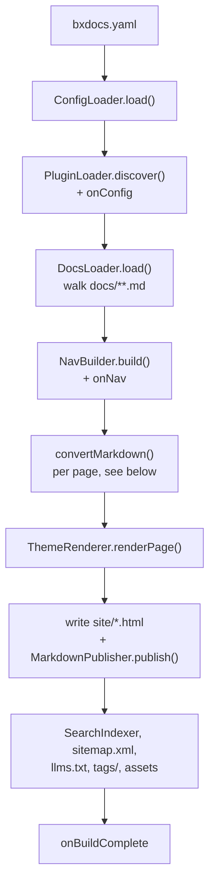
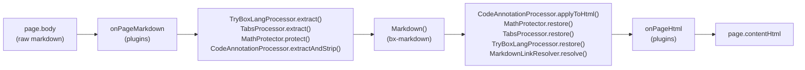

# bx-docs — Module Spec v0.1

A BoxLang module that generates static documentation sites from Markdown, in the spirit of mkdocs + mkdocs-material.

## 1. Identity

- Module name: `bx-docs`
- Slug: `bx-docs`
- BoxLang mapping: `bxdocs`
- Executable name: `bxDocs`

### box.json

```json
{
  "name": "BX Docs",
  "version": "@build.version@+@build.number@",
  "slug": "bx-docs",
  "type": "boxlang-modules",
  "shortDescription": "Static documentation site generator for BoxLang, built on bx-markdown",
  "boxlang": {
    "minimumVersion": "1.6.0",
    "moduleName": "bxdocs",
    "executable": "bxDocs"
  },
  "dependencies": {
    "bx-markdown": "*",
    "bx-esapi": "*",
    "bx-yaml": "*",
    "bx-image": "*"
  }
}
```

## 2. Invocation

```
boxlang module:bxDocs <verb> [options]
```

`ModuleConfig.bx` implements `main(args)` following the same verb-dispatch pattern as bx-agents: parsed CLI options (`--flag`, `--flag=value`, `--no-flag`, short forms), `resolveProjectRoot()` precedence (`--projectRoot` > first positional > cwd), one dispatcher class per verb under `models/cli/`.

### Verbs (v1)

| Verb | Purpose |
|---|---|
| `new` | Scaffold a docs project |
| `build` | Render `docs/**.md` → static site in `site/` |
| `serve` | Build + serve locally with live reload |
| `search-index` | Rebuild the search index standalone (also runs automatically during `build`) |
| `clean` | Remove `site/` and any cache |
| `gh-deploy` | Build + force-push `site/` to a `gh-pages`-style branch |
| `migrate` | Convert a GitBook export (`SUMMARY.md` + `.md` files, default) or an mkdocs project (`mkdocs.yml`, `--from=mkdocs`) into a bx-docs project |
| `check` | CI-grade content check on a built `site/`: broken internal links/images, missing alt text, orphaned pages |

## 3. Project structure

```
docs/                  # markdown source; folder nesting = nav structure
bxdocs.yaml            # site config (bxdocs.json also supported)
theme/                 # optional project-level theme override
site/                  # build output (generated)
```

## 4. Config file — bxdocs.yaml (or bxdocs.json)

Site name, description, nav (auto-inferred from folder/file structure by default; an explicit `nav` array — inline or in a project's own `docs/nav.json` — overrides that inference entirely), theme name + theme options, base URL, search on/off, `mermaid`/`math` on/off, a `plugins` array of BoxLang module names to activate, an `i18n` block (default-locale/locale display metadata for the `docs/i18n/<code>/` convention), markdown-extension passthrough settings (table options, anchor links, YouTube transformer, code style — all sourced from bx-markdown's existing option set), and per-page frontmatter (`tags`/`icon`/`summary`/`ogImage`/`toc`, on top of `title`/`order`/`hidden`/`description`).

## 5. Core pipeline





1. **Loader** — walks `docs/`, reads `.md` files + frontmatter (`title`, `order`, `hidden`)
2. **Parser** — delegates entirely to **bx-markdown** (`Markdown()` BIF / `bx:markdown` component) for markdown-to-HTML conversion, including admonitions (`!!! type "Title"`), footnotes and definition lists via bx-markdown's own native Flexmark extensions (`markdown.enableAdmonition`/`enableFootnotes`/`enableDefinitionLists`). No custom parsing on the bx-docs side for those three. Content tabs (`=== "Title"`), math (`$...$`/`$$...$$`, KaTeX client-side), fenced-code `hl_lines`/`linenums`/`title` annotations, and a `` ```tryboxlang `` fence (a live try.boxlang.io editor embed — `TryBoxLangProcessor`, extracted first so its literal BoxLang source is never misread by the other passes) have no Flexmark extension to lean on, so bx-docs implements each as its own pre/post-processing pass around `Markdown()` instead (`TabsProcessor`/`MathProtector`/`CodeAnnotationProcessor`/`TryBoxLangProcessor`) — protect the source from Flexmark's own inline parsing before conversion, restore/apply against the rendered HTML after. A page-to-page link written the normal mkdocs way — a file-relative path to another page's `.md` source, e.g. `[Search](../guides/search.md)` — is also rendered by bx-markdown completely verbatim, since it has no concept of where that file will eventually be built; `MarkdownLinkResolver` runs as a post-processing-only pass (no pre-processing needed) that rewrites every such `href` to its built pretty-URL, resolved against the *linking* page's own directory.
3. **Nav builder** — folder/file structure → nav tree, frontmatter overrides applied
4. **Theme renderer** — invokes the active theme's `.bxm` templates with page data + nav tree in scope, alongside `MarkdownPublisher`, which copies each page's own original `.md` source to `site/` at the same docs/-relative path its built HTML sits under (`guides/themes.md` next to `guides/themes/index.html`) — a "Download Markdown" link on the page itself points to it (`page.markdownUrl`)
5. **Search indexer** — builds a static JSON index (title, url, headings, truncated body text)
6. **Asset pipeline** — copies theme assets + `docs/assets/` into `site/`

## 6. Theme system

- Themes are native **BoxLang `.bxm` templates** — no separate template engine
- `ThemeProvider` contract: each theme folder provides `layout.bxm`, `page.bxm`, `search.bxm` (or search partial), `assets/` (css/js)
- Built-in themes ship in module `resources/themes/`; custom/project themes resolved relative to project root and referenced by name/path in `bxdocs.json`

### Built-in themes (v1)

- **`bootstrap` (default)** — Bootstrap (latest), restyled with BoxLang brand:
  - Gradient: `#00FF78` → `#00DBFF`
  - Accent: `#FFF500`
  - Font: Poppins
  - BoxLang logo mark
- **`material`** — Material-style, same brand palette applied
- **`tailwind`** — Tailwind-based, same brand palette applied

`new` defaults to `bootstrap` unless `--theme` is passed.

## 7. Search

- `"local"` (the default, v1-locked) — fully static, client-side, matches mkdocs' default (lunr.js), no server dependency. Index built at `build` time → `site/search-index.json`; each built-in theme wires its own search UI against the shared index format
- `bxdocs.json`'s `searchProvider.provider` selects the active provider (`SearchProviderRegistry.bx`) — `"algolia"` (Algolia DocSearch, no local index needed) and `"pagefind"` ([Pagefind](https://pagefind.app/), indexed from the built `site/` via the external `pagefind` CLI — `PagefindIndexer.bx` shells out to it after `build`, same `java.lang.ProcessBuilder` pattern GitRevisionDate.bx/GhPagesDeployer.bx use for `git`) are both built-in; any other name is a project's own provider, wired up via a `theme/` override reading `siteConfig.searchProvider` itself — see `docs/guides/search.md`
- Meilisearch integration (bx-meilisearch) as a first-class *built-in* provider (rather than a project's own theme override) explicitly deferred to a future optional add-on

## 8. Open items

None currently blocking. Deferred to later phases:
- Pluggable search providers beyond the default local/static one — **done**, see section 7: `searchProvider.provider` in `bxdocs.json`, `algolia` built-in, any other provider wired up by a project's own theme override
- Optional `bx-docs-search-meilisearch` add-on (a first-class built-in Meilisearch provider, as opposed to a project wiring it up itself via the theme-override mechanism above)
- Versioned docs (multiple doc sets / version switcher) — **done**, see section 5's `docs/versions/` convention
- Admonitions, footnotes, definition lists and Mermaid diagrams — **done**, see section 5 step 2 and `bxdocs.json`'s `mermaid` key
- Plugin hook system beyond themes (e.g. custom nav sources) - **done** for nav (see `nav`/`docs/nav.json`, section 4); bx-markdown also has a `markdownRegisterExtension()`/`markdownUnregisterExtension()` API for registering arbitrary Flexmark extensions, independent of bx-docs
- Per-page tags/icon/summary and per-page/auto-generated social cards — **done**, see section 4 and `bxdocs.json`'s `generateOgImages` key
- One-command GitHub Pages publish (`gh-deploy`) — **done**, see section 2's verb table
- Content tabs, math (KaTeX), and fenced-code `hl_lines`/`linenums`/`title` annotations — **done**, see section 5 step 2 and `bxdocs.json`'s `math` key
- Live embedded try.boxlang.io playgrounds via a `` ```tryboxlang `` fence — **done**, see section 5 step 2 (`TryBoxLangProcessor`) and `docs/guides/markdown.md`'s "Try it live" section
- General-purpose plugin system, based on BoxLang's own module system — **done**: a plugin is any BoxLang module exposing a `models/BxDocsPlugin.bx` class, opted in by module name via `bxdocs.json`'s `plugins` array (`PluginLoader.bx`). Five optional hooks — `onConfig`/`onPageMarkdown`/`onPageHtml`/`onNav`/`onBuildComplete` — cover the config, per-page markdown/HTML, nav tree, and post-build stages. See `docs/guides/plugins.md` and the worked example at `examples/hello-plugin/`
- i18n (multi-language docs) — **done**, see `docs/i18n/<code>/` (LocalesDiscoverer.bx, mirroring the versions-by-convention pattern) and `bxdocs.json`'s `i18n` key. A locale not yet translating a given page falls back to the default locale's own content, flagged; nav always mirrors the default locale's own shape. Theme chrome strings (not page content) staying English-only regardless of locale is a documented v1 limit — see `docs/guides/i18n.md`
- Versions × locales composing — **done**: a `docs/versions/<name>/i18n/<code>/` folder (same by-convention rule one level down) composes onto that version's own tree, so a version's own default-locale build gets a language switcher listing only the locales that version itself translates, and switching version always drops back to that version's own default locale rather than assuming a shared translation — see `docs/guides/i18n.md`'s "Versioned and translated docs" section
- CI-grade content quality gate (broken internal links/images, missing alt text, orphaned pages) — **done**, see section 2's verb table (`check`) and `docs/cli-reference.md`
- A documented, first-class Alpine.js reactive primitive for page content (not just theme chrome) — **done**: every page already bundles Alpine.js (it drives the dark-mode toggle and language dropdown), so this was a documentation gap rather than a code one — see `docs/guides/interactivity.md`
- Self-hosting third-party CSS/JS by default, for air-gapped/offline sites — **done** for Bootstrap's own CSS/JS, highlight.js, Alpine.js, lunr.js, and (opt-in) Mermaid: vendored under `resources/assets/vendor/` (`vendorAssets.mjs`, mirroring `vendorIcons.mjs`'s own pattern), copied into every built `site/assets/vendor/` by `BuildPipeline.bx`'s `copyAssets()`, and referenced locally instead of via CDN in every built-in theme's `layout.bxm`. Mermaid's own UMD bundle is vendored the same way as the always-on libraries, just gated behind `bxdocs.json`'s `mermaid` key the way lunr.js is gated behind the `local` search provider - only its one dynamic import, `elk-api.js` (an alternate layout engine a handful of diagram types use), still resolves against jsDelivr. Still CDN-loaded, only when a project opts into them: KaTeX (`math` - ships its own font files as separate resources, not a single vendorable bundle), Algolia search and Google Analytics (both inherently talk to a hosted API/endpoint regardless of vendoring), and the `tailwind` theme's own CDN-hosted JIT compiler (a live compiler, not a static file) — see `docs/guides/themes.md#air-gapped-offline-sites`
- A blog beyond the simple tags index - **done**: `docs/blog/posts/` by-convention posts (BlogDiscoverer.bx), an optional `docs/blog/authors.yml` roster with by-convention avatar resolution (BlogAuthorsLoader.bx), paginated `/blog/`+category+author pages and a per-post featured-image/byline header (BlogBuilder.bx), and `/blog/feed.xml` (BlogFeedGenerator.bx) - see `docs/guides/blog.md`. Posts fold into the existing tags index/search index/sitemap/llms.txt unchanged; no new theme template contract - every blog page renders through the same `page.bxm` as everything else

## 9. Phased task breakdown

**Phase 1 — Module skeleton**
- box.json, ModuleConfig.bx `main()` + verb stubs
- bxdocs.json loader/validator
- `new` verb (scaffold project + bootstrap theme default)

**Phase 2 — Core build pipeline**
- Loader + frontmatter parsing
- bx-markdown integration
- Nav builder
- Default theme (`bootstrap`) render path
- `build` verb end to end

**Phase 3 — Theme system**
- Formalize `ThemeProvider` contract
- Add `material`, `tailwind` themes
- Custom/project-level theme override support

**Phase 4 — Search**
- Static index builder
- Client search UI wired per theme
- `search-index` verb

**Phase 5 — serve / clean / polish**
- `serve` verb with live reload
- `clean` verb
- Docs + examples for bx-docs itself (dogfooding)
