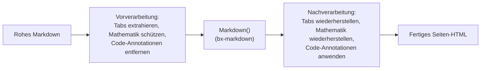
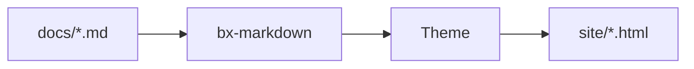

# Markdown-Erweiterungen

Über Standard-Markdown hinaus aktiviert BxSites standardmäßig drei der
nativen Flexmark-Erweiterungen von bx-markdown - Admonitions, Fußnoten und
Definitionslisten - sowie eine eigene Mermaid-Diagramm-Integration. Alle
vier sind über [die Schlüssel `markdown`/`mermaid` von `bxsites.yaml`](../configuration.md#markdown)
konfigurierbar.

Zusätzlich implementiert BxSites drei weitere eigene Erweiterungen, von
denen Flexmark überhaupt kein Konzept hat - Content-Tabs, Mathematik und
die Fenced-Code-Annotationen `hl_lines`/`linenums`/`title`. Da bx-sites den
Parser von bx-markdown nicht forken kann, arbeitet jede davon als
Vor-/Nachbearbeitungsdurchlauf rund um die normale Markdown-Konvertierung
- siehe die Abschnitte unten.



## Admonitions

Eine Callout-/Hinweisbox - standardmäßig aktiv, keine
`bxsites.yaml`-Konfiguration nötig:

```markdown title="Beispiel" linenums="1"
!!! note "Heads Up"
    This is an admonition. Its content is regular markdown - **bold**,
    `code`, [links](../index.md) and lists all work exactly as normal.
```

Was so gerendert wird:

!!! note "Zu beachten"
    Dies ist eine Admonition. Ihr Inhalt ist reguläres Markdown - **fett**,
    `code`, [Links](../index.md) und Listen funktionieren alle genau wie
    gewohnt.

Der Typ (oben `note`) bestimmt Icon/Farbe der Box, und wenn du kein
explizites `"Title"` angibst, wird stattdessen sein eigener großgeschriebener
Name verwendet. Viele gängige Synonyme lösen sich auf dieselben 12
kanonischen Typen auf, jeder mit eigener Akzentfarbe:

!!! note "note"
    Blau - auch der Fallback für jeden nicht in dieser Liste enthaltenen Typ.

!!! abstract "abstract / summary / tldr"
    Hellblau.

!!! info "info / todo"
    Cyan.

!!! tip "tip / hint / important"
    Türkis.

!!! success "success / check / done"
    Grün.

!!! faq "question / help / faq"
    Limette.

!!! warning "warning / caution / attention"
    Orange.

!!! fail "failure / fail / missing"
    Hellrot.

!!! danger "danger / error"
    Rot.

!!! bug "bug"
    Pink.

!!! example "example"
    Lila.

!!! quote "quote / cite"
    Grau.

Der Inhalt muss um 4 Leerzeichen (oder einen Tab) eingerückt bleiben; der
Block endet bei der ersten nicht eingerückten, nicht leeren Zeile. Leere
Zeilen sind *innerhalb* des Blocks kein Problem - sie beginnen einfach
einen neuen Absatz, genau wie überall sonst im Markdown.

### Einklappbare Admonitions

Stelle dem Typ `???` statt `!!!` voran, um den Block einklappbar zu
machen - `???` startet eingeklappt, `???+` startet ausgeklappt. So oder so
ist die Überschrift klickbar, um umzuschalten:

```markdown title="Beispiel" linenums="1"
??? tip "Click to expand"
    This starts collapsed.

???+ tip "Click to collapse"
    This starts open.
```

??? tip "Klicken zum Ausklappen"
    Dies startet eingeklappt.

???+ tip "Klicken zum Einklappen"
    Dies startet ausgeklappt.

Schalte Admonitions mit `{"markdown":{"enableAdmonition":false}}` ganz aus.

## Fußnoten

Verweise inline auf eine Fußnote mit `[^label]` und definiere ihren Text
irgendwo im Dokument mit `[^label]: text`:

```markdown title="Beispiel" linenums="1"
Here's a claim that needs backing up[^1].

[^1]: Here's the backup.
```

Hier ist eine Behauptung, die belegt werden muss[^1].

[^1]: Hier ist der Beleg.

Fußnoten-Definitionen werden gesammelt und als nummerierte Liste am Ende
der Seite gerendert, unabhängig davon, wo in der Quelle sie geschrieben
wurden. Standardmäßig aus - schalte es mit
`{"markdown":{"enableFootnotes":true}}` ein.

## Definitionslisten

Eine Begriffszeile, gefolgt von einer oder mehreren `:   `-Beschreibungszeilen,
wird zu einem `<dl>`:

```markdown title="Beispiel" linenums="1"
Term
:   Its definition.

Second term
:   First definition.
:   Second definition.
```

Begriff
:   Seine Definition.

Zweiter Begriff
:   Erste Definition.
:   Zweite Definition.

Standardmäßig aus - schalte es mit
`{"markdown":{"enableDefinitionLists":true}}` ein.

## Content-Tabs

Gruppiere alternative Inhalte - unterschiedliche Sprachen, unterschiedliche
Plattformen - hinter einer Reihe klickbarer Tabs mit `=== "Title"`,
eingerückt genauso wie der Inhalt einer Admonition (4 Leerzeichen oder ein
Tab):

```markdown title="Beispiel" linenums="1"
=== "Java"
    ```java
    System.out.println( "Hi" );
    ```

=== "BoxLang"
    ```bx
    println( "Hi" )
    ```
```

Was so gerendert wird:

=== "Java"
    ```java
    System.out.println( "Hi" );
    ```

=== "BoxLang"
    ```bx
    println( "Hi" )
    ```

Aufeinanderfolgende `=== "..."`-Blöcke (durch höchstens eine Leerzeile
getrennt) bilden eine einzige Tab-Gruppe; der Inhalt eines Tabs ist
vollständiges Markdown, also Code-Fences, Listen, Admonitions - alles, was
du auch sonst irgendwo schreiben würdest. Keine `bxsites.yaml`-Konfiguration
nötig - immer aktiv.

## Codeblöcke

Fenced Codeblöcke werden clientseitig syntax-hervorgehoben
(highlight.js), keine Konfiguration nötig - die Sprachkennung nach dem
öffnenden ` ``` ` wählt die Grammatik, z. B. ` ```json `. Zusätzlich zu den
mitgelieferten Sprachen von highlight.js selbst registriert BxSites eine
eigene, schlanke BoxLang-Grammatik unter `bx`/`boxlang`/`bxs`/`bxm`/`cfscript`:

```bx
class {

	numeric function add( required numeric a, required numeric b ) {
		var result = a + b
		var message = "The sum is #result#"
		return result
	}

}
```

### Zeilennummern, hervorgehobene Zeilen und Titel

Füge `linenums`, `hl_lines` und/oder `title` zum Info-String eines Fences
hinzu - jede Kombination, alle optional:

````markdown
```bx hl_lines="2" linenums="1" title="add.bx"
numeric function add( required numeric a, required numeric b ) {
	return a + b
}
```
````

Was so gerendert wird:

```bx hl_lines="2" linenums="1" title="add.bx"
numeric function add( required numeric a, required numeric b ) {
	return a + b
}
```

`linenums="N"` beginnt die Zählung im Gutter bei `N`; `hl_lines` nimmt
durch Leerzeichen getrennte Zeilennummern und/oder Bereiche (`"2 4-6"`)
entgegen, um sie hervorzuheben, gezählt vom Anfang des Blocks unabhängig
davon, wo `linenums` beginnt; `title` fügt eine kleine Titelleiste über
dem Block hinzu. Keine `bxsites.yaml`-Konfiguration nötig - immer
verfügbar.

### Diff-Markierungen und Terminal-Rahmen

Füge `insert`/`delete` hinzu, um hinzugefügte/entfernte Zeilen zu
markieren - dieselben durch Leerzeichen getrennten Zeilennummern/Bereiche,
die `hl_lines` bereits verwendet - als eingefärbte Zeile plus ein
`+`/`–`-Gutter-Symbol:

````markdown
```bx title="add.bx" insert="3-4" delete="7"
numeric function add( required numeric a, required numeric b ) {
	var sum = a + b
	var total = a + b
	log.info( "computed sum", total )
	return sum
}
```
````

Was so gerendert wird:

```bx title="add.bx" insert="3-4" delete="7"
numeric function add( required numeric a, required numeric b ) {
	var sum = a + b
	var total = a + b
	log.info( "computed sum", total )
	return sum
}
```

Bewusst ausgeschrieben - nicht auf `ins`/`del` abgekürzt - und als
Attribute statt als literale `+`/`-`-Zeilenpräfixe (wie es manche Tools
machen), sodass der Inhalt des Fences echter, unveränderter,
kopierbarer Quelltext bleibt; für die vorhandene Kopieren-Schaltfläche
muss nichts entfernt werden. `insert`/`delete` lassen sich sauber mit
`linenums` kombinieren - das Gutter-Symbol rückt nach rechts, um die
Zeilennummern-Spalte freizuhalten, wenn beide aktiv sind.

Füge `frame="terminal"` hinzu, um die einfache Titelleiste durch ein
Terminal-Fenster im macOS-Stil zu ersetzen - drei Status-Punkte,
zentrierter Titel:

````markdown
```bash frame="terminal" title="user@boxlang"
box install bx-sites
```
````

Was so gerendert wird:

```bash frame="terminal" title="user@boxlang"
box install bx-sites
```

`frame="code"` ist der explizite Name für die heutige einfache Leiste -
der Standard; niemand muss ihn schreiben. Weder `insert`/`delete` noch
`frame` benötigen `bxsites.yaml`-Konfiguration, genau wie
`hl_lines`/`linenums`/`title`.

#### Echte Git-Diffs

Markiere einen Fence als `diff` und füge echte `git diff`/`git
show`-Ausgabe direkt ein - das ist keine bx-sites-spezifische Syntax,
sondern einfach die eigene `diff`-Grammatik von highlight.js, die
Unified-Diff-Syntax (`+`/`-`/`@@`-Zeilen) von selbst erkennt:

````markdown
```diff
--- a/add.bx
+++ b/add.bx
@@ -1,4 +1,5 @@
 numeric function add( required numeric a, required numeric b ) {
-	var sum = a + b
-	return sum
+	var total = a + b
+	log.info( "computed", total )
+	return total
 }
```
````

Was so gerendert wird:

```diff title="git diff"
--- a/add.bx
+++ b/add.bx
@@ -1,4 +1,5 @@
 numeric function add( required numeric a, required numeric b ) {
-	var sum = a + b
-	return sum
+	var total = a + b
+	log.info( "computed", total )
+	return total
 }
```

### Live ausprobieren (try.boxlang.io)

Markiere einen Fence mit `tryboxlang` statt eines Sprachnamens, und er
wird als lebendiger, eingebetteter
[try.boxlang.io](https://try.boxlang.io)-Editor gerendert statt als
statisches Code-Listing - Leser können das Beispiel direkt auf der Seite
ausführen und damit experimentieren, keine Konfiguration nötig:

````markdown
```tryboxlang title="Closures"
user = { name: "Luis", getFullName: () => "Luis Majano" }
println( user.getFullName() )
```
````

Was so gerendert wird:

```tryboxlang title="Closures"
user = { name: "Luis", getFullName: () => "Luis Majano" }
println( user.getFullName() )
```

Optionale Attribute, alle in derselben Zeile wie `tryboxlang`:

| Attribut   | Standard | Beschreibung                                          |
| ---------- | -------- | ------------------------------------------------------ |
| `title`    | keiner   | Eine kleine Titelleiste über dem Embed                  |
| `height`   | `450px`  | Eine beliebige CSS-Länge (eine reine Zahl wird als Pixel behandelt) |
| `readonly` | `false`  | `"true"` sperrt den Editor auf Nur-Lesen                |

Der eigene Inhalt des Fences ist der Ausgangs-BoxLang-Quelltext - er wird
komprimiert und an den Editor von try.boxlang.io über dessen eigenen
`code`-URL-Parameter übergeben, genau so, wie ein "Share"-Link von
try.boxlang.io selbst funktioniert, sodass das Öffnen des
"Open in try.boxlang.io ↗"-Links des Embeds genau dort weitermacht, wo
das Embed beginnt.

## Diagramme

Opt-in über den [`mermaid`](../configuration.md#mermaid)-Schlüssel von `bxsites.yaml`:

```yaml title="bxsites.yaml"
mermaid: true
```

Einmal aktiviert, wird jeder ` ```mermaid `-Fenced-Codeblock als
lebendiges [Mermaid](https://mermaid.js.org/)-Diagramm gerendert, statt
als Code-Listing:



Mermaid unterstützt Flowcharts, Sequenzdiagramme, Klassendiagramme,
Gantt-Diagramme und mehr - siehe
[Mermaids eigene Syntax-Referenz](https://mermaid.js.org/intro/syntax-reference.html)
für alles, was es zeichnen kann.

## Mathematik

Opt-in über den [`math`](../configuration.md#math)-Schlüssel von `bxsites.yaml`:

```yaml title="bxsites.yaml"
math: true
```

Einmal aktiviert, setzt [KaTeX](https://katex.org/) `$...$` für Inline-Mathematik
und `$$...$$` für einen zentrierten Block, beides direkt in den
Markdown-Inhalt geschrieben:

```markdown title="Beispiel" linenums="1"
Euler's identity, $e^{i\pi} + 1 = 0$, relates five constants in one line.

$$
\int_0^1 x^2 \, dx = \frac{1}{3}
$$
```

Eulers Identität, $e^{i\pi} + 1 = 0$, verbindet fünf Konstanten in einer
einzigen Zeile.

$$
\int_0^1 x^2 \, dx = \frac{1}{3}
$$

Ein `$`, dem unmittelbar Leerraum folgt oder vorausgeht, wird in Ruhe
gelassen (sodass "$5 and $10" nicht als Formel missverstanden wird) -
gesetzte Mathematik sitzt immer bündig an beiden Begrenzern.

Siehe [Tabellen](tables.md) für GFM-Pipe-Tabellen - Ausrichtung, Escaping
und die automatische Behandlung für responsives Scrollen/eine fixierte
Kopfzeile, die jede Tabelle erhält.

Siehe [Content-Blöcke](content-blocks.md) für eine Familie von
GitBook-artigen `::: name ... :::`-Blöcken zusätzlich zu allem oben -
Expandables, Cards, Columns, ein Stepper, File-/Embed-/Page-Link-Cards,
ein Changelog-Block und wiederverwendbare Content-Includes.

Siehe [Responsive Bilder](images.md#bildunterschriften-ausrichtung-und-rahmung) für
Bildunterschriften, Ausrichtung und Rahmung (reines block-level HTML -
dafür ist überhaupt keine bx-sites-spezifische Syntax nötig).

## Plugin-Erweiterungen

Admonitions, Fußnoten und Definitionslisten decken die gängigen Fälle ab,
aber bx-markdown selbst hat über diese drei hinaus keine eigene Meinung -
jede andere Flexmark-Erweiterung kann direkt mit
`markdownRegisterExtension()` registriert werden, unabhängig von BxSites.
Details dazu in bx-markdowns eigenem Readme.
