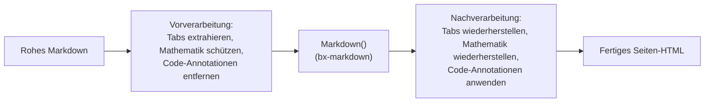
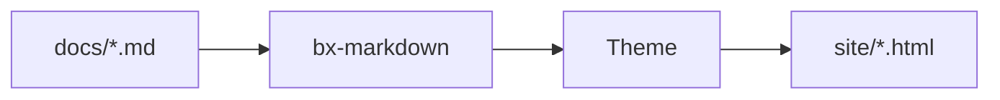

# Markdown-Erweiterungen

Über Standard-Markdown hinaus aktiviert BX Docs standardmäßig drei der
nativen Flexmark-Erweiterungen von bx-markdown - Admonitions, Fußnoten und
Definitionslisten - sowie eine eigene Mermaid-Diagramm-Integration. Alle
vier sind über [die Schlüssel `markdown`/`mermaid` von `bxdocs.json`](../configuration.md#markdown)
konfigurierbar.

Zusätzlich implementiert BX Docs drei weitere eigene Erweiterungen, von
denen Flexmark überhaupt kein Konzept hat - Content-Tabs, Mathematik und
die Fenced-Code-Annotationen `hl_lines`/`linenums`/`title`. Da bx-docs den
Parser von bx-markdown nicht forken kann, arbeitet jede davon als
Vor-/Nachbearbeitungsdurchlauf rund um die normale Markdown-Konvertierung
- siehe die Abschnitte unten.



## Admonitions

Eine Callout-/Hinweisbox - standardmäßig aktiv, keine `bxdocs.json`-Konfiguration nötig:

```markdown
!!! note "Heads Up"
    This is an admonition. Its content is regular markdown - **bold**,
    `code`, [links](../index.md) and lists all work exactly as normal.
```

Was so gerendert wird:

!!! note "Zu beachten"
    Dies ist eine Admonition. Ihr Inhalt ist reguläres Markdown - **fett**,
    `code`, [Links](../index.md) und Listen funktionieren alle genau wie
    gewohnt.

Der Typ (oben `note`) bestimmt Icon/Farbe der Box, und wenn du kein
explizites `"Title"` angibst, wird stattdessen sein eigener großgeschriebener
Name verwendet. Viele gängige Synonyme lösen sich auf dieselben 12
kanonischen Typen auf, jeder mit eigener Akzentfarbe:

!!! note "note"
    Blau - auch der Fallback für jeden nicht in dieser Liste enthaltenen Typ.

!!! abstract "abstract / summary / tldr"
    Hellblau.

!!! info "info / todo"
    Cyan.

!!! tip "tip / hint / important"
    Türkis.

!!! success "success / check / done"
    Grün.

!!! faq "question / help / faq"
    Limette.

!!! warning "warning / caution / attention"
    Orange.

!!! fail "failure / fail / missing"
    Hellrot.

!!! danger "danger / error"
    Rot.

!!! bug "bug"
    Pink.

!!! example "example"
    Lila.

!!! quote "quote / cite"
    Grau.

Der Inhalt muss um 4 Leerzeichen (oder einen Tab) eingerückt bleiben; der
Block endet bei der ersten nicht eingerückten, nicht leeren Zeile. Leere
Zeilen sind *innerhalb* des Blocks kein Problem - sie beginnen einfach
einen neuen Absatz, genau wie überall sonst im Markdown.

### Einklappbare Admonitions

Stelle dem Typ `???` statt `!!!` voran, um den Block einklappbar zu
machen - `???` startet eingeklappt, `???+` startet ausgeklappt. So oder so
ist die Überschrift klickbar, um umzuschalten:

```markdown
??? tip "Click to expand"
    This starts collapsed.

???+ tip "Click to collapse"
    This starts open.
```

??? tip "Klicken zum Ausklappen"
    Dies startet eingeklappt.

???+ tip "Klicken zum Einklappen"
    Dies startet ausgeklappt.

Schalte Admonitions mit `{"markdown":{"enableAdmonition":false}}` ganz aus.

## Fußnoten

Verweise inline auf eine Fußnote mit `[^label]` und definiere ihren Text
irgendwo im Dokument mit `[^label]: text`:

```markdown
Here's a claim that needs backing up[^1].

[^1]: Here's the backup.
```

Hier ist eine Behauptung, die belegt werden muss[^1].

[^1]: Hier ist der Beleg.

Fußnoten-Definitionen werden gesammelt und als nummerierte Liste am Ende
der Seite gerendert, unabhängig davon, wo in der Quelle sie geschrieben
wurden. Standardmäßig aus - schalte es mit
`{"markdown":{"enableFootnotes":true}}` ein.

## Definitionslisten

Eine Begriffszeile, gefolgt von einer oder mehreren `:   `-Beschreibungszeilen,
wird zu einem `<dl>`:

```markdown
Term
:   Its definition.

Second term
:   First definition.
:   Second definition.
```

Begriff
:   Seine Definition.

Zweiter Begriff
:   Erste Definition.
:   Zweite Definition.

Standardmäßig aus - schalte es mit
`{"markdown":{"enableDefinitionLists":true}}` ein.

## Content-Tabs

Gruppiere alternative Inhalte - unterschiedliche Sprachen, unterschiedliche
Plattformen - hinter einer Reihe klickbarer Tabs mit `=== "Title"`,
eingerückt genauso wie der Inhalt einer Admonition (4 Leerzeichen oder ein
Tab):

```markdown
=== "Java"
    ```java
    System.out.println( "Hi" );
    ```

=== "BoxLang"
    ```bx
    println( "Hi" )
    ```
```

Was so gerendert wird:

=== "Java"
    ```java
    System.out.println( "Hi" );
    ```

=== "BoxLang"
    ```bx
    println( "Hi" )
    ```

Aufeinanderfolgende `=== "..."`-Blöcke (durch höchstens eine Leerzeile
getrennt) bilden eine einzige Tab-Gruppe; der Inhalt eines Tabs ist
vollständiges Markdown, also Code-Fences, Listen, Admonitions - alles, was
du auch sonst irgendwo schreiben würdest. Keine `bxdocs.json`-Konfiguration
nötig - immer aktiv.

## Codeblöcke

Fenced Codeblöcke werden clientseitig syntax-hervorgehoben
(highlight.js), keine Konfiguration nötig - die Sprachkennung nach dem
öffnenden ` ``` ` wählt die Grammatik, z. B. ` ```json `. Zusätzlich zu den
mitgelieferten Sprachen von highlight.js selbst registriert BX Docs eine
eigene, schlanke BoxLang-Grammatik unter `bx`/`boxlang`/`bxs`/`bxm`/`cfscript`:

```bx
class {

	numeric function add( required numeric a, required numeric b ) {
		var result = a + b
		var message = "The sum is #result#"
		return result
	}

}
```

### Zeilennummern, hervorgehobene Zeilen und Titel

Füge `linenums`, `hl_lines` und/oder `title` zum Info-String eines Fences
hinzu - jede Kombination, alle optional:

````markdown
```bx hl_lines="2" linenums="1" title="add.bx"
numeric function add( required numeric a, required numeric b ) {
	return a + b
}
```
````

Was so gerendert wird:

```bx hl_lines="2" linenums="1" title="add.bx"
numeric function add( required numeric a, required numeric b ) {
	return a + b
}
```

`linenums="N"` beginnt die Zählung im Gutter bei `N`; `hl_lines` nimmt
durch Leerzeichen getrennte Zeilennummern und/oder Bereiche (`"2 4-6"`)
entgegen, um sie hervorzuheben, gezählt vom Anfang des Blocks unabhängig
davon, wo `linenums` beginnt; `title` fügt eine kleine Titelleiste über
dem Block hinzu. Keine `bxdocs.json`-Konfiguration nötig - immer
verfügbar.

## Diagramme

Opt-in über den [`mermaid`](../configuration.md#mermaid)-Schlüssel von `bxdocs.json`:

```json
{ "mermaid": true }
```

Einmal aktiviert, wird jeder ` ```mermaid `-Fenced-Codeblock als
lebendiges [Mermaid](https://mermaid.js.org/)-Diagramm gerendert, statt
als Code-Listing:



Mermaid unterstützt Flowcharts, Sequenzdiagramme, Klassendiagramme,
Gantt-Diagramme und mehr - siehe
[Mermaids eigene Syntax-Referenz](https://mermaid.js.org/intro/syntax-reference.html)
für alles, was es zeichnen kann.

## Mathematik

Opt-in über den [`math`](../configuration.md#math)-Schlüssel von `bxdocs.json`:

```json
{ "math": true }
```

Einmal aktiviert, setzt [KaTeX](https://katex.org/) `$...$` für Inline-Mathematik
und `$$...$$` für einen zentrierten Block, beides direkt in den
Markdown-Inhalt geschrieben:

```markdown
Euler's identity, $e^{i\pi} + 1 = 0$, relates five constants in one line.

$$
\int_0^1 x^2 \, dx = \frac{1}{3}
$$
```

Eulers Identität, $e^{i\pi} + 1 = 0$, verbindet fünf Konstanten in einer
einzigen Zeile.

$$
\int_0^1 x^2 \, dx = \frac{1}{3}
$$

Ein `$`, dem unmittelbar Leerraum folgt oder vorausgeht, wird in Ruhe
gelassen (sodass "$5 and $10" nicht als Formel missverstanden wird) -
gesetzte Mathematik sitzt immer bündig an beiden Begrenzern.

## GitBook-artige Blöcke

Zusätzlich zu allem oben unterstützt BX Docs eine Familie von
GitBook-artigen Inhaltsblöcken - für sich genommen praktisch, und der
Grund, warum sich der Inhalt einer GitBook-Website unkompliziert migrieren
lässt: jeder dieser Blöcke bildet direkt auf einen gleichnamigen
GitBook-Block ab. Jeder verwendet dieselbe Container-Syntax
`::: name ... :::` (ein einzelnes `:::` in seiner eigenen Zeile schließt
den jeweils gerade offenen Block) - keine `bxdocs.json`-Konfiguration
nötig, immer verfügbar. Ein Block kann in einem anderen verschachtelt
sein (etwa ein Expandable mit einer Cards-Gruppe darin) - jeder wird
erneut nach weiteren Blöcken in seinem eigenen Inhalt durchsucht.

### Expandable

Ein einfacher einklappbarer Bereich - kein Callout-Icon/keine Farbe, im
Gegensatz zu einer einklappbaren Admonition (`???`, siehe
[Admonitions](#collapsible-admonitions)):

```markdown
::: expandable "Is this different from a collapsible admonition?"
Yes - this has no type/icon/color, just a plain expand/collapse section.
Add `open="true"` to start it expanded.
:::
```

::: expandable "Unterscheidet sich das von einer einklappbaren Admonition?"
Ja - dies hat kein Typ/Icon/Farbe, nur einen einfachen
Auf-/Zuklapp-Bereich. Füge `open="true"` hinzu, um ihn ausgeklappt zu
starten.
:::

### Cards

Ein Raster aus Link-Cards, jede ihr eigenes `::: card` innerhalb eines
`::: cards`-Wrappers - `title`, `icon`, `image` und `href` sind alle
optional (eine Card ohne `href` wird als schlichte, nicht klickbare Card
gerendert):

```markdown
::: cards
::: card title="Getting Started" icon="🚀" href="../getting-started.md"
Install, scaffold and build your first site.
:::
::: card title="Themes" icon="🎨" href="themes.md"
Customize a built-in theme or write your own.
:::
:::
```

::: cards
::: card title="Erste Schritte" icon="🚀" href="../getting-started.md"
Installiere, erstelle und baue deine erste Website.
:::
::: card title="Themes" icon="🎨" href="themes.md"
Passe ein integriertes Theme an oder schreibe dein eigenes.
:::
:::

### Columns

Ein nebeneinanderliegendes Layout - `::: column` akzeptiert ein optionales
`width` (eine reine CSS-Länge/-Prozentangabe, z. B. `"40%"`); Spalten ohne
explizite Breite teilen sich die Reihe gleichmäßig:

```markdown
::: columns
::: column width="60%"
The wider column.
:::
::: column
The narrower one.
:::
:::
```

::: columns
::: column width="60%"
Die breitere Spalte.
:::
::: column
Die schmalere.
:::
:::

### Stepper

Eine nummerierte, verbundene Abfolge von Schritten:

```markdown
::: stepper
::: step "Install"
`install-bx-module bx-docs`
:::
::: step "Scaffold"
`boxlang module:bxDocs new`
:::
:::
```

::: stepper
::: step "Installieren"
`install-bx-module bx-docs`
:::
::: step "Aufsetzen"
`boxlang module:bxDocs new`
:::
:::

### File

Eine Download-Card für ein PDF, ein Video oder ein beliebiges anderes
Projekt-Asset - `src` wird auf dieselbe Weise aufgelöst wie
`theme.logo`/die Frontmatter-`ogImage` (relativ zu `docs/assets/`):

```markdown
::: file src="assets/spec.pdf" title="API Specification"
:::
```

### Embed

Ein responsives iframe-Embed für einen erkannten Anbieter - derzeit
YouTube, Vimeo, CodePen, Spotify, Loom und Figma. Eine URL von woanders
fällt stattdessen auf eine schlichte "visit ↗"-Link-Card zurück, statt
auf ein iframe, das ohnehin nicht rendern würde (die meisten Websites
blockieren das Einbetten in Frames):

```markdown
::: embed url="https://www.youtube.com/watch?v=dQw4w9WgXcQ" title="A demo"
:::
```

### Page Link

Eine ausführliche Vorschau-Card, die zu einer anderen Seite verlinkt -
`href` folgt derselben dateirelativen Konvention wie ein gewöhnlicher
[Seiten-Link](#linking-between-pages). Anders als eine Card werden
Titel/Icon/Zusammenfassung automatisch aus der eigenen Frontmatter der
Zielseite gezogen, sodass sie synchron bleibt, wenn diese Seite umbenannt
wird oder sich ihre Zusammenfassung ändert:

```markdown
::: page-link href="../getting-started.md"
:::
```

::: page-link href="../getting-started.md"
:::

### Updates (Changelog)

Eine datierte, taggbare Changelog-Liste - `::: update` akzeptiert
`date="YYYY-MM-DD"` und optional durch Kommas getrennte `tags`:

```markdown
::: updates
::: update date="2026-01-15" tags="feature,fix"
Added dark mode and fixed a footer alignment bug.
:::
::: update date="2026-01-01"
Initial release.
:::
:::
```

::: updates
::: update date="2026-01-15" tags="feature,fix"
Dunkelmodus hinzugefügt und einen Ausrichtungsfehler in der Fußzeile behoben.
:::
::: update date="2026-01-01"
Erstveröffentlichung.
:::
:::

Eine Seite mit einem `::: updates`-Block erhält außerdem ihre eigene
`feed.xml` (RSS 2.0), die daneben geschrieben wird, sobald `baseURL` in
`bxdocs.json` eine vollständige URL ist - dieselbe Voraussetzung wie bei
`sitemap.xml` - sodass Leser genau den Changelog dieser einen Seite
abonnieren können.

### Wiederverwendbare Inhalte (Includes)

`::: include src="..."` fügt an dieser Stelle das rohe Markdown einer
anderen Datei ein - aufgelöst dateirelativ zum eigenen Verzeichnis der
*einbindenden* Seite, dieselbe Konvention wie ein gewöhnlicher Seiten-Link.
Anders als jeder Block oben wird daraus echter Seiteninhalt (Überschriften,
Absätze, seine eigenen verschachtelten Blöcke), nicht etwas, das in ein
Widget verpackt wird - nützlich für einen Warn-/Hinweistext, der sich über
mehrere Seiten wiederholt:

```markdown
::: include src="_shared/beta-notice.md"
```

Eine eingebundene Datei kann selbst eine weitere einbinden (eine
zirkuläre Kette wirft zur Build-Zeit `BxDocs.CircularInclude`, statt
endlos zu laufen).

### Bilder: Bildunterschriften, Ausrichtung und Rahmung {#images}

Eine Bildunterschrift, ein Rahmen oder eine Mehrbild-Galerie sind alle
einfach block-level HTML - das bx-markdown/Flexmark vollständig
unverändert durchreicht (CommonMarks eigene "HTML-Block"-Regel), sodass
dafür überhaupt keine bx-docs-spezifische Syntax nötig ist:

```markdown
<figure>
  
  <figcaption>A freshly built site</figcaption>
</figure>

<div data-with-frame="true">
  
</div>

<div class="bxdocs-gallery">
  
  
  
</div>
```

## Plugin-Erweiterungen

Admonitions, Fußnoten und Definitionslisten decken die gängigen Fälle ab,
aber bx-markdown selbst hat über diese drei hinaus keine eigene Meinung -
jede andere Flexmark-Erweiterung kann direkt mit
`markdownRegisterExtension()` registriert werden, unabhängig von BX Docs.
Details dazu in bx-markdowns eigenem Readme.
