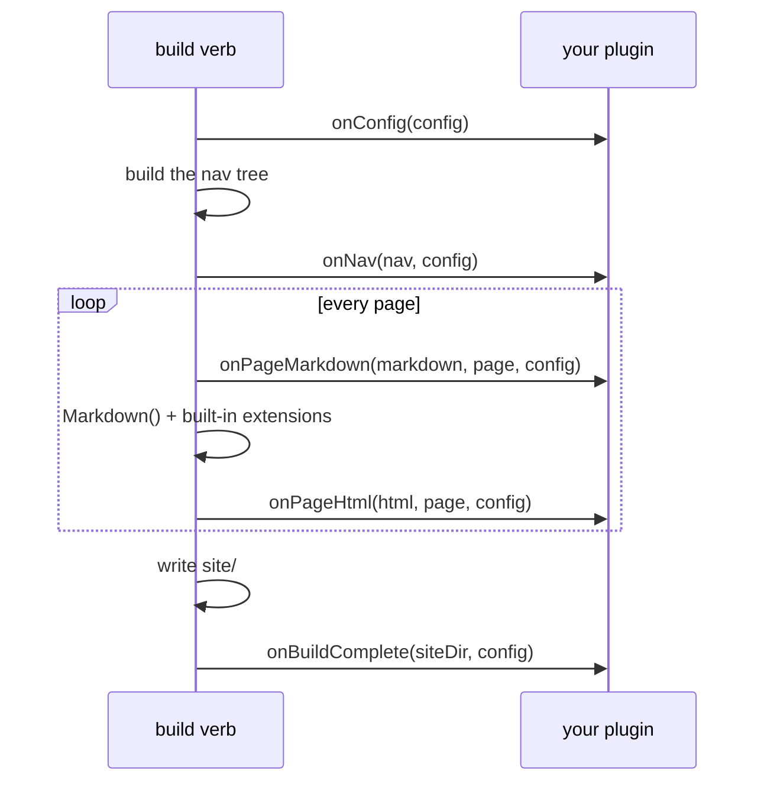

# Plugins

Ein BX-Sites-Plugin ist nichts weiter als ein weiteres BoxLang-Modul -
eine eigene `box.json` + `ModuleConfig.bx`, installiert als Geschwister
von `bx-sites` in derselben Laufzeitumgebung (`box install` ins Projekt,
genauso wie `bx-markdown`/`bx-esapi` bereits installiert sind). Keine
Plugin-API zum Importieren, keine separate Registry - BoxLangs eigenes
Modulsystem *ist* das Plugin-System.

Ein Modul allein zu installieren aktiviert es allerdings nie als Plugin -
ein Projekt bindet eines explizit über den BoxLang-Modulnamen im Array
[`plugins`](../configuration.md#plugins) von `bxsites.json` ein:

```json
{ "plugins": [ "myBxSitesPlugin" ] }
```

## Ein Plugin schreiben

Ein Plugin-Modul braucht genau eine Sache zusätzlich zu der üblichen
`box.json`/`ModuleConfig.bx`, die ein BoxLang-Modul bereits hat: eine
Klasse `models/BxSitesPlugin.bx`. Jede Methode darauf ist optional -
implementiere nur die Hooks, die du brauchst, BX Sites prüft vor jedem
Aufruf, ob sie existiert:

```bx
// models/BxSitesPlugin.bx
class {

	struct function onConfig( required struct config ) {
		// Mutate/return the site config, right after bxsites.json is loaded.
		return arguments.config
	}

	string function onPageMarkdown( required string markdown, required struct page, required struct config ) {
		// Mutate a page's raw markdown before conversion - the same
		// pre-processing seam BX Sites' own content tabs/math/code
		// annotations use internally (TabsProcessor.bx et al.).
		return arguments.markdown
	}

	string function onPageHtml( required string html, required struct page, required struct config ) {
		// Mutate a page's rendered HTML after conversion.
		return arguments.html
	}

	array function onNav( required array nav, required struct config ) {
		// Mutate the nav tree (NavBuilder.build()'s own shape: an array of
		// { title, url, order, children } nodes).
		return arguments.nav
	}

	void function onBuildComplete( required string siteDir, required struct config ) {
		// Fires once, after everything is written to siteDir - no return value.
	}

}
```

Hooks laufen in der Reihenfolge, in der sie im eigenen `plugins`-Array
von `bxsites.json` stehen, und (außer bei `onBuildComplete`) ersetzt der
Rückgabewert jedes Hooks das, was der nächste Hook (oder BX Sites selbst)
sieht - ein Plugin muss nur das zurückgeben, was es erhalten hat, wenn es
nichts zu ändern hat.

`onPageMarkdown`/`onPageHtml` laufen einmal pro Seite, für jeden Doc-Baum,
den BX Sites baut (den Haupt-`docs/`-Baum und jeden
`docs/versions/<name>/`-Baum). `onConfig`/`onNav`/`onBuildComplete`
werden, wo relevant, auch vom eigenständigen `search-index`-Verb
angewendet (`onConfig`, da es `markdown`/andere Einstellungen ändern
kann, von denen der Index-Build abhängt).

## Wann jeder Hook feuert



## Ein minimales Beispiel

`examples/hello-plugin/` in diesem Repo ist ein vollständiges,
funktionierendes Plugin-Modul - so, wie es ist, per `box install`
installierbar - das jeder Seite einen Kommentar
`<!-- rendered by hello-plugin -->` hinzufügt und nach Abschluss des
Builds eine Build-Zusammenfassungszeile an `site/hello-plugin.txt`
anhängt. Nutze es als Ausgangs-Skelett, oder lies es dir als
durchgearbeitetes Beispiel für den Ordneraufbau durch:

```
hello-plugin/
├── box.json              # boxlang.moduleName is what bxsites.json's [plugins] references
├── ModuleConfig.bx        # a normal, otherwise-empty BoxLang module descriptor
└── models/
    └── BxSitesPlugin.bx    # onPageHtml() + onBuildComplete()
```

## Fehler

- `BxSites.PluginNotFound` - ein Name im `plugins`-Array von
  `bxsites.json` ist kein installiertes/aktiviertes BoxLang-Modul.
- `BxSites.InvalidPlugin` - das Modul existiert, hat aber keine Klasse
  `models/BxSitesPlugin.bx`.
