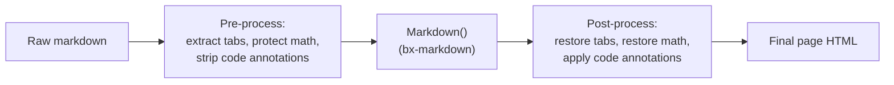
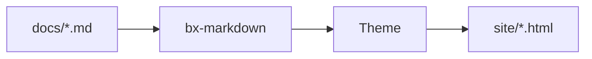

# Extensiones de Markdown

Más allá del Markdown estándar, BX Sites activa por defecto tres de las
extensiones nativas de Flexmark de bx-markdown - admoniciones, notas al
pie y listas de definiciones - más una integración de diagramas Mermaid
propia. Las cuatro son configurables mediante
[las claves `markdown`/`mermaid` de `bxsites.yaml`](../configuration.md#markdown).

Además de esas, BX Sites implementa tres extensiones propias más de las
que Flexmark no tiene ningún concepto en absoluto - pestañas de
contenido, matemáticas, y anotaciones de código con fence
`hl_lines`/`linenums`/`title`. Dado que bx-sites no puede bifurcar el
analizador de bx-markdown, cada una funciona como un paso de
preprocesamiento/postprocesamiento alrededor de la conversión de
markdown normal en su lugar - consulta las secciones de abajo.



## Admoniciones

Un cuadro de aviso/nota - activo por defecto, sin necesidad de
configuración en `bxsites.yaml`:

```markdown title="Example" linenums="1"
!!! note "Heads Up"
    This is an admonition. Its content is regular markdown - **bold**,
    `code`, [links](../index.md) and lists all work exactly as normal.
```

Lo que se renderiza como:

!!! note "Atención"
    Esto es una admonición. Su contenido es markdown normal - **negrita**,
    `code`, [enlaces](../index.md) y listas funcionan exactamente como
    de costumbre.

El tipo (`note` arriba) se convierte en el icono/color del cuadro y, si
no proporcionas un `"Title"` explícito, se usa su propio nombre en
mayúscula inicial en su lugar. Muchos sinónimos comunes se resuelven en
los mismos 12 tipos canónicos, cada uno con su propio color de acento:

!!! note "note"
    Azul - también el valor de reserva para cualquier tipo que no esté en esta lista.

!!! abstract "abstract / summary / tldr"
    Azul claro.

!!! info "info / todo"
    Cian.

!!! tip "tip / hint / important"
    Verde azulado.

!!! success "success / check / done"
    Verde.

!!! faq "question / help / faq"
    Lima.

!!! warning "warning / caution / attention"
    Naranja.

!!! fail "failure / fail / missing"
    Rojo claro.

!!! danger "danger / error"
    Rojo.

!!! bug "bug"
    Rosa.

!!! example "example"
    Morado.

!!! quote "quote / cite"
    Gris.

El cuerpo debe mantenerse sangrado 4 espacios (o un tabulador); el bloque
termina en la primera línea no sangrada y no vacía. Las líneas en blanco
están permitidas *dentro* del bloque - simplemente inician un nuevo
párrafo, igual que en cualquier otra parte de markdown.

### Admoniciones colapsables

Antepón `???` en lugar de `!!!` al tipo para hacer el bloque colapsable -
`???` empieza colapsado, `???+` empieza abierto. En cualquier caso, el
encabezado se puede pulsar para alternarlo:

```markdown title="Example" linenums="1"
??? tip "Click to expand"
    This starts collapsed.

???+ tip "Click to collapse"
    This starts open.
```

??? tip "Haz clic para expandir"
    Esto empieza colapsado.

???+ tip "Haz clic para colapsar"
    Esto empieza abierto.

Desactiva las admoniciones por completo con
`{"markdown":{"enableAdmonition":false}}`.

## Notas al pie

Haz referencia a una nota al pie en línea con `[^label]` y define su
texto en cualquier parte del documento con `[^label]: text`:

```markdown title="Example" linenums="1"
Here's a claim that needs backing up[^1].

[^1]: Here's the backup.
```

Aquí hay una afirmación que necesita respaldo[^1].

[^1]: Aquí está el respaldo.

Las definiciones de notas al pie se recopilan y renderizan como una lista
numerada al final de la página, sin importar en qué parte del origen
estén escritas. Desactivadas por defecto - actívalas con
`{"markdown":{"enableFootnotes":true}}`.

## Listas de Definiciones

Una línea de término seguida de una o más líneas de descripción `:   ` se
convierte en un `<dl>`:

```markdown title="Example" linenums="1"
Term
:   Its definition.

Second term
:   First definition.
:   Second definition.
```

Término
:   Su definición.

Segundo término
:   Primera definición.
:   Segunda definición.

Desactivadas por defecto - actívalas con
`{"markdown":{"enableDefinitionLists":true}}`.

## Pestañas de Contenido

Agrupa contenido alternativo - diferentes lenguajes, diferentes
plataformas - detrás de un conjunto de pestañas clicables con
`=== "Title"`, sangradas de la misma forma que el cuerpo de una
admonición (4 espacios o un tabulador):

```markdown title="Example" linenums="1"
=== "Java"
    ```java
    System.out.println( "Hi" );
    ```

=== "BoxLang"
    ```bx
    println( "Hi" )
    ```
```

Lo que se renderiza como:

=== "Java"
    ```java
    System.out.println( "Hi" );
    ```

=== "BoxLang"
    ```bx
    println( "Hi" )
    ```

Los bloques `=== "..."` consecutivos (separados por como máximo una línea
en blanco) forman un único grupo de pestañas; el contenido propio de una
pestaña es markdown completo, así que fences de código, listas,
admoniciones, lo que sea que escribirías en cualquier otra parte. Sin
necesidad de configuración en `bxsites.yaml` - siempre activo.

## Bloques de Código

Los bloques de código con fence se resaltan sintácticamente del lado del
cliente (highlight.js), sin necesidad de configuración - el identificador
de lenguaje después del ` ``` ` de apertura selecciona la gramática, por
ejemplo ` ```json `. Además de los propios lenguajes incluidos con
highlight.js, BX Sites registra su propia gramática ligera de BoxLang bajo
`bx`/`boxlang`/`bxs`/`bxm`/`cfscript`:

```bx
class {

	numeric function add( required numeric a, required numeric b ) {
		var result = a + b
		var message = "The sum is #result#"
		return result
	}

}
```

### Números de línea, líneas resaltadas y títulos

Añade `linenums`, `hl_lines` y/o `title` a la cadena de información de un
fence - cualquier combinación, todos opcionales:

````markdown
```bx hl_lines="2" linenums="1" title="add.bx"
numeric function add( required numeric a, required numeric b ) {
	return a + b
}
```
````

Lo que se renderiza como:

```bx hl_lines="2" linenums="1" title="add.bx"
numeric function add( required numeric a, required numeric b ) {
	return a + b
}
```

`linenums="N"` inicia el margen de numeración en `N`; `hl_lines` acepta
números de línea separados por espacios y/o rangos (`"2 4-6"`) para
resaltar, contados desde la parte superior del bloque
independientemente de dónde empiece `linenums`; `title` añade una
pequeña barra de título encima del bloque. Sin necesidad de configuración
en `bxsites.yaml` - siempre disponible.

### Marcadores de diff y marcos de terminal

Añade `insert`/`delete` para señalar líneas añadidas/eliminadas - los
mismos números de línea/rangos separados por espacios que `hl_lines` ya
usa - como una línea resaltada más un marcador de margen `+`/`–`:

````markdown
```bx title="add.bx" insert="3-4" delete="7"
numeric function add( required numeric a, required numeric b ) {
	var sum = a + b
	var total = a + b
	log.info( "computed sum", total )
	return sum
}
```
````

Lo que se renderiza como:

```bx title="add.bx" insert="3-4" delete="7"
numeric function add( required numeric a, required numeric b ) {
	var sum = a + b
	var total = a + b
	log.info( "computed sum", total )
	return sum
}
```

Escrito deliberadamente sin abreviar - no `ins`/`del` - y como atributos
en lugar de prefijos literales `+`/`-` en las líneas (como hacen algunas
herramientas), de modo que el contenido propio del fence permanezca
como código fuente real, sin modificar y copiable; no hay que eliminar
nada para el botón de copiar ya existente. `insert`/`delete` se
combinan bien con `linenums` - el marcador de margen se desplaza para
dejar libre la columna de numeración cuando ambos están activos.

Añade `frame="terminal"` para sustituir la barra de título simple por
una ventana de terminal al estilo macOS - tres puntos de estado, título
centrado:

````markdown
```bash frame="terminal" title="user@boxlang"
box install bx-sites
```
````

Lo que se renderiza como:

```bash frame="terminal" title="user@boxlang"
box install bx-sites
```

`frame="code"` es el nombre explícito de la barra simple de hoy - el
valor por defecto; nadie necesita escribirlo. Ni `insert`/`delete` ni
`frame` necesitan configuración en `bxsites.yaml`, igual que
`hl_lines`/`linenums`/`title`.

#### Diffs reales de git

Etiqueta un fence como `diff` y pega directamente la salida real de
`git diff`/`git show` - esto no es sintaxis específica de bx-sites en
absoluto, es simplemente la propia gramática `diff` de highlight.js
reconociendo por sí sola la sintaxis de diff unificado (líneas
`+`/`-`/`@@`):

````markdown
```diff
--- a/add.bx
+++ b/add.bx
@@ -1,4 +1,5 @@
 numeric function add( required numeric a, required numeric b ) {
-	var sum = a + b
-	return sum
+	var total = a + b
+	log.info( "computed", total )
+	return total
 }
```
````

Lo que se renderiza como:

```diff title="git diff"
--- a/add.bx
+++ b/add.bx
@@ -1,4 +1,5 @@
 numeric function add( required numeric a, required numeric b ) {
-	var sum = a + b
-	return sum
+	var total = a + b
+	log.info( "computed", total )
+	return total
 }
```

### Pruébalo en vivo (try.boxlang.io)

Etiqueta un fence como `tryboxlang` en lugar de un nombre de lenguaje y se
renderiza como un editor de [try.boxlang.io](https://try.boxlang.io)
incrustado en vivo, en lugar de un listado de código estático - los
lectores pueden ejecutar y experimentar con el ejemplo directamente en la
página, sin necesidad de configuración:

````markdown
```tryboxlang title="Closures"
user = { name: "Luis", getFullName: () => "Luis Majano" }
println( user.getFullName() )
```
````

Lo que se renderiza como:

```tryboxlang title="Closures"
user = { name: "Luis", getFullName: () => "Luis Majano" }
println( user.getFullName() )
```

Atributos opcionales, todos en la misma línea que `tryboxlang`:

| Atributo   | Por defecto | Descripción                                              |
| ---------- | ----------- | --------------------------------------------------------- |
| `title`    | ninguno     | Una pequeña barra de título encima de la incrustación      |
| `height`   | `450px`     | Cualquier longitud CSS (un número simple se trata como píxeles) |
| `readonly` | `false`     | `"true"` bloquea el editor en modo de solo lectura         |

El contenido propio del fence es el código fuente inicial de BoxLang - se
comprime y se pasa al editor de try.boxlang.io mediante su propio
parámetro de URL `code`, de la misma forma que ya funciona un enlace
"share" del propio try.boxlang.io, así que abrir el enlace "Open in
try.boxlang.io ↗" de la incrustación retoma exactamente donde empieza
esta.

## Diagramas

Opcional mediante la clave
[`mermaid`](../configuration.md#mermaid) de `bxsites.yaml`:

```yaml title="bxsites.yaml"
mermaid: true
```

Una vez activado, cualquier bloque de código con fence ` ```mermaid ` se
renderiza como un diagrama [Mermaid](https://mermaid.js.org/) en vivo en
lugar de un listado de código:



Mermaid admite diagramas de flujo, diagramas de secuencia, diagramas de
clases, diagramas de Gantt y más - consulta la
[propia referencia de sintaxis de Mermaid](https://mermaid.js.org/intro/syntax-reference.html)
para todo lo que puede dibujar.

## Matemáticas

Opcional mediante la clave [`math`](../configuration.md#math) de
`bxsites.yaml`:

```yaml title="bxsites.yaml"
math: true
```

Una vez activado, [KaTeX](https://katex.org/) compone `$...$` para
matemáticas en línea y `$$...$$` para un bloque centrado, ambos escritos
directamente en el cuerpo del markdown:

```markdown title="Example" linenums="1"
Euler's identity, $e^{i\pi} + 1 = 0$, relates five constants in one line.

$$
\int_0^1 x^2 \, dx = \frac{1}{3}
$$
```

La identidad de Euler, $e^{i\pi} + 1 = 0$, relaciona cinco constantes en
una sola línea.

$$
\int_0^1 x^2 \, dx = \frac{1}{3}
$$

Un `$` inmediatamente seguido o precedido de un espacio en blanco se deja
tal cual (para que "$5 y $10" no se interprete erróneamente como una
fórmula) - las matemáticas compuestas siempre se sitúan pegadas a ambos
delimitadores.

Consulta [Bloques de Contenido](content-blocks.md) para una familia de
bloques `::: name ... :::` al estilo GitBook por encima de todo lo
anterior - expandibles, tarjetas, columnas, un stepper, tarjetas de
archivo/incrustación/enlace de página, un bloque de registro de cambios,
y contenido reutilizable incluible.

Consulta [Imágenes Responsivas](images.md#leyendas-alineación-y-marcos)
para leyendas, alineación y marcos (HTML simple a nivel de bloque - sin
necesidad de ninguna sintaxis específica de bx-sites en absoluto).

## Extensiones de plugins

Las admoniciones, notas al pie y listas de definiciones cubren los casos
comunes, pero bx-markdown en sí mismo no tiene opinión más allá de esas
tres - cualquier otra extensión de Flexmark se puede registrar
directamente contra él con `markdownRegisterExtension()`, de forma
independiente a BX Sites. Consulta el propio readme de bx-markdown para
más detalles.
