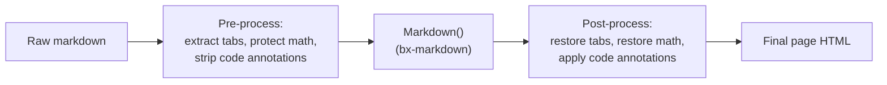
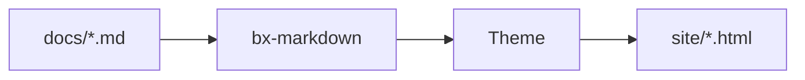

# Extensiones de Markdown

Más allá del Markdown estándar, BX Docs activa por defecto tres de las
extensiones nativas de Flexmark de bx-markdown - admoniciones, notas al
pie y listas de definiciones - más una integración de diagramas Mermaid
propia. Las cuatro son configurables mediante
[las claves `markdown`/`mermaid` de `bxdocs.json`](../configuration.md#markdown).

Además de esas, BX Docs implementa tres extensiones propias más de las
que Flexmark no tiene ningún concepto en absoluto - pestañas de
contenido, matemáticas, y anotaciones de código con fence
`hl_lines`/`linenums`/`title`. Dado que bx-docs no puede bifurcar el
analizador de bx-markdown, cada una funciona como un paso de
preprocesamiento/postprocesamiento alrededor de la conversión de
markdown normal en su lugar - consulta las secciones de abajo.



## Admoniciones

Un cuadro de aviso/nota - activo por defecto, sin necesidad de
configuración en `bxdocs.json`:

```markdown
!!! note "Heads Up"
    This is an admonition. Its content is regular markdown - **bold**,
    `code`, [links](../index.md) and lists all work exactly as normal.
```

Lo que se renderiza como:

!!! note "Atención"
    Esto es una admonición. Su contenido es markdown normal - **negrita**,
    `code`, [enlaces](../index.md) y listas funcionan exactamente como
    de costumbre.

El tipo (`note` arriba) se convierte en el icono/color del cuadro y, si
no proporcionas un `"Title"` explícito, se usa su propio nombre en
mayúscula inicial en su lugar. Muchos sinónimos comunes se resuelven en
los mismos 12 tipos canónicos, cada uno con su propio color de acento:

!!! note "note"
    Azul - también el valor de reserva para cualquier tipo que no esté en esta lista.

!!! abstract "abstract / summary / tldr"
    Azul claro.

!!! info "info / todo"
    Cian.

!!! tip "tip / hint / important"
    Verde azulado.

!!! success "success / check / done"
    Verde.

!!! faq "question / help / faq"
    Lima.

!!! warning "warning / caution / attention"
    Naranja.

!!! fail "failure / fail / missing"
    Rojo claro.

!!! danger "danger / error"
    Rojo.

!!! bug "bug"
    Rosa.

!!! example "example"
    Morado.

!!! quote "quote / cite"
    Gris.

El cuerpo debe mantenerse sangrado 4 espacios (o un tabulador); el bloque
termina en la primera línea no sangrada y no vacía. Las líneas en blanco
están permitidas *dentro* del bloque - simplemente inician un nuevo
párrafo, igual que en cualquier otra parte de markdown.

### Admoniciones colapsables

Antepón `???` en lugar de `!!!` al tipo para hacer el bloque colapsable -
`???` empieza colapsado, `???+` empieza abierto. En cualquier caso, el
encabezado se puede pulsar para alternarlo:

```markdown
??? tip "Click to expand"
    This starts collapsed.

???+ tip "Click to collapse"
    This starts open.
```

??? tip "Haz clic para expandir"
    Esto empieza colapsado.

???+ tip "Haz clic para colapsar"
    Esto empieza abierto.

Desactiva las admoniciones por completo con
`{"markdown":{"enableAdmonition":false}}`.

## Notas al pie

Haz referencia a una nota al pie en línea con `[^label]` y define su
texto en cualquier parte del documento con `[^label]: text`:

```markdown
Here's a claim that needs backing up[^1].

[^1]: Here's the backup.
```

Aquí hay una afirmación que necesita respaldo[^1].

[^1]: Aquí está el respaldo.

Las definiciones de notas al pie se recopilan y renderizan como una lista
numerada al final de la página, sin importar en qué parte del origen
estén escritas. Desactivadas por defecto - actívalas con
`{"markdown":{"enableFootnotes":true}}`.

## Listas de Definiciones

Una línea de término seguida de una o más líneas de descripción `:   ` se
convierte en un `<dl>`:

```markdown
Term
:   Its definition.

Second term
:   First definition.
:   Second definition.
```

Término
:   Su definición.

Segundo término
:   Primera definición.
:   Segunda definición.

Desactivadas por defecto - actívalas con
`{"markdown":{"enableDefinitionLists":true}}`.

## Pestañas de Contenido

Agrupa contenido alternativo - diferentes lenguajes, diferentes
plataformas - detrás de un conjunto de pestañas clicables con
`=== "Title"`, sangradas de la misma forma que el cuerpo de una
admonición (4 espacios o un tabulador):

```markdown
=== "Java"
    ```java
    System.out.println( "Hi" );
    ```

=== "BoxLang"
    ```bx
    println( "Hi" )
    ```
```

Lo que se renderiza como:

=== "Java"
    ```java
    System.out.println( "Hi" );
    ```

=== "BoxLang"
    ```bx
    println( "Hi" )
    ```

Los bloques `=== "..."` consecutivos (separados por como máximo una línea
en blanco) forman un único grupo de pestañas; el contenido propio de una
pestaña es markdown completo, así que fences de código, listas,
admoniciones, lo que sea que escribirías en cualquier otra parte. Sin
necesidad de configuración en `bxdocs.json` - siempre activo.

## Bloques de Código

Los bloques de código con fence se resaltan sintácticamente del lado del
cliente (highlight.js), sin necesidad de configuración - el identificador
de lenguaje después del ` ``` ` de apertura selecciona la gramática, por
ejemplo ` ```json `. Además de los propios lenguajes incluidos con
highlight.js, BX Docs registra su propia gramática ligera de BoxLang bajo
`bx`/`boxlang`/`bxs`/`bxm`/`cfscript`:

```bx
class {

	numeric function add( required numeric a, required numeric b ) {
		var result = a + b
		var message = "The sum is #result#"
		return result
	}

}
```

### Números de línea, líneas resaltadas y títulos

Añade `linenums`, `hl_lines` y/o `title` a la cadena de información de un
fence - cualquier combinación, todos opcionales:

````markdown
```bx hl_lines="2" linenums="1" title="add.bx"
numeric function add( required numeric a, required numeric b ) {
	return a + b
}
```
````

Lo que se renderiza como:

```bx hl_lines="2" linenums="1" title="add.bx"
numeric function add( required numeric a, required numeric b ) {
	return a + b
}
```

`linenums="N"` inicia el margen de numeración en `N`; `hl_lines` acepta
números de línea separados por espacios y/o rangos (`"2 4-6"`) para
resaltar, contados desde la parte superior del bloque
independientemente de dónde empiece `linenums`; `title` añade una
pequeña barra de título encima del bloque. Sin necesidad de configuración
en `bxdocs.json` - siempre disponible.

## Diagramas

Opcional mediante la clave
[`mermaid`](../configuration.md#mermaid) de `bxdocs.json`:

```json
{ "mermaid": true }
```

Una vez activado, cualquier bloque de código con fence ` ```mermaid ` se
renderiza como un diagrama [Mermaid](https://mermaid.js.org/) en vivo en
lugar de un listado de código:



Mermaid admite diagramas de flujo, diagramas de secuencia, diagramas de
clases, diagramas de Gantt y más - consulta la
[propia referencia de sintaxis de Mermaid](https://mermaid.js.org/intro/syntax-reference.html)
para todo lo que puede dibujar.

## Matemáticas

Opcional mediante la clave [`math`](../configuration.md#math) de
`bxdocs.json`:

```json
{ "math": true }
```

Una vez activado, [KaTeX](https://katex.org/) compone `$...$` para
matemáticas en línea y `$$...$$` para un bloque centrado, ambos escritos
directamente en el cuerpo del markdown:

```markdown
Euler's identity, $e^{i\pi} + 1 = 0$, relates five constants in one line.

$$
\int_0^1 x^2 \, dx = \frac{1}{3}
$$
```

La identidad de Euler, $e^{i\pi} + 1 = 0$, relaciona cinco constantes en
una sola línea.

$$
\int_0^1 x^2 \, dx = \frac{1}{3}
$$

Un `$` inmediatamente seguido o precedido de un espacio en blanco se deja
tal cual (para que "$5 y $10" no se interprete erróneamente como una
fórmula) - las matemáticas compuestas siempre se sitúan pegadas a ambos
delimitadores.

## Bloques al estilo GitBook

Además de todo lo anterior, BX Docs admite una familia de bloques de
contenido al estilo GitBook - útiles por sí mismos, y la razón por la que
el contenido de un sitio de GitBook es sencillo de migrar: cada uno de
estos se corresponde directamente con un bloque de GitBook del mismo
nombre. Cada uno usa la misma sintaxis de contenedor `::: name ... :::`
(un `:::` solo en su propia línea cierra el bloque que esté abierto en
ese momento) - sin necesidad de configuración en `bxdocs.json`, siempre
disponible. Un bloque puede anidarse dentro de otro (un expandible que
contiene un grupo de tarjetas, por ejemplo) - cada uno se vuelve a
analizar en busca de más bloques dentro de su propio contenido.

### Expandible

Una sección colapsable simple - sin icono/color de aviso, a diferencia de
una admonición colapsable (`???`, consulta
[Admoniciones](#collapsible-admonitions)):

```markdown
::: expandable "Is this different from a collapsible admonition?"
Yes - this has no type/icon/color, just a plain expand/collapse section.
Add `open="true"` to start it expanded.
:::
```

::: expandable "¿Es esto diferente de una admonición colapsable?"
Sí - esto no tiene tipo/icono/color, solo una sección simple de
expandir/colapsar. Añade `open="true"` para que empiece expandida.
:::

### Tarjetas

Una cuadrícula de tarjetas de enlace, cada una su propia `::: card`
dentro de un envoltorio `::: cards` - `title`, `icon`, `image` y `href`
son todos opcionales (una tarjeta sin `href` se renderiza como una
tarjeta simple, no clicable):

```markdown
::: cards
::: card title="Getting Started" icon="🚀" href="../getting-started.md"
Install, scaffold and build your first site.
:::
::: card title="Themes" icon="🎨" href="themes.md"
Customize a built-in theme or write your own.
:::
:::
```

::: cards
::: card title="Primeros Pasos" icon="🚀" href="../getting-started.md"
Instala, crea la estructura y construye tu primer sitio.
:::
::: card title="Temas" icon="🎨" href="themes.md"
Personaliza un tema incorporado o escribe el tuyo propio.
:::
:::

### Columnas

Un diseño lado a lado - `::: column` acepta un `width` opcional (una
longitud/porcentaje CSS simple, por ejemplo `"40%"`); las columnas sin un
ancho explícito comparten la fila equitativamente:

```markdown
::: columns
::: column width="60%"
The wider column.
:::
::: column
The narrower one.
:::
:::
```

::: columns
::: column width="60%"
La columna más ancha.
:::
::: column
La más estrecha.
:::
:::

### Stepper (secuencia de pasos)

Una secuencia numerada y conectada de pasos:

```markdown
::: stepper
::: step "Install"
`install-bx-module bx-docs`
:::
::: step "Scaffold"
`boxlang module:bxDocs new`
:::
:::
```

::: stepper
::: step "Instalar"
`install-bx-module bx-docs`
:::
::: step "Crear estructura"
`boxlang module:bxDocs new`
:::
:::

### Archivo

Una tarjeta de descarga para un PDF, video, o cualquier otro recurso del
proyecto - `src` se resuelve de la misma forma que ya lo hacen
`theme.logo`/el `ogImage` del frontmatter (relativo a `docs/assets/`):

```markdown
::: file src="assets/spec.pdf" title="API Specification"
:::
```

### Incrustación

Una incrustación de iframe responsiva para un proveedor reconocido -
actualmente YouTube, Vimeo, CodePen, Spotify, Loom y Figma. Una URL de
cualquier otro lugar recurre a una simple tarjeta de enlace "visit ↗" en
lugar de un iframe que simplemente se negaría a renderizarse (la mayoría
de los sitios bloquean ser incrustados en un frame):

```markdown
::: embed url="https://www.youtube.com/watch?v=dQw4w9WgXcQ" title="A demo"
:::
```

### Enlace de página

Una tarjeta de vista previa enriquecida que enlaza a otra página - `href`
sigue la misma convención relativa a archivos que un
[enlace de página](#linking-between-pages) ordinario. A diferencia de una
tarjeta, su título/icono/resumen se extraen automáticamente del propio
frontmatter de la página de destino, así que se mantiene sincronizado si
esa página se renombra o cambia su resumen:

```markdown
::: page-link href="../getting-started.md"
:::
```

::: page-link href="../getting-started.md"
:::

### Novedades (registro de cambios)

Una lista de registro de cambios con fecha y etiquetable - `::: update`
acepta `date="YYYY-MM-DD"` y unas `tags` opcionales separadas por comas:

```markdown
::: updates
::: update date="2026-01-15" tags="feature,fix"
Added dark mode and fixed a footer alignment bug.
:::
::: update date="2026-01-01"
Initial release.
:::
:::
```

::: updates
::: update date="2026-01-15" tags="feature,fix"
Se añadió el modo oscuro y se corrigió un error de alineación en el pie de página.
:::
::: update date="2026-01-01"
Lanzamiento inicial.
:::
:::

Una página con un bloque `::: updates` también obtiene su propio
`feed.xml` (RSS 2.0) escrito junto a ella en cuanto `baseURL` de
`bxdocs.json` es una URL completa - el mismo requisito que
`sitemap.xml` - de modo que los lectores puedan suscribirse solo al
registro de cambios de esa página.

### Contenido reutilizable (inclusiones)

`::: include src="..."` empalma el Markdown en bruto de otro archivo en
ese punto - resuelto relativo al archivo, respecto a la propia carpeta de
la página *que incluye*, la misma convención que un enlace de página
ordinario. A diferencia de todos los bloques anteriores, esto se
convierte en contenido de página real (encabezados, párrafos, sus propios
bloques anidados), no algo envuelto en un widget - útil para una
advertencia/aviso repetido en varias páginas:

```markdown
::: include src="_shared/beta-notice.md"
```

Un archivo incluido puede a su vez incluir otro (una cadena circular
lanza `BxDocs.CircularInclude` en el momento de la construcción en lugar
de entrar en un bucle infinito).

### Imágenes: leyendas, alineación y marcos {#images}

Una leyenda, un marco, o una galería de varias imágenes son todos
simplemente HTML a nivel de bloque - que bx-markdown/Flexmark deja pasar
completamente intacto (la propia regla de "bloque HTML" de CommonMark),
así que no se necesita ninguna sintaxis específica de bx-docs en
absoluto:

```markdown
<figure>
  
  <figcaption>A freshly built site</figcaption>
</figure>

<div data-with-frame="true">
  
</div>

<div class="bxdocs-gallery">
  
  
  
</div>
```

## Extensiones de plugins

Las admoniciones, notas al pie y listas de definiciones cubren los casos
comunes, pero bx-markdown en sí mismo no tiene opinión más allá de esas
tres - cualquier otra extensión de Flexmark se puede registrar
directamente contra él con `markdownRegisterExtension()`, de forma
independiente a BX Docs. Consulta el propio readme de bx-markdown para
más detalles.
