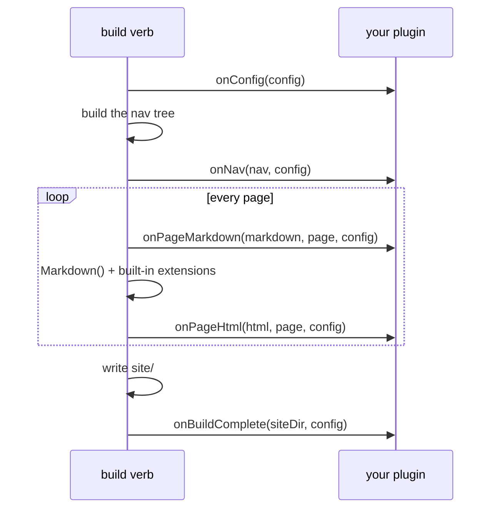

# Plugins

Un plugin de BX Sites no es más que otro módulo de BoxLang - su propio
`box.json` + `ModuleConfig.bx`, instalado como hermano de `bx-sites` en el
mismo runtime (`box install` en el proyecto, de la misma forma que ya lo
están `bx-markdown`/`bx-esapi`). Sin API de plugins que importar, sin
registro separado - el propio sistema de módulos de BoxLang *es* el
sistema de plugins.

Sin embargo, instalar un módulo por sí solo nunca lo activa como plugin -
un proyecto lo habilita explícitamente por nombre de módulo de BoxLang,
mediante el array [`plugins`](../configuration.md#plugins) de
`bxsites.json`:

```json
{ "plugins": [ "myBxSitesPlugin" ] }
```

## Instalar un plugin publicado

Un plugin publicado en ForgeBox se instala sin nada más que el propio
binario `bxSites` - no hace falta `box`/CommandBox:

```bash title="Uso"
bxSites install:plugin --name=bx-sites-plugin-analytics [--version=1.2.0]
```

Esto descarga el zip del paquete desde ForgeBox y lo extrae en
`boxlang_modules/bx-sites-plugin-analytics/` en la raíz del proyecto - la
propia convención de módulos locales autocargados de BoxLang (cualquier
carpeta de módulo ahí se detecta de la misma forma en que npm detecta un
`node_modules/` local al proyecto), de modo que queda activo en el
registro de módulos de BoxLang en ejecución sin necesidad de
`BOXLANG_HOME` ni de ningún paso de instalación global. `install:plugin`
lo carga en el runtime de inmediato e imprime de vuelta el nombre real de
mapeo del módulo registrado (que, según la nota de abajo, no siempre
coincide con el slug de ForgeBox) - añade *ese* nombre al array `plugins`
de `bxsites.json` para activarlo, igual que con cualquier otro módulo
instalado. Consulta
[`install:plugin`](../cli-reference.md#installplugin) en la referencia de
la CLI.

## Escribir un plugin

Un módulo de plugin necesita exactamente una cosa más allá del habitual
`box.json`/`ModuleConfig.bx` que ya tiene cualquier módulo de BoxLang:
una clase `models/BxSitesPlugin.bx`. Cada método en ella es opcional -
implementa solo los hooks que necesites, BX Sites verifica cada uno antes
de llamarlo:

```bx
// models/BxSitesPlugin.bx
class {

	struct function onConfig( required struct config ) {
		// Mutate/return the site config, right after bxsites.json is loaded.
		return arguments.config
	}

	string function onPageMarkdown( required string markdown, required struct page, required struct config ) {
		// Mutate a page's raw markdown before conversion - the same
		// pre-processing seam BX Sites' own content tabs/math/code
		// annotations use internally (TabsProcessor.bx et al.).
		return arguments.markdown
	}

	string function onPageHtml( required string html, required struct page, required struct config ) {
		// Mutate a page's rendered HTML after conversion.
		return arguments.html
	}

	array function onNav( required array nav, required struct config ) {
		// Mutate the nav tree (NavBuilder.build()'s own shape: an array of
		// { title, url, order, children } nodes).
		return arguments.nav
	}

	void function onBuildComplete( required string siteDir, required struct config ) {
		// Fires once, after everything is written to siteDir - no return value.
	}

}
```

Los hooks se ejecutan en el orden propio del array `plugins` de
`bxsites.json`, y (excepto `onBuildComplete`) el valor de retorno de cada
uno reemplaza el valor que ve el siguiente hook (o el propio BX Sites) -
un plugin solo necesita devolver lo que recibió si no tiene nada que
cambiar.

`onPageMarkdown`/`onPageHtml` se ejecutan una vez por página, para cada
árbol de documentos que construye BX Sites (el árbol `docs/` principal y
cada árbol `docs/versions/<name>/`). `onConfig`/`onNav`/`onBuildComplete`
también se aplican mediante el verbo independiente `search-index` donde
sea relevante (`onConfig`, ya que puede cambiar `markdown`/otras
configuraciones de las que depende la construcción del índice).

## Cuándo se dispara cada hook



## Un ejemplo mínimo

`examples/hello-plugin/` en este repositorio es un módulo de plugin
completo y funcional - instalable con `box install` tal cual - que añade
un comentario `<!-- rendered by hello-plugin -->` a cada página y agrega
una línea de resumen de construcción a `site/hello-plugin.txt` en cuanto
finaliza la construcción. Úsalo como esqueleto de partida, o léelo como
un ejemplo trabajado de la estructura de carpetas:

```
hello-plugin/
├── box.json              # boxlang.moduleName is what bxsites.json's [plugins] references
├── ModuleConfig.bx        # a normal, otherwise-empty BoxLang module descriptor
└── models/
    └── BxSitesPlugin.bx    # onPageHtml() + onBuildComplete()
```

## Errores

- `BxSites.PluginNotFound` - un nombre en el array `plugins` de
  `bxsites.json` no es un módulo de BoxLang instalado/activado.
- `BxSites.InvalidPlugin` - el módulo existe, pero no tiene una clase
  `models/BxSitesPlugin.bx`.
