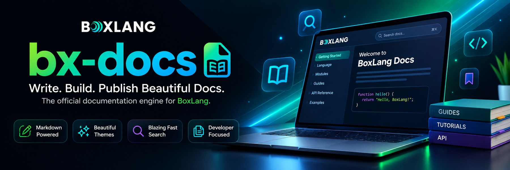

	
	

		<a class="bxsites-hero__btn bxsites-hero__btn--primary" href="getting-started.md">Comenzar</a>
		<a class="bxsites-hero__btn bxsites-hero__btn--secondary" href="https://github.com/ortus-boxlang/bx-sites">⭐ Danos una estrella en GitHub</a>
	

Este mismo sitio está construido con BxSites, a partir de los archivos
Markdown en la propia carpeta `docs/` de este repositorio.

BxSites no es solo para documentación de referencia - es un
**generador de sitios estáticos** de propósito general. Un sitio de
marketing, un blog, una base de conocimiento, un sitio de producto, un sitio
personal: todo lo que puedas escribir en Markdown se construye de la misma
forma, a través de los mismos temas, búsqueda e i18n.

::: cards
::: card title="Markdown como entrada, HTML estático como salida" icon="phosphor-duotone:file-html"
Apúntalo a una carpeta `docs/` y genera un sitio completo en `site/` - sin
necesidad de servidor para alojarlo.
:::
::: card title="La estructura de carpetas es la estructura de navegación" icon="phosphor-duotone:tree-structure"
Anida carpetas y archivos bajo `docs/` y la navegación se construye sola,
en el orden que definas mediante el frontmatter.
:::
::: card title="Diez temas incorporados" icon="phosphor-duotone:palette" href="guides/themes.md"
Una galería completa - `bootstrap`, `material`, `tailwind` y siete más
inspirados en Docsy, Stripe, Docusaurus, Just the Docs, VuePress, GitBook y
Notion - todos sobrescribibles con tu propio tema.
:::
::: card title="Búsqueda estática del lado del cliente" icon="phosphor-duotone:magnifying-glass" href="guides/search.md"
Un cuadro de búsqueda impulsado por MiniSearch (coincidencia difusa, búsqueda por prefijo), más una paleta de comandos
Cmd/Ctrl+K, conectado a un índice de búsqueda generado en el momento de
`build` - sin dependencia de servidor.
:::
::: card title="Un blog, listo de fábrica" icon="lucide:newspaper" href="guides/blog.md"
Coloca entradas bajo `docs/blog/posts/` y obtén autores, categorías,
archivos anuales, feeds RSS e imágenes destacadas por entrada - sin
configuración necesaria.
:::
::: card title="Rápido y sin conexión por defecto" icon="phosphor-duotone:wifi-slash" href="guides/themes.md#sitios-sin-conexión-a-internet-air-gapped"
Empaquetado de CSS/JS con huella digital e imágenes responsivas listos de
fábrica, además de Bootstrap, highlight.js, Alpine.js, MiniSearch y (opcional)
Mermaid, todos incluidos localmente - un sitio construido no necesita
ninguna solicitud saliente por defecto.
:::
::: card title="Un sistema de plugins real" icon="phosphor-duotone:puzzle-piece" href="guides/plugins.md"
Un plugin es simplemente otro módulo de BoxLang instalado - no hay una API
de plugins separada que aprender.
:::
::: card title="Plugins y temas, publicados en ForgeBox" icon="phosphor-duotone:package" href="guides/plugins.md#instalar-un-plugin-publicado"
`install:plugin` e `install:theme` descargan un paquete publicado
directamente a tu proyecto - explora `bxsites-plugins` y `bxsites-themes`
en ForgeBox.
:::
::: card title="Importa un tema existente" icon="phosphor-duotone:arrows-left-right" href="guides/theme-import.md"
`theme:import --source=mkdocs|jekyll|hugo` convierte las propias plantillas
de tema de otro generador en un scaffold de bx-sites sobre el que construir,
en lugar de empezar desde cero.
:::
::: card title="Migra desde GitBook, mkdocs, un zip o Notion" icon="phosphor-duotone:swap" href="guides/index.md"
`bxSites migrate --from=gitbook|mkdocs|markdown-zip|notion` convierte una
exportación o proyecto existente en un proyecto bx-sites funcional con un
solo comando.
:::
::: card title="Despliégalo donde quieras" icon="phosphor-duotone:cloud-arrow-up" href="guides/deployment.md"
`bxSites deploy` envía el sitio construido directamente a S3, Azure, GCS,
Firebase, FTP/SFTP, rsync, Netlify, Vercel, Cloudflare Pages o GitHub
Pages - o `bxSites package` lo empaqueta en un único archivo.
:::
::: card title="Variables reutilizables y funciones mágicas" icon="phosphor-duotone:function" href="guides/variables-and-functions.md"
`{{ dotted.path }}` toma valores del propio bloque `variables` de
`bxsites.yaml`; `{{ $name(args) }}` llama a un pequeño ayudante de
BoxLang directamente desde Markdown - sin plugin, sin cableado alguno.
:::
::: card title="Bloques de contenido enriquecido" icon="phosphor-duotone:squares-four" href="guides/content-blocks.md"
Tablas, botones, prompts, expandibles, pestañas y especificaciones
OpenAPI incrustadas - una biblioteca de bloques al estilo GitBook sobre
Markdown puro.
:::
:::

## Míralo, no solo leas sobre ello

El propio conjunto de herramientas Markdown de BxSites, en acción aquí
mismo en la página de inicio - no es una captura de pantalla, es lo real:

::: stepper
::: step "Instalar"
`install-bx-module bx-sites`
:::
::: step "Crear estructura"
`bxSites new`
:::
::: step "Construir y servir"
`bxSites serve`
:::
:::

::: columns
::: column
!!! tip "Callouts para cada ocasión"
    Doce tipos de admonición canónicos - `note`, `tip`, `warning`, `danger`
    y más - cada uno con su propio color de acento, además de una variante
    colapsable `???`. Consulta
    [Extensiones de Markdown](guides/markdown.md#admoniciones).
:::
::: column
!!! faq "Pestañas de contenido, matemáticas, diagramas"
    Pestañas de código agrupadas, matemáticas con KaTeX, diagramas Mermaid,
    notas al pie y listas de definiciones, todo incluido de fábrica -
    consulta [Extensiones de Markdown](guides/markdown.md).
:::
:::

## A dónde ir a continuación

::: cards
::: card title="Primeros Pasos" icon="phosphor-duotone:rocket-launch" href="getting-started.md"
Instala, crea un proyecto, constrúyelo y sírvelo.
:::
::: card title="Referencia de la CLI" icon="phosphor-duotone:terminal-window" href="cli-reference.md"
Todos los verbos y sus opciones.
:::
::: card title="Configuración" icon="phosphor-duotone:gear-six" href="configuration.md"
La referencia completa de `bxsites.yaml`.
:::
::: card title="Extensiones de Markdown" icon="phosphor-duotone:markdown-logo" href="guides/markdown.md"
Admoniciones, pestañas, tarjetas, callouts, matemáticas y diagramas
Mermaid.
:::
::: card title="Blog" icon="lucide:newspaper" href="guides/blog.md"
Entradas, autores, categorías, archivos, RSS, borradores y una página de
estadísticas.
:::
::: card title="Imágenes Responsivas y Pipeline de Recursos" icon="phosphor-duotone:image" href="guides/images.md"
Redimensionado automático de imágenes/WebP, y empaquetado de CSS/JS con
huella digital.
:::
::: card title="Despliegue" icon="phosphor-duotone:cloud-arrow-up" href="guides/deployment.md"
`deploy`/`package`, y el flujo de trabajo de GitHub Actions incorporado.
:::
::: card title="Lanzamientos" icon="phosphor-duotone:tag" href="releases/index.md"
Política de versionado y novedades de cada lanzamiento.
:::
:::

## ¿Necesitas ayuda para construir tu sitio?

BxSites es libre y de código abierto - pero si prefieres que el equipo
que lo construye haga el trabajo, [Ortus Solutions](https://www.ortussolutions.com)
ofrece servicios profesionales y consultoría para sitios de documentación,
migraciones y cualquier otro sitio estático construido con BxSites.

	<a class="bxsites-hero__btn bxsites-hero__btn--primary" href="mailto:consulting@ortussolutions.com">Escribe a consulting@ortussolutions.com</a>
	<a class="bxsites-hero__btn bxsites-hero__btn--secondary" href="services.md">Consultoría y Servicios Profesionales</a>

