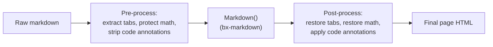
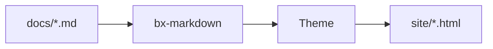

# Markdown Extensions

Beyond standard Markdown, BX Docs turns on three of bx-markdown's native
Flexmark extensions by default - admonitions, footnotes and definition lists
- plus a Mermaid diagram integration of its own. All four are configurable
via [`bxdocs.json`'s `markdown`/`mermaid` keys](../configuration.md#markdown).

On top of those, BX Docs implements three more extensions of its own that
Flexmark has no concept of at all - content tabs, math, and fenced-code
`hl_lines`/`linenums`/`title` annotations. Since bx-docs can't fork
bx-markdown's parser, each one works as a pre/post-processing pass around
the normal markdown conversion instead - see the sections below.



## Admonitions

A callout/note box - on by default, no `bxdocs.json` config needed:

```markdown
!!! note "Heads Up"
    This is an admonition. Its content is regular markdown - **bold**,
    `code`, [links](../index.md) and lists all work exactly as normal.
```

Which renders as:

!!! note "Heads Up"
    This is an admonition. Its content is regular markdown - **bold**,
    `code`, [links](../index.md) and lists all work exactly as normal.

The type (`note` above) becomes the box's icon/color and, if you don't give
an explicit `"Title"`, its own capitalized name is used instead. Many
common synonyms resolve to the same 12 canonical types, each with its own
accent color:

!!! note "note"
    Blue - also the fallback for any type not in this list.

!!! abstract "abstract / summary / tldr"
    Light blue.

!!! info "info / todo"
    Cyan.

!!! tip "tip / hint / important"
    Teal.

!!! success "success / check / done"
    Green.

!!! faq "question / help / faq"
    Lime.

!!! warning "warning / caution / attention"
    Orange.

!!! fail "failure / fail / missing"
    Light red.

!!! danger "danger / error"
    Red.

!!! bug "bug"
    Pink.

!!! example "example"
    Purple.

!!! quote "quote / cite"
    Gray.

The body must stay indented by 4 spaces (or a tab); the block ends at the
first non-indented, non-blank line. Blank lines are fine *inside* the block
- they just start a new paragraph, same as anywhere else in markdown.

### Collapsible admonitions

Prefix the type with `???` instead of `!!!` to make the block collapsible -
`???` starts collapsed, `???+` starts open. Either way the heading is
clickable to toggle it:

```markdown
??? tip "Click to expand"
    This starts collapsed.

???+ tip "Click to collapse"
    This starts open.
```

??? tip "Click to expand"
    This starts collapsed.

???+ tip "Click to collapse"
    This starts open.

Turn admonitions off entirely with `{"markdown":{"enableAdmonition":false}}`.

## Footnotes

Reference a footnote inline with `[^label]` and define its text anywhere in
the document with `[^label]: text`:

```markdown
Here's a claim that needs backing up[^1].

[^1]: Here's the backup.
```

Here's a claim that needs backing up[^1].

[^1]: Here's the backup.

Footnote definitions are collected and rendered as a numbered list at the
bottom of the page regardless of where in the source they're written. Off by
default - turn it on with `{"markdown":{"enableFootnotes":true}}`.

## Definition Lists

A term line followed by one or more `:   ` description lines becomes a
`<dl>`:

```markdown
Term
:   Its definition.

Second term
:   First definition.
:   Second definition.
```

Term
:   Its definition.

Second term
:   First definition.
:   Second definition.

Off by default - turn it on with `{"markdown":{"enableDefinitionLists":true}}`.

## Content Tabs

Group alternative content - different languages, different platforms -
behind a set of clickable tabs with `=== "Title"`, indented the same way an
admonition body is (4 spaces or a tab):

```markdown
=== "Java"
    ```java
    System.out.println( "Hi" );
    ```

=== "BoxLang"
    ```bx
    println( "Hi" )
    ```
```

Which renders as:

=== "Java"
    ```java
    System.out.println( "Hi" );
    ```

=== "BoxLang"
    ```bx
    println( "Hi" )
    ```

Consecutive `=== "..."` blocks (separated by at most one blank line) form a
single tab group; a tab's own content is full markdown, so code fences,
lists, admonitions, whatever you'd write anywhere else. No `bxdocs.json`
config needed - always on.

## Code Blocks

Fenced code blocks are syntax-highlighted client-side (highlight.js), no
config needed - the language identifier after the opening ` ``` ` selects
the grammar, e.g. ` ```json `. On top of highlight.js's own bundled
languages, BX Docs registers its own lightweight BoxLang grammar under
`bx`/`boxlang`/`bxs`/`bxm`/`cfscript`:

```bx
class {

	numeric function add( required numeric a, required numeric b ) {
		var result = a + b
		var message = "The sum is #result#"
		return result
	}

}
```

### Line numbers, highlighted lines, and titles

Add `linenums`, `hl_lines` and/or `title` to a fence's info string - any
combination, all optional:

````markdown
```bx hl_lines="2" linenums="1" title="add.bx"
numeric function add( required numeric a, required numeric b ) {
	return a + b
}
```
````

Which renders as:

```bx hl_lines="2" linenums="1" title="add.bx"
numeric function add( required numeric a, required numeric b ) {
	return a + b
}
```

`linenums="N"` starts the gutter counting at `N`; `hl_lines` takes
space-separated line numbers and/or ranges (`"2 4-6"`) to highlight, counted
from the top of the block regardless of where `linenums` starts; `title`
adds a small title bar above the block. No `bxdocs.json` config needed -
always available.

### Try it live (try.boxlang.io)

Tag a fence `tryboxlang` instead of a language name and it renders as a
live, embedded [try.boxlang.io](https://try.boxlang.io) editor instead of a
static code listing - readers can run and tinker with the example right on
the page, no config needed:

````markdown
```tryboxlang title="Closures"
user = { name: "Luis", getFullName: () => "Luis Majano" }
println( user.getFullName() )
```
````

Which renders as:

```tryboxlang title="Closures"
user = { name: "Luis", getFullName: () => "Luis Majano" }
println( user.getFullName() )
```

Optional attributes, all on the same line as `tryboxlang`:

| Attribute  | Default | Description                                             |
| ---------- | ------- | -------------------------------------------------------- |
| `title`    | none    | A small title bar above the embed                        |
| `height`   | `450px` | Any CSS length (a bare number is treated as pixels)       |
| `readonly` | `false` | `"true"` locks the editor to read-only                   |

The fence's own content is the starting BoxLang source - it's compressed
and passed to try.boxlang.io's editor via its own `code` URL parameter, the
same way a "share" link from try.boxlang.io itself works, so opening the
embed's "Open in try.boxlang.io ↗" link picks up right where the embed
starts.

## Diagrams

Opt-in via `bxdocs.json`'s [`mermaid`](../configuration.md#mermaid) key:

```json
{ "mermaid": true }
```

Once enabled, any ` ```mermaid ` fenced code block renders as a live
[Mermaid](https://mermaid.js.org/) diagram instead of a code listing:



Mermaid supports flowcharts, sequence diagrams, class diagrams, Gantt
charts and more - see [Mermaid's own syntax reference](https://mermaid.js.org/intro/syntax-reference.html)
for everything it can draw.

## Math

Opt-in via `bxdocs.json`'s [`math`](../configuration.md#math) key:

```json
{ "math": true }
```

Once enabled, [KaTeX](https://katex.org/) typesets `$...$` for inline math
and `$$...$$` for a centered block, both written straight into the markdown
body:

```markdown
Euler's identity, $e^{i\pi} + 1 = 0$, relates five constants in one line.

$$
\int_0^1 x^2 \, dx = \frac{1}{3}
$$
```

Euler's identity, $e^{i\pi} + 1 = 0$, relates five constants in one line.

$$
\int_0^1 x^2 \, dx = \frac{1}{3}
$$

A `$` immediately followed or preceded by whitespace is left alone (so
"$5 and $10" isn't misread as a formula) - typeset math always sits flush
against both delimiters.

## GitBook-style blocks

On top of everything above, BX Docs supports a family of GitBook-style
content blocks - handy on its own, and the reason a GitBook site's content
is straightforward to migrate: each of these maps directly to a GitBook
block of the same name. Every one uses the same `::: name ... :::`
container syntax (a bare `:::` on its own line closes whichever block is
currently open) - no `bxdocs.json` config needed, always available. A
block can nest inside another (an expandable containing a cards group,
for instance) - each is scanned again for further blocks inside its own
content.

### Expandable

A plain collapsible section - no callout icon/color, unlike a collapsible
admonition (`???`, see [Admonitions](#collapsible-admonitions)):

```markdown
::: expandable "Is this different from a collapsible admonition?"
Yes - this has no type/icon/color, just a plain expand/collapse section.
Add `open="true"` to start it expanded.
:::
```

::: expandable "Is this different from a collapsible admonition?"
Yes - this has no type/icon/color, just a plain expand/collapse section.
Add `open="true"` to start it expanded.
:::

### Cards

A grid of link cards, each its own `::: card` inside a `::: cards`
wrapper - `title`, `icon`, `image` and `href` are all optional (a card
with no `href` renders as a plain, non-clickable card). `icon` is resolved
the same way frontmatter/nav `icon` values are - a plain emoji, or a named
icon from a bundled library (`icon="phosphor-duotone:rocket-launch"`,
`icon="lucide:rocket"`, ...) - see [Themes: Icons](themes.md#icons):

```markdown
::: cards
::: card title="Getting Started" icon="phosphor-duotone:rocket-launch" href="../getting-started.md"
Install, scaffold and build your first site.
:::
::: card title="Themes" icon="phosphor-duotone:palette" href="themes.md"
Customize a built-in theme or write your own.
:::
:::
```

::: cards
::: card title="Getting Started" icon="phosphor-duotone:rocket-launch" href="../getting-started.md"
Install, scaffold and build your first site.
:::
::: card title="Themes" icon="phosphor-duotone:palette" href="themes.md"
Customize a built-in theme or write your own.
:::
:::

### Columns

A side-by-side layout - `::: column` accepts an optional `width` (a plain
CSS length/percentage, e.g. `"40%"`); columns with no explicit width
share the row equally:

```markdown
::: columns
::: column width="60%"
The wider column.
:::
::: column
The narrower one.
:::
:::
```

::: columns
::: column width="60%"
The wider column.
:::
::: column
The narrower one.
:::
:::

### Stepper

A numbered, connected sequence of steps:

```markdown
::: stepper
::: step "Install"
`install-bx-module bx-docs`
:::
::: step "Scaffold"
`boxlang module:bxDocs new`
:::
:::
```

::: stepper
::: step "Install"
`install-bx-module bx-docs`
:::
::: step "Scaffold"
`boxlang module:bxDocs new`
:::
:::

A step's own optional `color` attribute flags its marker with one of four
semantic colors - the default (no `color`), `success`, `warning` or
`danger` - independent of the step's position in the sequence:

```markdown
::: stepper
::: step "Back up your data" color="success"
Routine, safe to run any time.
:::
::: step "Optional: enable telemetry" color="warning"
Skip this one if you're not sure.
:::
::: step "Delete the old install" color="danger"
Irreversible - make sure the backup above finished first.
:::
:::
```

::: stepper
::: step "Back up your data" color="success"
Routine, safe to run any time.
:::
::: step "Optional: enable telemetry" color="warning"
Skip this one if you're not sure.
:::
::: step "Delete the old install" color="danger"
Irreversible - make sure the backup above finished first.
:::
:::

The numbered marker, connecting line, and each of the three `color`
palettes above are themeable independently of the rest of the site's
palette, via CSS custom properties - see [Customizing colors](themes.md#customizing-colors-without-a-theme-override).

### File

A download card for a PDF, video, or any other project asset - `src` is
resolved the same way `theme.logo`/frontmatter `ogImage` already are
(relative to `docs/assets/`):

```markdown
::: file src="assets/spec.pdf" title="API Specification"
:::
```

### Embed

A responsive iframe embed for a recognized provider - currently YouTube,
Vimeo, CodePen, Spotify, Loom and Figma. A URL from anywhere else falls
back to a plain "visit ↗" link card instead of an iframe that would just
refuse to render (most sites block being framed):

```markdown
::: embed url="https://www.youtube.com/watch?v=dQw4w9WgXcQ" title="A demo"
:::
```

### Page link

A rich preview card linking to another page - `href` follows the same
file-relative convention as an ordinary [page link](#linking-between-pages).
Unlike a card, its title/icon/summary are pulled automatically from the
target page's own frontmatter, so it stays in sync if that page is
renamed or its summary changes:

```markdown
::: page-link href="../getting-started.md"
:::
```

::: page-link href="../getting-started.md"
:::

### Updates (changelog)

A dated, taggable changelog list - `::: update` accepts `date="YYYY-MM-DD"`
and an optional comma-separated `tags`:

```markdown
::: updates
::: update date="2026-01-15" tags="feature,fix"
Added dark mode and fixed a footer alignment bug.
:::
::: update date="2026-01-01"
Initial release.
:::
:::
```

A page with an `::: updates` block also gets its own `feed.xml` (RSS 2.0)
written alongside it once `bxdocs.json`'s `baseURL` is a full URL - same
requirement as `sitemap.xml` - so readers can subscribe to just that
page's changelog.

### Reusable content (includes)

`::: include src="..."` splices another file's raw Markdown in at that
point - resolved file-relative to the *including* page's own directory,
same convention as an ordinary page link. Unlike every block above, this
becomes real page content (headings, paragraphs, its own nested blocks),
not something wrapped in a widget - useful for a warning/notice repeated
across several pages:

```markdown
::: include src="_shared/beta-notice.md"
```

An included file can itself include another (a circular chain throws
`BxDocs.CircularInclude` at build time rather than looping forever).

### Images: captions, alignment and framing {#images}

A caption, a frame, or a multi-image gallery are all just block-level
HTML - which bx-markdown/Flexmark passes through completely untouched
(CommonMark's own "HTML block" rule), so no bx-docs-specific syntax is
needed at all:

```markdown
<figure>
  
  <figcaption>A freshly built site</figcaption>
</figure>

<div data-with-frame="true">
  
</div>

<div class="bxdocs-gallery">
  
  
  
</div>
```

## Plugin extensions

Admonitions, footnotes and definition lists cover the common cases, but
bx-markdown itself has no opinion beyond those three - any other Flexmark
extension can be registered directly against it with `markdownRegisterExtension()`,
independent of BX Docs. See bx-markdown's own readme for details.
