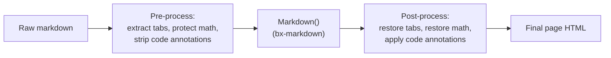
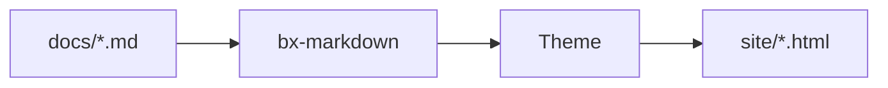

# Markdown Extensions

Beyond standard Markdown, BxSites turns on three of bx-markdown's native
Flexmark extensions by default - admonitions, footnotes and definition lists
- plus a Mermaid diagram integration of its own. All four are configurable
via [`bxsites.yaml`'s `markdown`/`mermaid` keys](../configuration.md#markdown).

On top of those, BxSites implements three more extensions of its own that
Flexmark has no concept of at all - content tabs, math, and fenced-code
`hl_lines`/`linenums`/`title` annotations. Since bx-sites can't fork
bx-markdown's parser, each one works as a pre/post-processing pass around
the normal markdown conversion instead - see the sections below.



## Admonitions

A callout/note box - on by default, no `bxsites.yaml` config needed:

```markdown title="Example" linenums="1"
!!! note "Heads Up"
    This is an admonition. Its content is regular markdown - **bold**,
    `code`, [links](../index.md) and lists all work exactly as normal.
```

Which renders as:

!!! note "Heads Up"
    This is an admonition. Its content is regular markdown - **bold**,
    `code`, [links](../index.md) and lists all work exactly as normal.

The type (`note` above) becomes the box's icon/color and, if you don't give
an explicit `"Title"`, its own capitalized name is used instead. Many
common synonyms resolve to the same 12 canonical types, each with its own
accent color:

!!! note "note"
    Blue - also the fallback for any type not in this list.

!!! abstract "abstract / summary / tldr"
    Light blue.

!!! info "info / todo"
    Cyan.

!!! tip "tip / hint / important"
    Teal.

!!! success "success / check / done"
    Green.

!!! faq "question / help / faq"
    Lime.

!!! warning "warning / caution / attention"
    Orange.

!!! fail "failure / fail / missing"
    Light red.

!!! danger "danger / error"
    Red.

!!! bug "bug"
    Pink.

!!! example "example"
    Purple.

!!! quote "quote / cite"
    Gray.

The body must stay indented by 4 spaces (or a tab); the block ends at the
first non-indented, non-blank line. Blank lines are fine *inside* the block
- they just start a new paragraph, same as anywhere else in markdown.

### Collapsible admonitions

Prefix the type with `???` instead of `!!!` to make the block collapsible -
`???` starts collapsed, `???+` starts open. Either way the heading is
clickable to toggle it:

```markdown title="Example" linenums="1"
??? tip "Click to expand"
    This starts collapsed.

???+ tip "Click to collapse"
    This starts open.
```

??? tip "Click to expand"
    This starts collapsed.

???+ tip "Click to collapse"
    This starts open.

Turn admonitions off entirely with `{"markdown":{"enableAdmonition":false}}`.

## Footnotes

Reference a footnote inline with `[^label]` and define its text anywhere in
the document with `[^label]: text`:

```markdown title="Example" linenums="1"
Here's a claim that needs backing up[^1].

[^1]: Here's the backup.
```

Here's a claim that needs backing up[^1].

[^1]: Here's the backup.

Footnote definitions are collected and rendered as a numbered list at the
bottom of the page regardless of where in the source they're written. Off by
default - turn it on with `{"markdown":{"enableFootnotes":true}}`.

## Definition Lists

A term line followed by one or more `:   ` description lines becomes a
`<dl>`:

```markdown title="Example" linenums="1"
Term
:   Its definition.

Second term
:   First definition.
:   Second definition.
```

Term
:   Its definition.

Second term
:   First definition.
:   Second definition.

Off by default - turn it on with `{"markdown":{"enableDefinitionLists":true}}`.

## Content Tabs

Group alternative content - different languages, different platforms -
behind a set of clickable tabs with `=== "Title"`, indented the same way an
admonition body is (4 spaces or a tab):

```markdown title="Example" linenums="1"
=== "Java"
    ```java
    System.out.println( "Hi" );
    ```

=== "BoxLang"
    ```bx
    println( "Hi" )
    ```
```

Which renders as:

=== "Java"
    ```java
    System.out.println( "Hi" );
    ```

=== "BoxLang"
    ```bx
    println( "Hi" )
    ```

Consecutive `=== "..."` blocks (separated by at most one blank line) form a
single tab group; a tab's own content is full markdown, so code fences,
lists, admonitions, whatever you'd write anywhere else. No `bxsites.yaml`
config needed - always on.

## Code Blocks

Fenced code blocks are syntax-highlighted client-side (highlight.js), no
config needed - the language identifier after the opening ` ``` ` selects
the grammar, e.g. ` ```json `. On top of highlight.js's own bundled
languages, BxSites registers its own lightweight BoxLang grammar under
`bx`/`boxlang`/`bxs`/`bxm`/`cfscript`:

```bx
class {

	numeric function add( required numeric a, required numeric b ) {
		var result = a + b
		var message = "The sum is #result#"
		return result
	}

}
```

### Line numbers, highlighted lines, and titles

Add `linenums`, `hl_lines` and/or `title` to a fence's info string - any
combination, all optional:

````markdown
```bx hl_lines="2" linenums="1" title="add.bx"
numeric function add( required numeric a, required numeric b ) {
	return a + b
}
```
````

Which renders as:

```bx hl_lines="2" linenums="1" title="add.bx"
numeric function add( required numeric a, required numeric b ) {
	return a + b
}
```

`linenums="N"` starts the gutter counting at `N`; `hl_lines` takes
space-separated line numbers and/or ranges (`"2 4-6"`) to highlight, counted
from the top of the block regardless of where `linenums` starts; `title`
adds a small title bar above the block. No `bxsites.yaml` config needed -
always available.

### Diff markers and terminal frames

Add `insert`/`delete` to call out added/removed lines - the same
space-separated line numbers/ranges `hl_lines` already takes - as a tinted
row plus a `+`/`–` gutter marker:

````markdown
```bx title="add.bx" insert="3-4" delete="7"
numeric function add( required numeric a, required numeric b ) {
	var sum = a + b
	var total = a + b
	log.info( "computed sum", total )
	return sum
}
```
````

Which renders as:

```bx title="add.bx" insert="3-4" delete="7"
numeric function add( required numeric a, required numeric b ) {
	var sum = a + b
	var total = a + b
	log.info( "computed sum", total )
	return sum
}
```

Spelled out in full on purpose - not abbreviated to `ins`/`del` - and kept
as attributes rather than literal `+`/`-` line prefixes the way some tools
do it, so the fence's own content stays real, unmodified, copy-pasteable
source; the existing copy button needs nothing stripped out of it.
`insert`/`delete` stack cleanly with `linenums` - the gutter marker shifts
over to clear the line-number column when both are on.

Add `frame="terminal"` to swap the plain title bar for a macOS-style
terminal window - three status dots, centered title - instead:

````markdown
```bash frame="terminal" title="user@boxlang"
box install bx-sites
```
````

Which renders as:

```bash frame="terminal" title="user@boxlang"
box install bx-sites
```

`frame="code"` is the explicit name for today's plain bar - the default;
nothing needs to write it. Both `insert`/`delete` and `frame` need no
`bxsites.yaml` config, same as `hl_lines`/`linenums`/`title`.

#### Real git diffs

Tag a fence `diff` and paste real `git diff`/`git show` output straight in
- this isn't bx-sites-specific syntax at all, just highlight.js's own `diff`
grammar recognizing unified-diff syntax (`+`/`-`/`@@` lines) on its own:

````markdown
```diff
--- a/add.bx
+++ b/add.bx
@@ -1,4 +1,5 @@
 numeric function add( required numeric a, required numeric b ) {
-	var sum = a + b
-	return sum
+	var total = a + b
+	log.info( "computed", total )
+	return total
 }
```
````

Which renders as:

```diff title="git diff"
--- a/add.bx
+++ b/add.bx
@@ -1,4 +1,5 @@
 numeric function add( required numeric a, required numeric b ) {
-	var sum = a + b
-	return sum
+	var total = a + b
+	log.info( "computed", total )
+	return total
 }
```

### Try it live (try.boxlang.io)

Tag a fence `tryboxlang` instead of a language name and it renders as a
live, embedded [try.boxlang.io](https://try.boxlang.io) editor instead of a
static code listing - readers can run and tinker with the example right on
the page, no config needed:

````markdown
```tryboxlang title="Closures"
user = { name: "Luis", getFullName: () => "Luis Majano" }
println( user.getFullName() )
```
````

Which renders as:

```tryboxlang title="Closures"
user = { name: "Luis", getFullName: () => "Luis Majano" }
println( user.getFullName() )
```

Optional attributes, all on the same line as `tryboxlang`:

| Attribute  | Default | Description                                             |
| ---------- | ------- | -------------------------------------------------------- |
| `title`    | none    | A small title bar above the embed                        |
| `height`   | `450px` | Any CSS length (a bare number is treated as pixels)       |
| `readonly` | `false` | `"true"` locks the editor to read-only                   |

The fence's own content is the starting BoxLang source - it's compressed
and passed to try.boxlang.io's editor via its own `code` URL parameter, the
same way a "share" link from try.boxlang.io itself works, so opening the
embed's "Open in try.boxlang.io ↗" link picks up right where the embed
starts.

## Diagrams

Opt-in via `bxsites.yaml`'s [`mermaid`](../configuration.md#mermaid) key:

```yaml title="bxsites.yaml"
mermaid: true
```

Once enabled, any ` ```mermaid ` fenced code block renders as a live
[Mermaid](https://mermaid.js.org/) diagram instead of a code listing:



Mermaid supports flowcharts, sequence diagrams, class diagrams, Gantt
charts and more - see [Mermaid's own syntax reference](https://mermaid.js.org/intro/syntax-reference.html)
for everything it can draw.

## Math

Opt-in via `bxsites.yaml`'s [`math`](../configuration.md#math) key:

```yaml title="bxsites.yaml"
math: true
```

Once enabled, [KaTeX](https://katex.org/) typesets `$...$` for inline math
and `$$...$$` for a centered block, both written straight into the markdown
body:

```markdown title="Example" linenums="1"
Euler's identity, $e^{i\pi} + 1 = 0$, relates five constants in one line.

$$
\int_0^1 x^2 \, dx = \frac{1}{3}
$$
```

Euler's identity, $e^{i\pi} + 1 = 0$, relates five constants in one line.

$$
\int_0^1 x^2 \, dx = \frac{1}{3}
$$

A `$` immediately followed or preceded by whitespace is left alone (so
"$5 and $10" isn't misread as a formula) - typeset math always sits flush
against both delimiters.

See [Tables](tables.md) for GFM pipe tables - alignment, escaping, and
the automatic responsive-scroll/sticky-header treatment every table gets.

See [Content Blocks](content-blocks.md) for a family of GitBook-style
`::: name ... :::` blocks on top of everything above - expandables,
cards, columns, a stepper, file/embed/page-link cards, a changelog
block, and reusable content includes.

See [Responsive Images](images.md#captions-alignment-and-framing) for
captions, alignment and framing (plain block-level HTML - no
bx-sites-specific syntax needed at all).

## Plugin extensions

Admonitions, footnotes and definition lists cover the common cases, but
bx-markdown itself has no opinion beyond those three - any other Flexmark
extension can be registered directly against it with `markdownRegisterExtension()`,
independent of BxSites. See bx-markdown's own readme for details.
