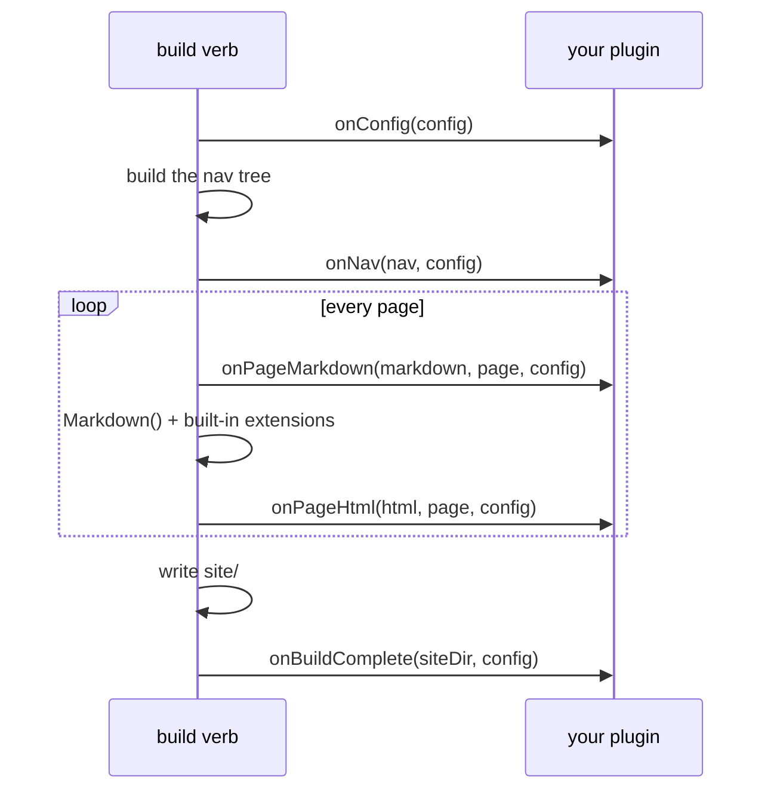

# Plugins

A BxSites plugin is nothing more than another BoxLang module - its own
`box.json` + `ModuleConfig.bx`, installed as a sibling of `bx-sites` in the
same runtime (`box install` into the project, the same way `bx-markdown`/
`bx-esapi` already are). No plugin API to import, no separate registry -
BoxLang's own module system *is* the plugin system.

Installing a module alone never activates it as a plugin, though - a
project opts one in explicitly by BoxLang module name, via `bxsites.yaml`'s
[`plugins`](../configuration.md#plugins) array:

=== "YAML"
    ```yaml title="bxsites.yaml"
    plugins: [ myBxSitesPlugin ]
    ```

=== "JSON"
    ```json title="bxsites.json"
    { "plugins": ["myBxSitesPlugin"] }
    ```

## Installing a published plugin

A plugin published to ForgeBox installs with nothing but the `bxSites`
binary itself - no `box`/CommandBox needed. Browse what's already published
under the [`bxsites-plugins`](https://www.forgebox.io/type/bxsites-plugins)
category on ForgeBox:

```bash title="Usage"
bxSites install:plugin --name=bx-sites-plugin-analytics [--version=1.2.0]
```

This downloads the package's zip from ForgeBox and extracts it into
`boxlang_modules/bx-sites-plugin-analytics/` at the project root -
BoxLang's own auto-loaded local-module convention (any module folder
there is picked up the same way a project-local `node_modules/` is for
npm), so it's active in the running BoxLang module registry with no
`BOXLANG_HOME`/global install step at all. `install:plugin` loads it into
the runtime immediately and prints back its real registered module
mapping name (which, per the note below, isn't always the same as the
ForgeBox slug) - add *that* name to `bxsites.yaml`'s `plugins` array to
activate it, same as any other installed module. See
[`install:plugin`](../cli-reference.md#installplugin) in the CLI reference.

## Writing a plugin

A plugin module needs exactly one thing beyond the usual `box.json`/
`ModuleConfig.bx` a BoxLang module already has: a `models/BxSitesPlugin.bx`
class. Every method on it is optional - implement only the hooks you need,
BxSites checks for each one before calling it:

```bx title="models/BxSitesPlugin.bx" linenums="1"
// models/BxSitesPlugin.bx
class {

	struct function onConfig( required struct config ) {
		// Mutate/return the site config, right after bxsites.yaml is loaded.
		return arguments.config
	}

	string function onPageMarkdown( required string markdown, required struct page, required struct config ) {
		// Mutate a page's raw markdown before conversion - the same
		// pre-processing seam BxSites' own content tabs/math/code
		// annotations use internally (TabsProcessor.bx et al.).
		return arguments.markdown
	}

	string function onPageHtml( required string html, required struct page, required struct config ) {
		// Mutate a page's rendered HTML after conversion.
		return arguments.html
	}

	array function onNav( required array nav, required struct config ) {
		// Mutate the nav tree (NavBuilder.build()'s own shape: an array of
		// { title, url, order, children } nodes).
		return arguments.nav
	}

	void function onBuildComplete( required string siteDir, required struct config ) {
		// Fires once, after everything is written to siteDir - no return value.
	}

}
```

Hooks run in `bxsites.yaml`'s own `plugins` array order, and (except
`onBuildComplete`) each one's return value replaces the value the next
hook (or BxSites itself) sees - a plugin only needs to return what it was
given if it has nothing to change.

`onPageMarkdown`/`onPageHtml` run once per page, for every doc tree BX
Docs builds (the main `docs/` tree and every `docs/versions/<name>/`
tree). `onConfig`/`onNav`/`onBuildComplete` are also applied by the
standalone `search-index` verb where relevant (`onConfig`, since it can
change `markdown`/other settings the index build depends on).

## When each hook fires



## A minimal example

`examples/hello-plugin/` in this repo is a complete, working plugin
module - `box install`-able as-is - that adds a `<!-- rendered by
hello-plugin -->` comment to every page and appends a build-summary line
to `site/hello-plugin.txt` once the build finishes. Use it as a starting
skeleton, or read it for a worked example of the folder layout:

```text title="hello-plugin/ layout"
hello-plugin/
├── box.json              # boxlang.moduleName is what bxsites.yaml's [plugins] references
├── ModuleConfig.bx        # a normal, otherwise-empty BoxLang module descriptor
└── models/
    └── BxSitesPlugin.bx    # onPageHtml() + onBuildComplete()
```

## Errors

- `BxSites.PluginNotFound` - a name in `bxsites.yaml`'s `plugins` array
  isn't an installed/activated BoxLang module.
- `BxSites.InvalidPlugin` - the module exists, but has no
  `models/BxSitesPlugin.bx` class.
