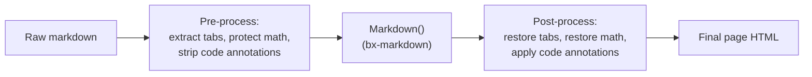
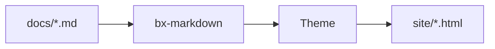

# Estensioni Markdown

Oltre al Markdown standard, BX Docs attiva di default tre estensioni
Flexmark native di bx-markdown - ammonizioni, note a piè di pagina e
liste di definizioni - più un'integrazione con i diagrammi Mermaid tutta
sua. Tutte e quattro sono configurabili tramite le
[chiavi `markdown`/`mermaid` di `bxdocs.json`](../configuration.md#markdown).

Oltre a queste, BX Docs implementa altre tre estensioni proprie di cui
Flexmark non ha alcun concetto - schede di contenuto, matematica, e
annotazioni `hl_lines`/`linenums`/`title` sui blocchi di codice
delimitati. Dato che bx-docs non può forkare il parser di bx-markdown,
ognuna di queste funziona come un passaggio di pre/post-elaborazione
intorno alla normale conversione del markdown - vedi le sezioni sotto.



## Ammonizioni

Un box di richiamo/nota - attivo di default, nessuna configurazione di
`bxdocs.json` necessaria:

```markdown
!!! note "Heads Up"
    This is an admonition. Its content is regular markdown - **bold**,
    `code`, [links](../index.md) and lists all work exactly as normal.
```

Che viene renderizzato così:

!!! note "Attenzione"
    Questa è un'ammonizione. Il suo contenuto è markdown normale -
    **grassetto**, `code`, [link](../index.md) e liste funzionano tutti
    esattamente come al solito.

Il tipo (`note` sopra) diventa l'icona/colore del box e, se non fornisci
un `"Title"` esplicito, viene usato invece il suo nome capitalizzato.
Molti sinonimi comuni si risolvono negli stessi 12 tipi canonici, ognuno
con il proprio colore d'accento:

!!! note "note"
    Blu - anche il ripiego per qualsiasi tipo non presente in questo elenco.

!!! abstract "abstract / summary / tldr"
    Azzurro chiaro.

!!! info "info / todo"
    Ciano.

!!! tip "tip / hint / important"
    Verde acqua.

!!! success "success / check / done"
    Verde.

!!! faq "question / help / faq"
    Verde lime.

!!! warning "warning / caution / attention"
    Arancione.

!!! fail "failure / fail / missing"
    Rosso chiaro.

!!! danger "danger / error"
    Rosso.

!!! bug "bug"
    Rosa.

!!! example "example"
    Viola.

!!! quote "quote / cite"
    Grigio.

Il corpo deve restare indentato di 4 spazi (o un tab); il blocco termina
alla prima riga non indentata e non vuota. Le righe vuote vanno bene
*dentro* il blocco - iniziano semplicemente un nuovo paragrafo, come
ovunque altrove nel markdown.

### Ammonizioni comprimibili

Anteponi al tipo `???` invece di `!!!` per rendere il blocco comprimibile
- `???` inizia compresso, `???+` inizia aperto. In entrambi i casi
l'intestazione è cliccabile per attivarlo/disattivarlo:

```markdown
??? tip "Click to expand"
    This starts collapsed.

???+ tip "Click to collapse"
    This starts open.
```

??? tip "Clicca per espandere"
    Questo inizia compresso.

???+ tip "Clicca per comprimere"
    Questo inizia aperto.

Disattiva del tutto le ammonizioni con `{"markdown":{"enableAdmonition":false}}`.

## Note a piè di pagina

Fai riferimento a una nota a piè di pagina in linea con `[^label]` e
definiscine il testo in qualsiasi punto del documento con
`[^label]: text`:

```markdown
Here's a claim that needs backing up[^1].

[^1]: Here's the backup.
```

Ecco un'affermazione che ha bisogno di una conferma[^1].

[^1]: Ecco la conferma.

Le definizioni delle note a piè di pagina vengono raccolte e renderizzate
come una lista numerata in fondo alla pagina, indipendentemente da dove
nel sorgente siano state scritte. Disattivate di default - attivale con
`{"markdown":{"enableFootnotes":true}}`.

## Liste di definizioni

Una riga di termine seguita da una o più righe di descrizione `:   `
diventa una `<dl>`:

```markdown
Term
:   Its definition.

Second term
:   First definition.
:   Second definition.
```

Termine
:   La sua definizione.

Secondo termine
:   Prima definizione.
:   Seconda definizione.

Disattivate di default - attivale con
`{"markdown":{"enableDefinitionLists":true}}`.

## Schede di contenuto

Raggruppa contenuti alternativi - linguaggi diversi, piattaforme diverse -
dietro un insieme di schede cliccabili con `=== "Title"`, indentate allo
stesso modo del corpo di un'ammonizione (4 spazi o un tab):

```markdown
=== "Java"
    ```java
    System.out.println( "Hi" );
    ```

=== "BoxLang"
    ```bx
    println( "Hi" )
    ```
```

Che viene renderizzato così:

=== "Java"
    ```java
    System.out.println( "Hi" );
    ```

=== "BoxLang"
    ```bx
    println( "Hi" )
    ```

Blocchi `=== "..."` consecutivi (separati al massimo da una riga vuota)
formano un unico gruppo di schede; il contenuto di una scheda è markdown
completo, quindi blocchi di codice, liste, ammonizioni, qualsiasi cosa
scriveresti altrove. Nessuna configurazione di `bxdocs.json` necessaria -
sempre attivo.

## Blocchi di codice

I blocchi di codice delimitati vengono evidenziati lato client
(highlight.js), nessuna configurazione necessaria - l'identificatore di
linguaggio dopo l'apertura ` ``` ` seleziona la grammatica, ad es.
` ```json `. Oltre ai linguaggi già inclusi in highlight.js, BX Docs
registra una propria grammatica BoxLang leggera sotto
`bx`/`boxlang`/`bxs`/`bxm`/`cfscript`:

```bx
class {

	numeric function add( required numeric a, required numeric b ) {
		var result = a + b
		var message = "The sum is #result#"
		return result
	}

}
```

### Numeri di riga, righe evidenziate e titoli

Aggiungi `linenums`, `hl_lines` e/o `title` alla stringa info di un
blocco delimitato - qualsiasi combinazione, tutti opzionali:

````markdown
```bx hl_lines="2" linenums="1" title="add.bx"
numeric function add( required numeric a, required numeric b ) {
	return a + b
}
```
````

Che viene renderizzato così:

```bx hl_lines="2" linenums="1" title="add.bx"
numeric function add( required numeric a, required numeric b ) {
	return a + b
}
```

`linenums="N"` fa iniziare il conteggio nel margine da `N`; `hl_lines`
accetta numeri di riga e/o intervalli separati da spazi (`"2 4-6"`) da
evidenziare, contati dall'inizio del blocco indipendentemente da dove
parte `linenums`; `title` aggiunge una piccola barra del titolo sopra il
blocco. Nessuna configurazione di `bxdocs.json` necessaria - sempre
disponibile.

### Indicatori di diff e cornici terminale

Aggiungi `insert`/`delete` per segnalare righe aggiunte/rimosse - gli
stessi numeri di riga/intervalli separati da spazi che `hl_lines` già
usa - come riga evidenziata più un indicatore nel margine `+`/`–`:

````markdown
```bx title="add.bx" insert="3-4" delete="7"
numeric function add( required numeric a, required numeric b ) {
	var sum = a + b
	var total = a + b
	log.info( "computed sum", total )
	return sum
}
```
````

Che viene renderizzato così:

```bx title="add.bx" insert="3-4" delete="7"
numeric function add( required numeric a, required numeric b ) {
	var sum = a + b
	var total = a + b
	log.info( "computed sum", total )
	return sum
}
```

Scritto per intero deliberatamente - non abbreviato in `ins`/`del` - e
come attributi invece di prefissi letterali `+`/`-` sulle righe (come
fanno alcuni strumenti), così il contenuto del blocco resta codice
sorgente reale, non modificato e copiabile; non c'è nulla da rimuovere
per il pulsante di copia già esistente. `insert`/`delete` si combinano
bene con `linenums` - l'indicatore nel margine si sposta per lasciare
libera la colonna dei numeri di riga quando entrambi sono attivi.

Aggiungi `frame="terminal"` per sostituire la semplice barra del titolo
con una finestra di terminale in stile macOS - tre pallini di stato,
titolo centrato:

````markdown
```bash frame="terminal" title="user@boxlang"
box install bx-docs
```
````

Che viene renderizzato così:

```bash frame="terminal" title="user@boxlang"
box install bx-docs
```

`frame="code"` è il nome esplicito per la barra semplice di oggi - il
valore predefinito; nessuno ha bisogno di scriverlo. Né `insert`/`delete`
né `frame` richiedono configurazione in `bxdocs.json`, come
`hl_lines`/`linenums`/`title`.

#### Diff git reali

Etichetta un blocco come `diff` e incolla direttamente l'output reale di
`git diff`/`git show` - questa non è affatto sintassi specifica di
bx-docs, è solo la grammatica `diff` di highlight.js che riconosce da
sola la sintassi diff unificato (righe `+`/`-`/`@@`):

````markdown
```diff
--- a/add.bx
+++ b/add.bx
@@ -1,4 +1,5 @@
 numeric function add( required numeric a, required numeric b ) {
-	var sum = a + b
-	return sum
+	var total = a + b
+	log.info( "computed", total )
+	return total
 }
```
````

Che viene renderizzato così:

```diff
--- a/add.bx
+++ b/add.bx
@@ -1,4 +1,5 @@
 numeric function add( required numeric a, required numeric b ) {
-	var sum = a + b
-	return sum
+	var total = a + b
+	log.info( "computed", total )
+	return total
 }
```

## Diagrammi

Opzionale tramite la chiave [`mermaid`](../configuration.md#mermaid) di
`bxdocs.json`:

```json
{ "mermaid": true }
```

Una volta attivato, qualsiasi blocco di codice delimitato ` ```mermaid `
viene renderizzato come un diagramma [Mermaid](https://mermaid.js.org/)
dal vivo invece che come un listato di codice:



Mermaid supporta diagrammi di flusso, diagrammi di sequenza, diagrammi di
classe, diagrammi di Gantt e altro - vedi il
[riferimento di sintassi ufficiale di Mermaid](https://mermaid.js.org/intro/syntax-reference.html)
per tutto ciò che può disegnare.

## Matematica

Opzionale tramite la chiave [`math`](../configuration.md#math) di
`bxdocs.json`:

```json
{ "math": true }
```

Una volta attivato, [KaTeX](https://katex.org/) compone `$...$` per la
matematica in linea e `$$...$$` per un blocco centrato, entrambi scritti
direttamente nel corpo del markdown:

```markdown
Euler's identity, $e^{i\pi} + 1 = 0$, relates five constants in one line.

$$
\int_0^1 x^2 \, dx = \frac{1}{3}
$$
```

L'identità di Eulero, $e^{i\pi} + 1 = 0$, mette in relazione cinque
costanti in un'unica riga.

$$
\int_0^1 x^2 \, dx = \frac{1}{3}
$$

Un `$` immediatamente preceduto o seguito da uno spazio viene lasciato
intatto (così "$5 e $10" non viene scambiato per una formula) - la
matematica composta sta sempre accostata a entrambi i delimitatori.

## Blocchi in stile GitBook

Oltre a tutto quanto sopra, BX Docs supporta una famiglia di blocchi di
contenuto in stile GitBook - utili di per sé, e il motivo per cui il
contenuto di un sito GitBook è semplice da migrare: ognuno di questi
corrisponde direttamente a un blocco GitBook dello stesso nome. Ognuno
usa la stessa sintassi contenitore `::: name ... :::` (un `:::` nudo su
una riga a sé chiude qualsiasi blocco attualmente aperto) - nessuna
configurazione di `bxdocs.json` necessaria, sempre disponibile. Un
blocco può essere annidato dentro un altro (un espandibile che contiene
un gruppo di card, per esempio) - ognuno viene analizzato di nuovo per
ulteriori blocchi al proprio interno.

### Espandibile

Una sezione comprimibile semplice - nessuna icona/colore di richiamo, a
differenza di un'ammonizione comprimibile (`???`, vedi
[Ammonizioni comprimibili](#collapsible-admonitions)):

```markdown
::: expandable "Is this different from a collapsible admonition?"
Yes - this has no type/icon/color, just a plain expand/collapse section.
Add `open="true"` to start it expanded.
:::
```

::: expandable "È diverso da un'ammonizione comprimibile?"
Sì - questa non ha tipo/icona/colore, solo una semplice sezione
espandi/comprimi. Aggiungi `open="true"` per farla iniziare espansa.
:::

### Card

Una griglia di card di collegamento, ognuna un proprio `::: card` dentro
un wrapper `::: cards` - `title`, `icon`, `image` e `href` sono tutti
opzionali (una card senza `href` viene renderizzata come una card
semplice, non cliccabile):

```markdown
::: cards
::: card title="Getting Started" icon="🚀" href="../getting-started.md"
Install, scaffold and build your first site.
:::
::: card title="Themes" icon="🎨" href="themes.md"
Customize a built-in theme or write your own.
:::
:::
```

::: cards
::: card title="Per iniziare" icon="🚀" href="../getting-started.md"
Installa, genera lo scheletro e compila il tuo primo sito.
:::
::: card title="Temi" icon="🎨" href="themes.md"
Personalizza un tema integrato oppure scrivine uno tuo.
:::
:::

### Colonne

Un layout affiancato - `::: column` accetta un `width` opzionale (una
lunghezza/percentuale CSS semplice, ad es. `"40%"`); le colonne senza una
larghezza esplicita condividono la riga in parti uguali:

```markdown
::: columns
::: column width="60%"
The wider column.
:::
::: column
The narrower one.
:::
:::
```

::: columns
::: column width="60%"
La colonna più larga.
:::
::: column
Quella più stretta.
:::
:::

### Stepper

Una sequenza numerata e collegata di passaggi:

```markdown
::: stepper
::: step "Install"
`install-bx-module bx-docs`
:::
::: step "Scaffold"
`boxlang module:bxDocs new`
:::
:::
```

::: stepper
::: step "Installazione"
`install-bx-module bx-docs`
:::
::: step "Scheletro del progetto"
`boxlang module:bxDocs new`
:::
:::

### File

Una card di download per un PDF, un video, o qualsiasi altro asset di
progetto - `src` viene risolto allo stesso modo in cui lo sono già
`theme.logo`/`ogImage` del frontmatter (relativo a `docs/assets/`):

```markdown
::: file src="assets/spec.pdf" title="API Specification"
:::
```

### Embed

Un embed responsivo in iframe per un provider riconosciuto - attualmente
YouTube, Vimeo, CodePen, Spotify, Loom e Figma. Un URL da qualsiasi altra
fonte ricade su una semplice card di link "visita ↗" invece di un iframe
che si rifiuterebbe comunque di renderizzarsi (la maggior parte dei siti
blocca l'essere incorniciata):

```markdown
::: embed url="https://www.youtube.com/watch?v=dQw4w9WgXcQ" title="A demo"
:::
```

### Link a pagina

Una card di anteprima ricca che rimanda a un'altra pagina - `href` segue
la stessa convenzione relativa al file di un normale
[link a pagina](#linking-between-pages). A differenza di una card, il suo
titolo/icona/riepilogo vengono ricavati automaticamente dal frontmatter
proprio della pagina di destinazione, così resta sincronizzato se quella
pagina viene rinominata o il suo riepilogo cambia:

```markdown
::: page-link href="../getting-started.md"
:::
```

::: page-link href="../getting-started.md"
:::

### Aggiornamenti (changelog)

Una lista di changelog datata e taggabile - `::: update` accetta
`date="YYYY-MM-DD"` e un `tags` opzionale separato da virgole:

```markdown
::: updates
::: update date="2026-01-15" tags="feature,fix"
Added dark mode and fixed a footer alignment bug.
:::
::: update date="2026-01-01"
Initial release.
:::
:::
```

::: updates
::: update date="2026-01-15" tags="funzionalità,correzione"
Aggiunta la modalità scura e corretto un bug di allineamento del footer.
:::
::: update date="2026-01-01"
Prima release.
:::
:::

Una pagina con un blocco `::: updates` ottiene anche il proprio
`feed.xml` (RSS 2.0) scritto accanto a sé una volta che `baseURL` di
`bxdocs.json` è un URL completo - lo stesso requisito di `sitemap.xml` -
così i lettori possono iscriversi solo al changelog di quella pagina.

### Contenuto riutilizzabile (include)

`::: include src="..."` inserisce il Markdown grezzo di un altro file in
quel punto - risolto in modo relativo alla cartella propria della pagina
*che include*, la stessa convenzione di un normale link a pagina. A
differenza di ogni blocco sopra, questo diventa vero contenuto di pagina
(intestazioni, paragrafi, i propri blocchi annidati), non qualcosa
avvolto in un widget - utile per un avviso/nota ripetuto su più pagine:

```markdown
::: include src="_shared/beta-notice.md"
```

Un file incluso può a sua volta includerne un altro (una catena circolare
genera `BxDocs.CircularInclude` al momento del build invece di
ripetersi all'infinito).

### Immagini: didascalie, allineamento e cornici {#images}

Una didascalia, una cornice, o una galleria multi-immagine sono tutte
semplicemente HTML a livello di blocco - che bx-markdown/Flexmark lascia
passare completamente intatto (la regola "HTML block" propria di
CommonMark), quindi non serve alcuna sintassi specifica di bx-docs:

```markdown
<figure>
  
  <figcaption>A freshly built site</figcaption>
</figure>

<div data-with-frame="true">
  
</div>

<div class="bxdocs-gallery">
  
  
  
</div>
```

## Estensioni tramite plugin

Ammonizioni, note a piè di pagina e liste di definizioni coprono i casi
comuni, ma bx-markdown stesso non ha opinioni oltre a queste tre -
qualsiasi altra estensione Flexmark può essere registrata direttamente
contro di esso con `markdownRegisterExtension()`, indipendentemente da BX
Docs. Vedi il readme proprio di bx-markdown per i dettagli.
