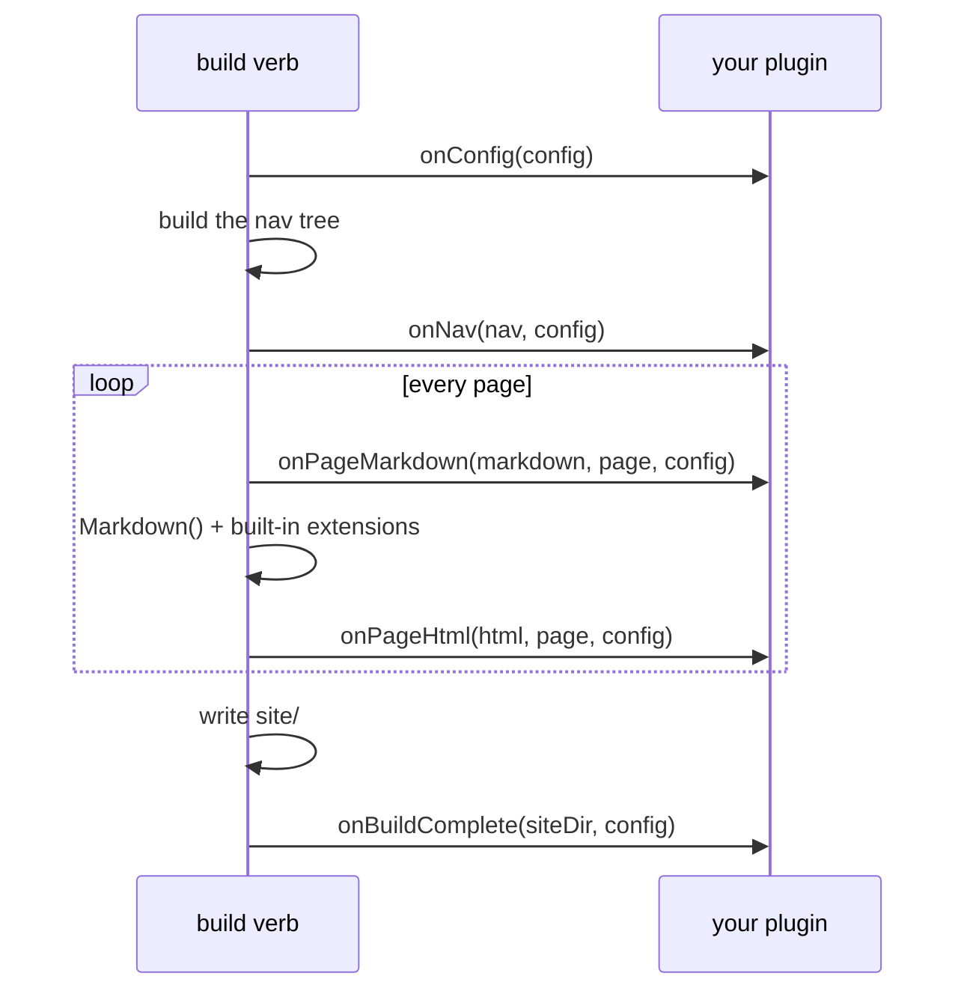

# Plugin

Un plugin di BX Docs non è altro che un altro modulo BoxLang - il proprio
`box.json` + `ModuleConfig.bx`, installato come fratello di `bx-docs`
nello stesso runtime (`box install` nel progetto, allo stesso modo in cui
lo sono già `bx-markdown`/`bx-esapi`). Nessuna API di plugin da
importare, nessun registro separato - il sistema di moduli stesso di
BoxLang *è* il sistema di plugin.

Installare da solo un modulo non lo attiva mai come plugin, però - un
progetto lo attiva esplicitamente per nome di modulo BoxLang, tramite
l'array [`plugins`](../configuration.md#plugins) di `bxdocs.json`:

```json
{ "plugins": [ "myBxDocsPlugin" ] }
```

## Scrivere un plugin

Un modulo plugin necessita esattamente di una cosa oltre al normale
`box.json`/`ModuleConfig.bx` che già ha qualsiasi modulo BoxLang: una
classe `models/BxDocsPlugin.bx`. Ogni metodo su di essa è opzionale -
implementa solo gli hook di cui hai bisogno, BX Docs verifica la presenza
di ciascuno prima di chiamarlo:

```bx
// models/BxDocsPlugin.bx
class {

	struct function onConfig( required struct config ) {
		// Mutate/return the site config, right after bxdocs.json is loaded.
		return arguments.config
	}

	string function onPageMarkdown( required string markdown, required struct page, required struct config ) {
		// Mutate a page's raw markdown before conversion - the same
		// pre-processing seam BX Docs' own content tabs/math/code
		// annotations use internally (TabsProcessor.bx et al.).
		return arguments.markdown
	}

	string function onPageHtml( required string html, required struct page, required struct config ) {
		// Mutate a page's rendered HTML after conversion.
		return arguments.html
	}

	array function onNav( required array nav, required struct config ) {
		// Mutate the nav tree (NavBuilder.build()'s own shape: an array of
		// { title, url, order, children } nodes).
		return arguments.nav
	}

	void function onBuildComplete( required string siteDir, required struct config ) {
		// Fires once, after everything is written to siteDir - no return value.
	}

}
```

Gli hook girano nell'ordine dell'array `plugins` proprio di
`bxdocs.json`, e (tranne `onBuildComplete`) il valore di ritorno di
ognuno sostituisce il valore che vede l'hook successivo (o BX Docs
stesso) - un plugin deve restituire ciò che ha ricevuto solo se non ha
nulla da cambiare.

`onPageMarkdown`/`onPageHtml` girano una volta per pagina, per ogni
albero di documenti che BX Docs compila (l'albero `docs/` principale e
ogni albero `docs/versions/<name>/`). `onConfig`/`onNav`/
`onBuildComplete` vengono applicati anche dal verbo autonomo
`search-index` dove è rilevante (`onConfig`, dato che può cambiare
`markdown`/altre impostazioni da cui dipende la compilazione
dell'indice).

## Quando scatta ogni hook



## Un esempio minimale

`examples/hello-plugin/` in questo repository è un modulo plugin
completo e funzionante - installabile con `box install` così com'è - che
aggiunge un commento `<!-- rendered by hello-plugin -->` a ogni pagina e
aggiunge una riga di riepilogo del build a `site/hello-plugin.txt` una
volta terminato il build. Usalo come scheletro di partenza, oppure
leggilo come esempio pratico della struttura delle cartelle:

```
hello-plugin/
├── box.json              # boxlang.moduleName is what bxdocs.json's [plugins] references
├── ModuleConfig.bx        # a normal, otherwise-empty BoxLang module descriptor
└── models/
    └── BxDocsPlugin.bx    # onPageHtml() + onBuildComplete()
```

## Errori

- `BxDocs.PluginNotFound` - un nome nell'array `plugins` di
  `bxdocs.json` non è un modulo BoxLang installato/attivato.
- `BxDocs.InvalidPlugin` - il modulo esiste, ma non ha una classe
  `models/BxDocsPlugin.bx`.
