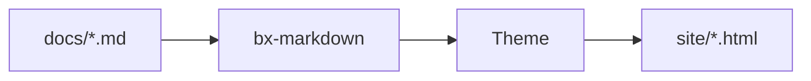

# Markdown 拡張機能

標準 Markdown に加えて、BX Sites はデフォルトで bx-markdown のネイティブ Flexmark 拡張機能を
3 つ有効にします（Admonition、脚注、定義リスト）。さらに、BX Sites 独自の Mermaid ダイアグラム統合も提供します。
これらはすべて [`bxsites.json` の `markdown`/`mermaid` キー](../configuration.md#markdown) で設定できます。

BX Sites はさらに 3 つの独自拡張機能を実装しています（Flexmark には概念すらないもの）:
コンテンツタブ、数式、フェンスコードの `hl_lines`/`linenums`/`title` アノテーション。
bx-sites は bx-markdown のパーサーをフォークできないため、これらはそれぞれ
通常の Markdown 変換の前後処理パスとして動作します。

## Admonition

コールアウト/注意書きボックス - デフォルトで有効、`bxsites.json` の設定不要:

```markdown
!!! note "ご注意"
    これは Admonition です。**太字**、`コード`、[リンク](../index.md)、
    リストなど、通常の Markdown がすべて使えます。
```

`note` のような型がボックスのアイコン/色になり、明示的な `"タイトル"` を指定しない場合は
その型の名前が大文字化されたものが使われます。多くの同義語が 12 の標準型に解決されます:

!!! note "note"
    青 - このリストにない型のフォールバック。

!!! abstract "abstract / summary / tldr"
    薄い青。

!!! info "info / todo"
    シアン。

!!! tip "tip / hint / important"
    ティール。

!!! success "success / check / done"
    緑。

!!! warning "warning / caution / attention"
    オレンジ。

!!! danger "danger / error"
    赤。

本文は 4 スペース（またはタブ）でインデントしたままにする必要があります。
空行はブロック内で使用できます（段落の区切りとして機能します）。

### 折りたたみ可能な Admonition

型の前に `???` を付けると折りたたみ可能なブロックになります（`???` は折りたたまれた状態で、
`???+` は展開された状態で開始します）。見出しをクリックして切り替えられます:

```markdown
??? tip "クリックして展開"
    これは折りたたまれた状態で始まります。

???+ tip "クリックして折りたたむ"
    これは展開された状態で始まります。
```

`{"markdown":{"enableAdmonition":false}}` で Admonition を完全に無効にできます。

## 脚注

`[^label]` でインライン脚注を参照し、`[^label]: text` でどこにでもテキストを定義します:

```markdown
これは裏付けが必要な主張です[^1]。

[^1]: これがその裏付けです。
```

脚注の定義はソース内のどこに書かれていても、ページの下部に番号付きリストとして集められてレンダリングされます。
デフォルトでは無効です。`{"markdown":{"enableFootnotes":true}}` で有効にします。

## 定義リスト

用語行とそれに続く 1 つ以上の `:   ` 説明行が `<dl>` になります:

```markdown
用語
:   その定義。

2 番目の用語
:   最初の定義。
:   2 番目の定義。
```

デフォルトでは無効です。`{"markdown":{"enableDefinitionLists":true}}` で有効にします。

## コンテンツタブ

異なる言語やプラットフォームの代替コンテンツを、クリック可能なタブでグループ化します。
`=== "タイトル"` を使って、Admonition の本文と同じようにインデントします（4 スペースまたはタブ）:

```markdown
=== "Java"
    ```java
    System.out.println( "Hi" );
    ```

=== "BoxLang"
    ```bx
    println( "Hi" )
    ```
```

`bxsites.json` の設定不要 - 常に有効です。

## コードブロック

フェンスコードブロックはクライアントサイドで構文ハイライトされます（highlight.js）。
設定不要です。開き ` ``` ` の後の言語識別子でグラマーを選択します。
BX Sites は `bx`/`boxlang`/`bxs`/`bxm`/`cfscript` で独自の軽量 BoxLang グラマーを登録しています:

```bx
class {

	numeric function add( required numeric a, required numeric b ) {
		var result = a + b
		var message = "The sum is #result#"
		return result
	}

}
```

### 行番号、ハイライト行、タイトル

フェンスの情報文字列に `linenums`、`hl_lines`、`title` を追加します（任意の組み合わせ、すべて省略可）:

````markdown
```bx hl_lines="2" linenums="1" title="add.bx"
numeric function add( required numeric a, required numeric b ) {
	return a + b
}
```
````

`linenums="N"` は `N` からガターのカウントを開始します。`hl_lines` はスペース区切りの行番号と
範囲（`"2 4-6"`）を受け取り、`linenums` がどこから始まるかに関係なくブロックの先頭からカウントします。
`title` はブロックの上に小さなタイトルバーを追加します。設定不要 - 常に使用できます。

### 差分マーカーとターミナル風フレーム

`insert`/`delete` を追加すると、追加/削除された行を示せます（`hl_lines` と同じスペース区切りの
行番号/範囲構文）。色付きの行と `+`/`–` のガターマーカーで表示されます:

````markdown
```bx title="add.bx" insert="3-4" delete="7"
numeric function add( required numeric a, required numeric b ) {
	var sum = a + b
	var total = a + b
	log.info( "computed sum", total )
	return sum
}
```
````

省略せずに `insert`/`delete` と書きます（`ins`/`del` ではありません）。リテラルな `+`/`-` の行プレフィックス
ではなく属性として扱うため、フェンスの内容は本物のコピー可能なソースコードのままです。`linenums` と組み合わせても
問題なく、両方が有効な場合はガターマーカーが行番号の列を避けて右にずれます。

`frame="terminal"` を追加すると、プレーンなタイトルバーの代わりに macOS 風のターミナルウィンドウ
（3 つのステータスドット、中央揃えのタイトル）になります:

````markdown
```bash frame="terminal" title="user@boxlang"
box install bx-sites
```
````

`frame="code"` は今日のプレーンなバーを明示的に指定する名前です（デフォルトなので書く必要はありません）。
`insert`/`delete` も `frame` も `bxsites.json` の設定は不要です。`hl_lines`/`linenums`/`title` と同様です。

#### 本物の git diff

フェンスに `diff` を指定すると、実際の `git diff`/`git show` の出力をそのまま貼り付けられます - これは
bx-sites 独自の構文ではなく、highlight.js 自身の `diff` グラマーが Unified diff 構文（`+`/`-`/`@@` 行）を
自動的に認識しているだけです:

````markdown
```diff
--- a/add.bx
+++ b/add.bx
@@ -1,4 +1,5 @@
 numeric function add( required numeric a, required numeric b ) {
-	var sum = a + b
-	return sum
+	var total = a + b
+	log.info( "computed", total )
+	return total
 }
```
````

## ダイアグラム

`bxsites.json` の [`mermaid`](../configuration.md#mermaid) キーでオプトイン:

```json
{ "mermaid": true }
```

有効にすると、` ```mermaid ` フェンスコードブロックがコードリストではなく
[Mermaid](https://mermaid.js.org/) のライブダイアグラムとしてレンダリングされます:



Mermaid はフローチャート、シーケンス図、クラス図、ガントチャートなど多くのダイアグラムをサポートします。

## 数式

`bxsites.json` の [`math`](../configuration.md#math) キーでオプトイン:

```json
{ "math": true }
```

有効にすると、[KaTeX](https://katex.org/) がインライン数式には `$...$`、
センタリングされたブロックには `$$...$$` を組版します:

```markdown
オイラーの等式 $e^{i\pi} + 1 = 0$ は 5 つの定数を一行で結びつけます。

$$
\int_0^1 x^2 \, dx = \frac{1}{3}
$$
```

## GitBook スタイルのブロック

BX Sites は GitBook スタイルのコンテンツブロックもサポートしています。各ブロックは GitBook の
同名ブロックに直接対応しており、GitBook サイトのコンテンツを移行しやすくなっています。
すべてのブロックは同じ `::: name ... :::` コンテナ構文を使用します。
`bxsites.json` の設定不要、常に使用できます。

### 展開可能

```markdown
::: expandable "これは折りたたみ可能な Admonition と違いますか？"
はい - これにはタイプ/アイコン/色がなく、単なるプレーンな展開/折りたたみセクションです。
`open="true"` を追加すると展開された状態で開始します。
:::
```

### カード

リンクカードのグリッド。各カードは `::: cards` ラッパー内の独自の `::: card`:

```markdown
::: cards
::: card title="はじめに" icon="🚀" href="../getting-started.md"
インストール、スキャフォールド、最初のサイトのビルド。
:::
::: card title="テーマ" icon="🎨" href="themes.md"
組み込みテーマのカスタマイズまたは独自テーマの作成。
:::
:::
```

### 列

横並びレイアウト。`::: column` はオプションの `width`（プレーンな CSS の長さ/パーセンテージ）を受け取ります:

```markdown
::: columns
::: column width="60%"
広い方の列。
:::
::: column
狭い方の列。
:::
:::
```

### ステッパー

番号付きの連続したステップ:

```markdown
::: stepper
::: step "インストール"
`install-bx-module bx-sites`
:::
::: step "スキャフォールド"
`boxlang module:bxSites new`
:::
:::
```

### ファイル

PDF、動画、その他のプロジェクトアセットのダウンロードカード:

```markdown
::: file src="assets/spec.pdf" title="API 仕様"
:::
```

### 埋め込み

認識されたプロバイダーのレスポンシブ iframe 埋め込み（YouTube、Vimeo、CodePen、Spotify、Loom、Figma）:

```markdown
::: embed url="https://www.youtube.com/watch?v=dQw4w9WgXcQ" title="デモ"
:::
```

### ページリンク

別のページへのリッチプレビューカード。タイトル/アイコン/サマリはターゲットページのフロントマターから
自動的に取得されます:

```markdown
::: page-link href="../getting-started.md"
:::
```

### 更新履歴（changelog）

日付とタグ付きの変更ログリスト:

```markdown
::: updates
::: update date="2026-01-15" tags="feature,fix"
ダークモードを追加し、フッターの整列バグを修正しました。
:::
::: update date="2026-01-01"
初回リリース。
:::
:::
```

### 再利用可能なコンテンツ（インクルード）

`::: include src="..."` は別のファイルの生の Markdown をその場所に挿入します:

```markdown
::: include src="_shared/beta-notice.md"
```
