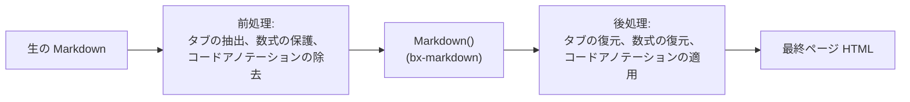
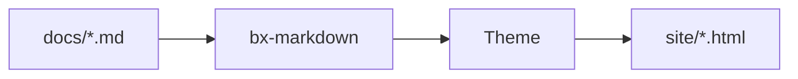

# Markdown 拡張機能

標準 Markdown に加えて、BxSites は bx-markdown のネイティブ Flexmark 拡張機能を
デフォルトで 3 つ有効にします - Admonition、脚注、定義リストです - さらに独自の
Mermaid ダイアグラム統合も備えています。この 4 つはすべて
[`bxsites.yaml` の `markdown`/`mermaid` キー](../configuration.md#markdown)
から設定できます。

これらに加えて、BxSites は Flexmark がまったく概念すら持たない、独自の拡張機能を
さらに 3 つ実装しています - コンテンツタブ、数式、そしてフェンスコードの
`hl_lines`/`linenums`/`title` アノテーションです。bx-sites は bx-markdown の
パーサーをフォークできないため、それぞれが通常の Markdown 変換の前後に
挟まる前処理/後処理パスとして動作します - 詳細は下記の各セクションを参照してください。



## Admonition

コールアウト/注意書きボックス - デフォルトで有効、`bxsites.yaml` の設定は不要です:

```markdown title="Example" linenums="1"
!!! note "ご注意"
    これは Admonition です。内容は通常の Markdown です - **太字**、
    `コード`、[リンク](../index.md)、リストなど、すべて普段どおりに使えます。
```

次のようにレンダリングされます:

!!! note "ご注意"
    これは Admonition です。内容は通常の Markdown です - **太字**、
    `コード`、[リンク](../index.md)、リストなど、すべて普段どおりに使えます。

型（上記の `note`）がボックスのアイコン/色になり、明示的な `"タイトル"` を
指定しない場合はその型自身の名前が大文字化されたものが使われます。多くの
一般的な同義語が、それぞれ独自のアクセントカラーを持つ同じ 12 の標準型に
解決されます:

!!! note "note"
    青 - このリストにない型のフォールバックでもあります。

!!! abstract "abstract / summary / tldr"
    薄い青。

!!! info "info / todo"
    シアン。

!!! tip "tip / hint / important"
    ティール。

!!! success "success / check / done"
    緑。

!!! faq "question / help / faq"
    ライム。

!!! warning "warning / caution / attention"
    オレンジ。

!!! fail "failure / fail / missing"
    薄い赤。

!!! danger "danger / error"
    赤。

!!! bug "bug"
    ピンク。

!!! example "example"
    紫。

!!! quote "quote / cite"
    グレー。

本文は 4 スペース（またはタブ）でインデントしたままにする必要があります。
インデントされておらず、かつ空行でもない最初の行でブロックが終了します。
空行はブロック*内*では問題ありません - Markdown の他の場所とまったく同じく、
単に新しい段落が始まるだけです。

### 折りたたみ可能な Admonition

`!!!` の代わりに型の前に `???` を付けると折りたたみ可能なブロックになります -
`???` は折りたたまれた状態で始まり、`???+` は展開された状態で始まります。
どちらの場合も見出しをクリックして切り替えられます:

```markdown title="Example" linenums="1"
??? tip "クリックして展開"
    これは折りたたまれた状態で始まります。

???+ tip "クリックして折りたたむ"
    これは展開された状態で始まります。
```

??? tip "クリックして展開"
    これは折りたたまれた状態で始まります。

???+ tip "クリックして折りたたむ"
    これは展開された状態で始まります。

`{"markdown":{"enableAdmonition":false}}` で Admonition を完全に無効にできます。

## 脚注

`[^label]` でインライン脚注を参照し、`[^label]: text` でドキュメント内の
どこにでもそのテキストを定義できます:

```markdown title="Example" linenums="1"
これは裏付けが必要な主張です[^1]。

[^1]: これがその裏付けです。
```

これは裏付けが必要な主張です[^1]。

[^1]: これがその裏付けです。

脚注の定義は、ソース内のどこに書かれていても、ページ下部に番号付きリストとして
集められてレンダリングされます。デフォルトでは無効です -
`{"markdown":{"enableFootnotes":true}}` で有効にします。

## 定義リスト

用語行とそれに続く 1 つ以上の `:   ` 説明行が `<dl>` になります:

```markdown title="Example" linenums="1"
用語
:   その定義。

2 番目の用語
:   最初の定義。
:   2 番目の定義。
```

用語
:   その定義。

2 番目の用語
:   最初の定義。
:   2 番目の定義。

デフォルトでは無効です - `{"markdown":{"enableDefinitionLists":true}}` で
有効にします。

## コンテンツタブ

異なる言語やプラットフォームの代替コンテンツを、クリック可能な一連のタブに
まとめます。`=== "タイトル"` を使い、Admonition の本文と同じ方法で
インデントします（4 スペースまたはタブ）:

```markdown title="Example" linenums="1"
=== "Java"
    ```java
    System.out.println( "Hi" );
    ```

=== "BoxLang"
    ```bx
    println( "Hi" )
    ```
```

次のようにレンダリングされます:

=== "Java"
    ```java
    System.out.println( "Hi" );
    ```

=== "BoxLang"
    ```bx
    println( "Hi" )
    ```

連続した `=== "..."` ブロック（間に空行が最大 1 行まで）は 1 つのタブ
グループを形成します。タブ自身の内容は完全な Markdown です - コードフェンス、
リスト、Admonition など、他のどこにでも書けるものが使えます。`bxsites.yaml`
の設定は不要 - 常に有効です。

## コードブロック

フェンスコードブロックはクライアントサイドで構文ハイライトされます
（highlight.js）。設定は不要です - 開きの ` ``` ` の後の言語識別子でグラマーが
選択されます（例: ` ```json `）。highlight.js 自身が同梱する言語に加えて、
BxSites は `bx`/`boxlang`/`bxs`/`bxm`/`cfscript` 用に独自の軽量な BoxLang
グラマーを登録しています:

```bx
class {

	numeric function add( required numeric a, required numeric b ) {
		var result = a + b
		var message = "The sum is #result#"
		return result
	}

}
```

### 行番号、ハイライト行、タイトル

フェンスの情報文字列に `linenums`、`hl_lines`、`title` を追加します
（任意の組み合わせで、すべて省略可能です）:

````markdown
```bx hl_lines="2" linenums="1" title="add.bx"
numeric function add( required numeric a, required numeric b ) {
	return a + b
}
```
````

次のようにレンダリングされます:

```bx hl_lines="2" linenums="1" title="add.bx"
numeric function add( required numeric a, required numeric b ) {
	return a + b
}
```

`linenums="N"` はガターのカウントを `N` から開始します。`hl_lines` は
スペース区切りの行番号や範囲（`"2 4-6"`）を受け取ってハイライトし、
`linenums` がどこから始まるかに関係なく、ブロックの先頭からカウントします。
`title` はブロックの上に小さなタイトルバーを追加します。`bxsites.yaml`
の設定は不要 - 常に使用できます。

### 差分マーカーとターミナルフレーム

`insert`/`delete` を追加すると、追加/削除された行を示せます - `hl_lines`
がすでに使っているのと同じ、スペース区切りの行番号/範囲構文です - 色付きの
行と `+`/`–` のガターマーカーとして表示されます:

````markdown
```bx title="add.bx" insert="3-4" delete="7"
numeric function add( required numeric a, required numeric b ) {
	var sum = a + b
	var total = a + b
	log.info( "computed sum", total )
	return sum
}
```
````

次のようにレンダリングされます:

```bx title="add.bx" insert="3-4" delete="7"
numeric function add( required numeric a, required numeric b ) {
	var sum = a + b
	var total = a + b
	log.info( "computed sum", total )
	return sum
}
```

意図的に省略せず書きます（`ins`/`del` ではありません）。一部のツールがやる
ようなリテラルな `+`/`-` の行プレフィックスではなく属性として扱うため、
フェンス自身の内容は本物の、無加工でコピー＆ペースト可能なソースコードの
ままです - 既存のコピーボタンから何かを取り除く必要もありません。
`insert`/`delete` は `linenums` ときれいに積み重なります - 両方が有効な
場合、ガターマーカーは行番号の列を避けて右にずれます。

`frame="terminal"` を追加すると、プレーンなタイトルバーの代わりに macOS
風のターミナルウィンドウ（3 つのステータスドット、中央揃えのタイトル）に
なります:

````markdown
```bash frame="terminal" title="user@boxlang"
box install bx-sites
```
````

次のようにレンダリングされます:

```bash frame="terminal" title="user@boxlang"
box install bx-sites
```

`frame="code"` は、今日のデフォルトであるプレーンなバーを明示的に指定する
名前です - デフォルトなので書く必要はありません。`insert`/`delete` も
`frame` も、`hl_lines`/`linenums`/`title` と同様に `bxsites.yaml` の設定は
不要です。

#### 本物の git diff

フェンスに `diff` を指定すると、実際の `git diff`/`git show` の出力を
そのまま貼り付けられます - これは bx-sites 独自の構文ではまったくなく、
highlight.js 自身の `diff` グラマーが Unified diff 構文（`+`/`-`/`@@` 行）を
自動的に認識しているだけです:

````markdown
```diff
--- a/add.bx
+++ b/add.bx
@@ -1,4 +1,5 @@
 numeric function add( required numeric a, required numeric b ) {
-	var sum = a + b
-	return sum
+	var total = a + b
+	log.info( "computed", total )
+	return total
 }
```
````

次のようにレンダリングされます:

```diff title="git diff"
--- a/add.bx
+++ b/add.bx
@@ -1,4 +1,5 @@
 numeric function add( required numeric a, required numeric b ) {
-	var sum = a + b
-	return sum
+	var total = a + b
+	log.info( "computed", total )
+	return total
 }
```

### ライブで試す（try.boxlang.io）

言語名の代わりにフェンスに `tryboxlang` を指定すると、静的なコードリストの
代わりに、ライブの埋め込み [try.boxlang.io](https://try.boxlang.io) エディタ
としてレンダリングされます - 読者はページ上でそのままサンプルを実行し、
自由にいじれます。設定は不要です:

````markdown
```tryboxlang title="クロージャ"
user = { name: "Luis", getFullName: () => "Luis Majano" }
println( user.getFullName() )
```
````

次のようにレンダリングされます:

```tryboxlang title="クロージャ"
user = { name: "Luis", getFullName: () => "Luis Majano" }
println( user.getFullName() )
```

任意の属性（すべて `tryboxlang` と同じ行に記述します）:

| 属性 | デフォルト | 説明 |
| ---------- | ------- | -------------------------------------------------------- |
| `title`    | なし    | 埋め込みの上に表示される小さなタイトルバー |
| `height`   | `450px` | 任意の CSS 長さ（裸の数値はピクセルとして扱われます） |
| `readonly` | `false` | `"true"` でエディタを読み取り専用にロックします |

フェンス自体の内容が、エディタの起点となる BoxLang ソースになります -
これは圧縮され、try.boxlang.io 自身の `code` URL パラメータ経由でエディタに
渡されます。これは try.boxlang.io 自体の「シェア」リンクと同じ仕組みなので、
埋め込みの「Open in try.boxlang.io ↗」リンクを開くと、埋め込みが始まった
箇所からそのまま続けられます。

## ダイアグラム

`bxsites.yaml` の [`mermaid`](../configuration.md#mermaid) キーでオプトイン:

```yaml title="bxsites.yaml"
mermaid: true
```

有効にすると、` ```mermaid ` フェンスコードブロックはコードリストの代わりに
[Mermaid](https://mermaid.js.org/) のライブダイアグラムとしてレンダリング
されます:



Mermaid はフローチャート、シーケンス図、クラス図、ガントチャートなど、
多くの種類のダイアグラムをサポートしています。描画できる内容の全体像は
[Mermaid 独自の構文リファレンス](https://mermaid.js.org/intro/syntax-reference.html)
を参照してください。

## 数式

`bxsites.yaml` の [`math`](../configuration.md#math) キーでオプトイン:

```yaml title="bxsites.yaml"
math: true
```

有効にすると、[KaTeX](https://katex.org/) がインライン数式には `$...$`、
中央揃えのブロックには `$$...$$` を組版します。どちらも Markdown 本文に
直接書きます:

```markdown title="Example" linenums="1"
オイラーの等式 $e^{i\pi} + 1 = 0$ は、5 つの定数を一行で結びつけます。

$$
\int_0^1 x^2 \, dx = \frac{1}{3}
$$
```

オイラーの等式 $e^{i\pi} + 1 = 0$ は、5 つの定数を一行で結びつけます。

$$
\int_0^1 x^2 \, dx = \frac{1}{3}
$$

前後にすぐ空白が続く/先行する `$` はそのまま扱われます（そのため
「$5 and $10」が数式と誤読されることはありません）- 組版される数式は
常に両方の区切り記号にぴったりと接しています。

GFM パイプテーブル - 配置、エスケープ、そしてすべてのテーブルに自動で
適用されるレスポンシブなスクロール/固定ヘッダー処理 - については
[テーブル](tables.md) を参照してください。

上記のすべてに加えて、GitBook スタイルの `::: name ... :::` ブロック群
（展開可能セクション、カード、列、ステッパー、ファイル/埋め込み/
ページリンクカード、更新履歴（changelog）ブロック、再利用可能な
コンテンツインクルード）については [コンテンツブロック](content-blocks.md)
を参照してください。

キャプション、配置、フレーミング（プレーンなブロックレベル HTML であり、
bx-sites 独自の構文は一切不要です）については
[レスポンシブ画像](images.md#キャプション配置フレーミング) を参照して
ください。

## プラグイン拡張

Admonition、脚注、定義リストは一般的なユースケースをカバーしますが、
bx-markdown 自体はこの 3 つ以外について特に意見を持ちません - その他の
Flexmark 拡張機能は、BxSites とは独立に `markdownRegisterExtension()` を
使って直接登録できます。詳細は bx-markdown 自身の readme を参照してください。
