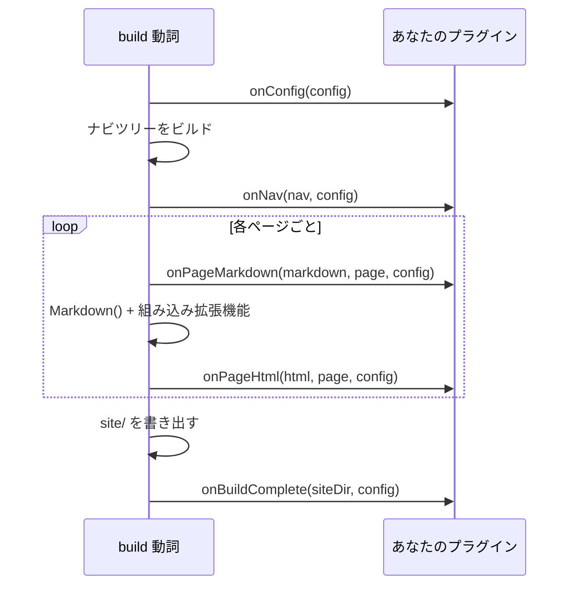

# プラグイン

BxSites プラグインは単なる別の BoxLang モジュールです。`box.json` + `ModuleConfig.bx` を持ち、
`bx-sites` と同じランタイムの兄弟としてインストールされます（`box install` でプロジェクトに追加、
`bx-markdown`/`bx-esapi` と同様）。インポートする Plugin API も、専用レジストリも不要です。
BoxLang 独自のモジュールシステムが*そのまま*プラグインシステムになっています。

ただし、モジュールをインストールしただけではプラグインとして有効化されません。
プロジェクトが `bxsites.yaml` の [`plugins`](../configuration.md#plugins) 配列に BoxLang モジュール名を
明示的に追加することでオプトインする必要があります:

=== "YAML"
    ```yaml title="bxsites.yaml"
    plugins: [ myBxSitesPlugin ]
    ```

=== "JSON"
    ```json title="bxsites.json"
    { "plugins": ["myBxSitesPlugin"] }
    ```

## 公開済みプラグインのインストール

ForgeBox に公開されたプラグインは、`bxSites` バイナリ自体だけでインストールできます -
`box`/CommandBox は不要です。すでに公開されているパッケージは、ForgeBox の
[`bxsites-plugins`](https://www.forgebox.io/type/bxsites-plugins) カテゴリーから
探せます:

```bash title="Usage"
bxSites install:plugin --name=bx-sites-plugin-analytics [--version=1.2.0]
```

これはパッケージの zip を ForgeBox からダウンロードし、プロジェクトルートの
`boxlang_modules/bx-sites-plugin-analytics/` に展開します - BoxLang 独自の
自動読み込みされるローカルモジュールの規約です（そこにあるモジュールフォルダは、
npm にとってのプロジェクトローカルな `node_modules/` と同じ方法で検出されます）。
そのため、`BOXLANG_HOME`/グローバルインストールのステップなしに、実行中の
BoxLang モジュールレジストリで有効になります。`install:plugin` はそれを
即座にランタイムに読み込み、実際に登録されたモジュールのマッピング名
（下記の注記のとおり、これは必ずしも ForgeBox のスラグと同じとは限りません）
を出力します - 他のインストール済みモジュールと同様に、*その* 名前を
`bxsites.yaml` の `plugins` 配列に追加して有効化してください。CLI リファレンスの
[`install:plugin`](../cli-reference.md#installplugin) を参照してください。

## プラグインの作成

プラグインモジュールが通常の BoxLang モジュールに追加で必要なのは `models/BxSitesPlugin.bx` クラスだけです。
すべてのメソッドはオプションです。必要なフックのみを実装してください。BxSites は呼び出す前に
各フックの存在をチェックします:

```bx title="models/BxSitesPlugin.bx" linenums="1"
// models/BxSitesPlugin.bx
class {

	struct function onConfig( required struct config ) {
		// bxsites.yaml が読み込まれた直後にサイト設定を変更/返す。
		return arguments.config
	}

	string function onPageMarkdown( required string markdown, required struct page, required struct config ) {
		// 変換前のページの生 Markdown を変更する。
		return arguments.markdown
	}

	string function onPageHtml( required string html, required struct page, required struct config ) {
		// 変換後のページのレンダリング済み HTML を変更する。
		return arguments.html
	}

	array function onNav( required array nav, required struct config ) {
		// ナビゲーションツリーを変更する。
		return arguments.nav
	}

	void function onBuildComplete( required string siteDir, required struct config ) {
		// すべてが siteDir に書き出された後、一度だけ実行される。戻り値なし。
	}

}
```

フックは `bxsites.yaml` の `plugins` 配列の順序で実行され、各フックの戻り値（`onBuildComplete` 以外）が
次のフック（または BxSites 自体）が受け取る値を置き換えます。変更がない場合は受け取った値をそのまま
返すだけで構いません。

`onPageMarkdown`/`onPageHtml` は、BxSites がビルドするすべての docs ツリー
（メインの `docs/` ツリーと各 `docs/versions/<name>/` ツリー）について、
ページごとに一度実行されます。`onConfig`/`onNav`/`onBuildComplete` は、
関係する場合はスタンドアロンの `search-index` 動詞にも適用されます
（`onConfig` は、インデックスビルドが依存する `markdown`/その他の設定を
変更しうるためです）。

## 各フックが発火するタイミング



## 最小限の例

このリポジトリの `examples/hello-plugin/` は完全に動作するプラグインモジュールです。
`box install` ですぐに使えます。すべてのページに `<!-- rendered by hello-plugin -->` コメントを追加し、
ビルド完了後に `site/hello-plugin.txt` にビルドサマリを追記します。
フォルダレイアウトの実例として活用してください:

```text title="hello-plugin/ layout"
hello-plugin/
├── box.json              # boxlang.moduleName が bxsites.yaml の [plugins] から参照される名前
├── ModuleConfig.bx        # 通常の（そうでなければ空の）BoxLang モジュールディスクリプタ
└── models/
    └── BxSitesPlugin.bx    # onPageHtml() + onBuildComplete()
```

## エラー

- `BxSites.PluginNotFound` - `bxsites.yaml` の `plugins` 配列内の名前がインストール/有効化された
  BoxLang モジュールでない場合。
- `BxSites.InvalidPlugin` - モジュールは存在するが、`models/BxSitesPlugin.bx` クラスがない場合。
