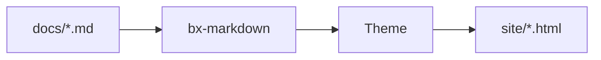

# Markdown Extensions

Beyond standard Markdown (and whatever [bx-markdown option](../configuration.md#markdown)
you've turned on), BX Docs adds two content extensions of its own: admonitions
and Mermaid diagrams.

## Admonitions

A callout/note box - no `bxdocs.json` config needed, just write it:

```markdown
!!! note "Heads Up"
    This is an admonition. Its content is regular markdown - **bold**,
    `code`, [links](../index.md) and lists all work exactly as normal.
```

Which renders as:

!!! note "Heads Up"
    This is an admonition. Its content is regular markdown - **bold**,
    `code`, [links](../index.md) and lists all work exactly as normal.

The type (`note` above) becomes the box's CSS class and, if you don't give
an explicit `"Title"`, its own capitalized name is used instead. A handful
of types get their own accent color out of the box:

!!! tip "tip / hint / success / check / done"
    Green.

!!! warning "warning / caution / attention"
    Orange.

!!! danger "danger / error / failure / fail / missing"
    Red.

!!! question "question / help / faq"
    Amber.

!!! example "example"
    Purple.

Any other type still renders as a valid admonition box (in the default blue
accent) - the type list above is just which ones get their own color.

The body must stay indented by 4 spaces (or a tab); the block ends at the
first non-indented, non-blank line. Blank lines are fine *inside* the block
- they just start a new paragraph, same as anywhere else in markdown.

## Diagrams

Opt-in via `bxdocs.json`'s [`mermaid`](../configuration.md#mermaid) key:

```json
{ "mermaid": true }
```

Once enabled, any ` ```mermaid ` fenced code block renders as a live
[Mermaid](https://mermaid.js.org/) diagram instead of a code listing:



Mermaid supports flowcharts, sequence diagrams, class diagrams, Gantt
charts and more - see [Mermaid's own syntax reference](https://mermaid.js.org/intro/syntax-reference.html)
for everything it can draw.
