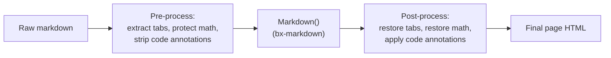
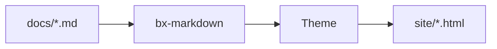

# Estensioni Markdown

Oltre al Markdown standard, BxSites attiva di default tre estensioni
Flexmark native di bx-markdown - ammonizioni, note a piè di pagina e
liste di definizioni - più un'integrazione con i diagrammi Mermaid tutta
sua. Tutte e quattro sono configurabili tramite le
[chiavi `markdown`/`mermaid` di `bxsites.yaml`](../configuration.md#markdown).

Oltre a queste, BxSites implementa altre tre estensioni proprie di cui
Flexmark non ha alcun concetto - schede di contenuto, matematica, e
annotazioni `hl_lines`/`linenums`/`title` sui blocchi di codice delimitati.
Dato che bx-sites non può forkare il parser di bx-markdown, ognuna di
queste funziona come un passaggio di pre/post-elaborazione intorno alla
normale conversione del markdown - vedi le sezioni sotto.



## Ammonizioni

Un box di richiamo/nota - attivo di default, nessuna configurazione di
`bxsites.yaml` necessaria:

```markdown title="Esempio" linenums="1"
!!! note "Heads Up"
    This is an admonition. Its content is regular markdown - **bold**,
    `code`, [links](../index.md) and lists all work exactly as normal.
```

Che viene renderizzato così:

!!! note "Attenzione"
    Questa è un'ammonizione. Il suo contenuto è markdown normale -
    **grassetto**, `code`, [link](../index.md) e liste funzionano tutti
    esattamente come al solito.

Il tipo (`note` sopra) diventa l'icona/colore del box e, se non fornisci
un `"Title"` esplicito, viene usato invece il suo nome capitalizzato.
Molti sinonimi comuni si risolvono negli stessi 12 tipi canonici, ognuno
con il proprio colore d'accento:

!!! note "note"
    Blu - anche il ripiego per qualsiasi tipo non presente in questo elenco.

!!! abstract "abstract / summary / tldr"
    Azzurro chiaro.

!!! info "info / todo"
    Ciano.

!!! tip "tip / hint / important"
    Verde acqua.

!!! success "success / check / done"
    Verde.

!!! faq "question / help / faq"
    Verde lime.

!!! warning "warning / caution / attention"
    Arancione.

!!! fail "failure / fail / missing"
    Rosso chiaro.

!!! danger "danger / error"
    Rosso.

!!! bug "bug"
    Rosa.

!!! example "example"
    Viola.

!!! quote "quote / cite"
    Grigio.

Il corpo deve restare indentato di 4 spazi (o un tab); il blocco termina
alla prima riga non indentata e non vuota. Le righe vuote vanno bene
*dentro* il blocco - iniziano semplicemente un nuovo paragrafo, come
ovunque altrove nel markdown.

### Ammonizioni comprimibili

Anteponi al tipo `???` invece di `!!!` per rendere il blocco comprimibile
- `???` inizia compresso, `???+` inizia aperto. In entrambi i casi
l'intestazione è cliccabile per attivarlo/disattivarlo:

```markdown title="Esempio" linenums="1"
??? tip "Click to expand"
    This starts collapsed.

???+ tip "Click to collapse"
    This starts open.
```

??? tip "Clicca per espandere"
    Questo inizia compresso.

???+ tip "Clicca per comprimere"
    Questo inizia aperto.

Disattiva del tutto le ammonizioni con `{"markdown":{"enableAdmonition":false}}`.

## Note a piè di pagina

Fai riferimento a una nota a piè di pagina in linea con `[^label]` e
definiscine il testo in qualsiasi punto del documento con
`[^label]: text`:

```markdown title="Esempio" linenums="1"
Here's a claim that needs backing up[^1].

[^1]: Here's the backup.
```

Ecco un'affermazione che ha bisogno di una conferma[^1].

[^1]: Ecco la conferma.

Le definizioni delle note a piè di pagina vengono raccolte e renderizzate
come una lista numerata in fondo alla pagina, indipendentemente da dove
nel sorgente siano state scritte. Disattivate di default - attivale con
`{"markdown":{"enableFootnotes":true}}`.

## Liste di definizioni

Una riga di termine seguita da una o più righe di descrizione `:   `
diventa una `<dl>`:

```markdown title="Esempio" linenums="1"
Term
:   Its definition.

Second term
:   First definition.
:   Second definition.
```

Termine
:   La sua definizione.

Secondo termine
:   Prima definizione.
:   Seconda definizione.

Disattivate di default - attivale con
`{"markdown":{"enableDefinitionLists":true}}`.

## Schede di contenuto

Raggruppa contenuti alternativi - linguaggi diversi, piattaforme diverse -
dietro un insieme di schede cliccabili con `=== "Title"`, indentate allo
stesso modo del corpo di un'ammonizione (4 spazi o un tab):

```markdown title="Esempio" linenums="1"
=== "Java"
    ```java
    System.out.println( "Hi" );
    ```

=== "BoxLang"
    ```bx
    println( "Hi" )
    ```
```

Che viene renderizzato così:

=== "Java"
    ```java
    System.out.println( "Hi" );
    ```

=== "BoxLang"
    ```bx
    println( "Hi" )
    ```

Blocchi `=== "..."` consecutivi (separati al massimo da una riga vuota)
formano un unico gruppo di schede; il contenuto di una scheda è markdown
completo, quindi blocchi di codice, liste, ammonizioni, qualsiasi cosa
scriveresti altrove. Nessuna configurazione di `bxsites.yaml` necessaria -
sempre attivo.

## Tabelle

Tabelle a pipe GFM standard - nessuna configurazione di `bxsites.yaml`
necessaria, sempre attive:

```markdown title="Example" linenums="1"
| Feature      | Community | Enterprise |
| ------------ | :-------: | ---------: |
| Themes       |    10     |         10 |
| Multi-locale |    Yes    |        Yes |
| Support      |  Forums   |     24/7   |
```

Che viene renderizzato così:

| Feature      | Community | Enterprise |
| ------------ | :-------: | ---------: |
| Themes       |    10     |         10 |
| Multi-locale |    Yes    |        Yes |
| Support      |  Forums   |     24/7   |

Una riga di `---` sotto l'intestazione attiva la tabella; metti i due
punti su quella riga separatrice per controllare l'allineamento per
colonna - `:---` sinistra, `:---:` centro, `---:` destra. Il contenuto
delle celle è normale markdown inline, quindi `code`, **grassetto**, e
[link](../index.md) funzionano tutti.

I dettagli del parsing - le righe corte vengono riempite, le righe lunghe
vengono troncate, e la classe CSS con cui viene renderizzata ogni
`<table>` - sono tutti controllati da
[`markdown.tableOptions`](../configuration.md#markdown) in `bxsites.yaml`;
i valori predefiniti sopra sono quasi sempre quello che vuoi.

## Blocchi di codice

I blocchi di codice delimitati vengono evidenziati lato client
(highlight.js), nessuna configurazione necessaria - l'identificatore di
linguaggio dopo l'apertura ` ``` ` seleziona la grammatica, ad es.
` ```json `. Oltre ai linguaggi già inclusi in highlight.js, BxSites
registra una propria grammatica BoxLang leggera sotto
`bx`/`boxlang`/`bxs`/`bxm`/`cfscript`:

```bx
class {

	numeric function add( required numeric a, required numeric b ) {
		var result = a + b
		var message = "The sum is #result#"
		return result
	}

}
```

### Numeri di riga, righe evidenziate e titoli

Aggiungi `linenums`, `hl_lines` e/o `title` alla stringa info di un
blocco delimitato - qualsiasi combinazione, tutti opzionali:

````markdown
```bx hl_lines="2" linenums="1" title="add.bx"
numeric function add( required numeric a, required numeric b ) {
	return a + b
}
```
````

Che viene renderizzato così:

```bx hl_lines="2" linenums="1" title="add.bx"
numeric function add( required numeric a, required numeric b ) {
	return a + b
}
```

`linenums="N"` fa iniziare il conteggio nel margine da `N`; `hl_lines`
accetta numeri di riga e/o intervalli separati da spazi (`"2 4-6"`) da
evidenziare, contati dall'inizio del blocco indipendentemente da dove
parte `linenums`; `title` aggiunge una piccola barra del titolo sopra il
blocco. Nessuna configurazione di `bxsites.yaml` necessaria - sempre
disponibile.

### Indicatori di diff e cornici terminale

Aggiungi `insert`/`delete` per segnalare righe aggiunte/rimosse - gli
stessi numeri di riga/intervalli separati da spazi che `hl_lines` già
usa - come riga evidenziata più un indicatore nel margine `+`/`–`:

````markdown
```bx title="add.bx" insert="3-4" delete="7"
numeric function add( required numeric a, required numeric b ) {
	var sum = a + b
	var total = a + b
	log.info( "computed sum", total )
	return sum
}
```
````

Che viene renderizzato così:

```bx title="add.bx" insert="3-4" delete="7"
numeric function add( required numeric a, required numeric b ) {
	var sum = a + b
	var total = a + b
	log.info( "computed sum", total )
	return sum
}
```

Scritto per intero deliberatamente - non abbreviato in `ins`/`del` - e
come attributi invece di prefissi letterali `+`/`-` sulle righe (come
fanno alcuni strumenti), così il contenuto del blocco resta codice
sorgente reale, non modificato e copiabile; non c'è nulla da rimuovere
per il pulsante di copia già esistente. `insert`/`delete` si combinano
bene con `linenums` - l'indicatore nel margine si sposta per lasciare
libera la colonna dei numeri di riga quando entrambi sono attivi.

Aggiungi `frame="terminal"` per sostituire la semplice barra del titolo
con una finestra di terminale in stile macOS - tre pallini di stato,
titolo centrato:

````markdown
```bash frame="terminal" title="user@boxlang"
box install bx-sites
```
````

Che viene renderizzato così:

```bash frame="terminal" title="user@boxlang"
box install bx-sites
```

`frame="code"` è il nome esplicito per la barra semplice di oggi - il
valore predefinito; nessuno ha bisogno di scriverlo. Né `insert`/`delete`
né `frame` richiedono configurazione in `bxsites.yaml`, come
`hl_lines`/`linenums`/`title`.

#### Diff git reali

Etichetta un blocco come `diff` e incolla direttamente l'output reale di
`git diff`/`git show` - questa non è affatto sintassi specifica di
bx-sites, è solo la grammatica `diff` di highlight.js che riconosce da
sola la sintassi diff unificato (righe `+`/`-`/`@@`):

````markdown
```diff
--- a/add.bx
+++ b/add.bx
@@ -1,4 +1,5 @@
 numeric function add( required numeric a, required numeric b ) {
-	var sum = a + b
-	return sum
+	var total = a + b
+	log.info( "computed", total )
+	return total
 }
```
````

Che viene renderizzato così:

```diff title="git diff"
--- a/add.bx
+++ b/add.bx
@@ -1,4 +1,5 @@
 numeric function add( required numeric a, required numeric b ) {
-	var sum = a + b
-	return sum
+	var total = a + b
+	log.info( "computed", total )
+	return total
 }
```

### Provalo dal vivo (try.boxlang.io)

Etichetta un blocco `tryboxlang` invece di un nome di linguaggio e viene
renderizzato come un editor [try.boxlang.io](https://try.boxlang.io) dal
vivo, incorporato, invece che come un listato di codice statico - i
lettori possono eseguire e modificare l'esempio direttamente sulla
pagina, nessuna configurazione necessaria:

````markdown
```tryboxlang title="Closures"
user = { name: "Luis", getFullName: () => "Luis Majano" }
println( user.getFullName() )
```
````

Che viene renderizzato così:

```tryboxlang title="Closures"
user = { name: "Luis", getFullName: () => "Luis Majano" }
println( user.getFullName() )
```

Attributi opzionali, tutti sulla stessa riga di `tryboxlang`:

| Attributo  | Predefinito | Descrizione                                              |
| ---------- | ----------- | --------------------------------------------------------- |
| `title`    | nessuno     | Una piccola barra del titolo sopra l'embed                 |
| `height`   | `450px`     | Qualsiasi lunghezza CSS (un numero nudo viene trattato come pixel) |
| `readonly` | `false`     | `"true"` blocca l'editor in sola lettura                   |

Il contenuto stesso del blocco è il sorgente BoxLang di partenza - viene
compresso e passato all'editor di try.boxlang.io tramite il suo stesso
parametro URL `code`, allo stesso modo in cui funziona già un link
"share" da try.boxlang.io stesso, quindi aprire il link "Apri in
try.boxlang.io ↗" dell'embed riprende esattamente da dove parte l'embed.

## Diagrammi

Opzionale tramite la chiave [`mermaid`](../configuration.md#mermaid) di
`bxsites.yaml`:

```yaml title="bxsites.yaml"
mermaid: true
```

Una volta attivato, qualsiasi blocco di codice delimitato ` ```mermaid `
viene renderizzato come un diagramma [Mermaid](https://mermaid.js.org/)
dal vivo invece che come un listato di codice:



Mermaid supporta diagrammi di flusso, diagrammi di sequenza, diagrammi di
classe, diagrammi di Gantt e altro - vedi il
[riferimento di sintassi ufficiale di Mermaid](https://mermaid.js.org/intro/syntax-reference.html)
per tutto ciò che può disegnare.

## Matematica

Opzionale tramite la chiave [`math`](../configuration.md#math) di
`bxsites.yaml`:

```yaml title="bxsites.yaml"
math: true
```

Una volta attivato, [KaTeX](https://katex.org/) compone `$...$` per la
matematica in linea e `$$...$$` per un blocco centrato, entrambi scritti
direttamente nel corpo del markdown:

```markdown title="Esempio" linenums="1"
Euler's identity, $e^{i\pi} + 1 = 0$, relates five constants in one line.

$$
\int_0^1 x^2 \, dx = \frac{1}{3}
$$
```

L'identità di Eulero, $e^{i\pi} + 1 = 0$, mette in relazione cinque
costanti in un'unica riga.

$$
\int_0^1 x^2 \, dx = \frac{1}{3}
$$

Un `$` immediatamente preceduto o seguito da uno spazio viene lasciato
intatto (così "$5 e $10" non viene scambiato per una formula) - la
matematica composta sta sempre accostata a entrambi i delimitatori.

Vedi [Blocchi di contenuto](content-blocks.md) per una famiglia di
blocchi in stile GitBook `::: name ... :::` che si aggiunge a tutto
quanto sopra - espandibili, card, colonne, uno stepper, card
file/embed/link-a-pagina, un blocco changelog, e contenuto riutilizzabile
tramite include.

Vedi [Immagini Responsive](images.md#captions-alignment-and-framing) per
didascalie, allineamento e cornici (semplice HTML a livello di blocco -
nessuna sintassi specifica di bx-sites necessaria).

## Estensioni tramite plugin

Ammonizioni, note a piè di pagina e liste di definizioni coprono i casi
comuni, ma bx-markdown stesso non ha opinioni oltre a queste tre -
qualsiasi altra estensione Flexmark può essere registrata direttamente
contro di esso con `markdownRegisterExtension()`, indipendentemente da BX
Docs. Vedi il readme proprio di bx-markdown per i dettagli.
